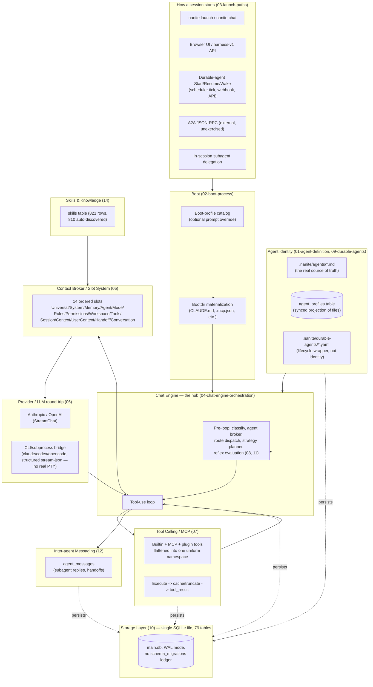

# Nanite System Audit — 2026-08-17

> **Correction (2026-08-17, post-review):** references to "PTY" below (including the diagram) describe the CLI-wrapped subprocess path loosely — no real pseudo-terminal is actually allocated in production; it's structured NDJSON over plain stdin/stdout pipes. See `code-architecture/06-provider-llm-roundtrip.md`'s correction note for the full detail and source citations.

## What this is

A system-level snapshot of Nanite's agent stack as it exists today — not a code review, not a recommendations doc. The goal was to gather evidence for a later, separate decision about architectural changes: what's complex, what's over-steered, what's under-steered, what requires manual setup that "should just work," and what else is here that wasn't on anyone's radar.

Two independent research tracks fed this:

- **Chat/transcript analysis** — six parallel passes over real evidence of Nanite agents misbehaving: Claude Code dev-session transcripts for Nanite itself (32 sessions, two batches), Loom + Fragments Engine (two consumer apps), Torque (the orchestration-adjacent app), eight headless boot-launched CLI transcripts, and direct read-only queries against the live production database (`~/.local/share/nanite/workspaces/default/main.db` — 343 sessions, 1,103 messages, 174 subagent runs, 122 durable-agent events, 1,004+314 broker decisions).
- **Code architecture** — sixteen subsystem docs tracing how the system works today, from agent definition through boot, launch, chat orchestration, context assembly, the LLM round-trip, tool calling, reflexes, durable agents, storage, broker/steering, inter-agent messaging, session lifecycle/recovery, skills, envelopes, and plugins — plus a taxonomy doc disentangling the naming collisions that surfaced across all of them.

23 documents, ~5,200 lines, all evidence-cited (file paths, line numbers, timestamps, DB rows, or verbatim transcript excerpts) so every claim below can be independently re-verified.

**Read `17-taxonomy-agent-types.md` first if anything below is unclear on "which agent/broker/reflex/mode/boot is this."** It's the disambiguation reference for eight distinct naming collisions this audit found.

## Where everything is

```
docs/system-audit/2026-08-17/
├── 00-overview.md                              (this file)
├── chat-analysis/
│   ├── 01-nanite-dev-sessions-early.md         (Aug 13-14 dev sessions)
│   ├── 02-nanite-dev-sessions-late.md          (Aug 15-17 dev sessions)
│   ├── 03-loom-fragments-engine-dev-sessions.md (two Nanite-consumer apps)
│   ├── 04-torque-dev-sessions.md               (orchestration-adjacent app)
│   ├── 05-boot-launched-agent-transcripts.md   (raw headless CLI runs)
│   ├── 06-live-runtime-db.md                   (production DB, read-only)
│   └── 07-synthesis.md                         (cross-source patterns, if present — see note below)
└── code-architecture/
    ├── 01-agent-definition-and-config.md
    ├── 02-boot-process.md
    ├── 03-launch-paths.md
    ├── 04-chat-engine-orchestration.md
    ├── 05-context-broker-slot-system.md
    ├── 06-provider-llm-roundtrip.md
    ├── 07-tool-calling-mcp.md
    ├── 08-reflexes-internal-tooling.md
    ├── 09-durable-agents-runtime.md
    ├── 10-storage-layer.md
    ├── 11-broker-strategy-steering.md
    ├── 12-inter-agent-messaging.md
    ├── 13-session-lifecycle-recovery.md
    ├── 14-skills-and-knowledge.md
    ├── 15-envelope-system.md
    ├── 16-plugin-system.md
    └── 17-taxonomy-agent-types.md               (start here for naming confusion)
```

*Note on `07-synthesis.md`: a dedicated agent was dispatched to cross-reference the six chat-analysis docs for patterns spanning multiple sources. If it hadn't landed by the time this overview was written, its cross-source patterns are still substantially covered below — this overview was written after reading all six chat docs and all sixteen code docs directly, not only their summaries.*

## The system, at a glance



Everything converges on two runtime primitives regardless of entry point: `internal/runtime/agent.Boot` (CLI-shaped providers, spawns a subprocess) or `provider.StreamChat` (API-shaped providers, in-process HTTP call). The nine distinct *entry points* enumerated in `03-launch-paths.md` are triggers into that shared pair, not nine separate runtimes.

## What the evidence actually shows

### 1. Silent fallback / fail-open is the single most repeated pattern in the codebase

This is not a one-off observation — it recurs across nearly every subsystem this audit touched, in both the code docs and the chat evidence, independently:

- **Tool discovery**: an MCP connection's tool list gets a hard positional cap (`tools[:limits.MaxToolsPerServer]`) with no error surfaced; `torque_task_get` fell out of a live Orchestrator's catalog with zero indication anything was cut (`chat-analysis/02`, "Tool-calling issues").
- **Tool selection**: `FinalizeToolSelection` caps at 15 tools via a plain positional slice on an *alphabetically sorted* candidate list — not relevance-ranked. Once the catalog grew past ~300 tools, Curator's actual `loom_*` tools never sorted early enough to make the cut; the agent had definitions for none of the tools it needed and nothing told it why (`chat-analysis/02`; `07-tool-calling-mcp.md` §3.4).
- **MCP tool-name collisions**: only the `self` server's namespace was protected against a same-named external proxy stealing its bare tool-name slot; `dev_bash` silently routed to the wrong tool with no error until commit `5144590` generalized the protection (`07-tool-calling-mcp.md` §4).
- **Provider fallback**: a stale `user_settings.provider_fallback_chain=["pty"]` DB row silently misrouted API-intended sessions to CLI boot; the fallback chain's last resort was a hardcoded `"anthropic"` literal, so a fully unconfigured install "just worked" by silently picking a provider (`chat-analysis/01`).
- **Migration mechanism**: no `schema_migrations` ledger exists — every migration file re-runs on every boot, idempotency achieved by swallowing specific SQL errors. This directly caused a ~250-restart production crash-loop (`e2273f8`, 2026-08-17) when an old migration's CHECK constraint couldn't accommodate a status value a newer migration had added (`10-storage-layer.md` §2; `13-session-lifecycle-recovery.md` §4.1; corroborated live in `chat-analysis/02`, `03`, and `06`).
- **Recovery**: the crash-recovery broker unconditionally retries through the CLI-boot bootdir path (misleadingly labeled "PTY" in places — no real pseudo-terminal is involved) regardless of what kind of session failed — 46 of 50 permanent-outcome recovery breadcrumbs in the live DB are HTTP-streamed sessions failing at a bootdir-setup step that was never meant to serve them, so a transient failure the classifier correctly judged retryable gets escalated to a permanent user-visible error (`13-session-lifecycle-recovery.md` §4.2, live DB data).
- **Model pinning**: ten agent-role profile files hardcoded a since-retired Anthropic model ID, bypassing Nanite's own working default-model resolver. Every worker/reviewer/researcher dispatch failed at the first turn and self-reported a generic placeholder — while the dispatching Orchestrator session, on a correct model, looked completely healthy throughout (`chat-analysis/02`, "Hallucinations"; corroborated in `chat-analysis/06`, incident 2).
- **Inter-agent messaging**: subagent reply-delivery had been silently colliding on a UNIQUE constraint and swallowing the failure as a WARN since at least three months before discovery — on *every* real dispatch — with a pre-existing regression test that kept passing throughout, because the failure path itself is what the test never exercised (`chat-analysis/02`).
- **Tool-result caching**: `was_truncated=1` on literally every one of 1,117 live `tool_result_cache` rows regardless of size (439 of 452 in-window rows are under the documented 64 KiB threshold) — a discrepancy between the documented gate and observed behavior (`chat-analysis/06`, incident 8).

None of these produced an error a human or the agent itself could see at the point of failure. All were caught by direct live dogfooding, a GitHub Copilot automated PR review pass, or — in one case — three months of silent operation before anyone noticed.

### 2. GitHub Copilot's automated review caught real bugs more often than the implementing agent's own pre-merge testing

Both chat-analysis batches for the Nanite repo count this explicitly: 7 of ~13 PR-producing sessions in the Aug 13-14 window, and at least 6 more distinct instances in the Aug 15-17 window, had a substantive bug (prompt-injection gap, data race, silent status-downgrade, cross-request state leak, hardcoded dev-specific path, mutable exported slice) found only in post-PR review — never by the agent's own "full test suite green" verification before opening the PR.

### 3. Steering is layered five different ways, with no single place that shows "why did the agent do that"

`11-broker-strategy-steering.md` documents this as its central finding: three independently-evolved, deterministic decision layers run on nearly every turn (the agent broker, the strategy planner, the tool broker), plus a documented "broker quartet" (Context/Tool/Skill/Agent) referenced in the skill broker's own source comment. Two of them — the agent broker and the strategy planner — independently run the *same* reflex-catalog match against the same user text, at two separate call sites, and weight the result differently: the agent broker treats a reflex match as its single highest-priority overriding rule; the strategy planner logs the identical match as merely "(advisory)" commentary. Separately, "mode" names four independently-persisted mechanisms (session mode, legacy agent mode, an unused mode↔agent junction table, and an ephemeral per-turn classifier signal) that share vocabulary but not code (`11-broker-strategy-steering.md` §5). The one frontend debug panel for any of this reads the oldest/narrowest of the five layers, with label keys that no longer match what the backend writes.

This is concretely visible in the chat evidence: a live Orchestrator session dispatched the same task via *both* `workflow_run` and `subagent_spawn` in the same turn, despite its own boot prompt saying to pick one (`chat-analysis/02`). Separately, the reflex engine (`08-reflexes-internal-tooling.md`) injects silent `<system-reminder>` blocks into the agent's context outside its own tool-calling loop — the model never explicitly requested this content and has no way to negotiate with it directly.

### 4. Under-steering shows up as agents told to use tools/procedures that don't exist, with no discovery path documented

- Two agent-role profiles declared tool names that don't exist (`bash_run` for `dev_bash`, `skill_get` for the real name) — described in-session as "systemic doc/reality drift, not a one-off typo" (`chat-analysis/02`).
- `procedure_get`, called by two profiles' own documented boot sequences, has no read-back path into a running agent's context at all — the entire "procedures" feature is write-only (`chat-analysis/02`; corroborated in `14-skills-and-knowledge.md` §3, Pipeline 3, "not a contract the runtime enforces").
- A live Orchestrator needed a tool that wasn't loaded, didn't know discovery tools (`request_tools`/`tool_list`/`tool_describe`) existed, improvised with a different-layer tool, and failed 5 times before giving up — root-caused to no boot prompt documenting that discovery tools exist (`chat-analysis/02`).
- Curator's own system prompt asserted false facts about its target codebase ("Loom (Ion, rebranded)") sourced from a stale doc it was correctly instructed to consult — the chat-analysis doc explicitly frames this as *not* a model-reasoning failure: the agent did exactly what it was told, and the false belief originated in Nanite's config/doc layer (`chat-analysis/03`).

### 5. A large fraction of the schema is built and wired but never actually exercised

`10-storage-layer.md` counted this directly: **27 of 79 live tables hold zero rows**, spread across every functional category, not concentrated in one area. Cross-referencing what each empty table's sibling doc found:

| Feature | State | Doc |
|---|---|---|
| `agent_cycles` | Full CRUD, its own doc comment calls it "the durable unit of live-context continuity for durable agents" — zero production callers | `09-durable-agents-runtime.md` §8 |
| `compaction_events` + CompactionContract disclosure | Both read and write sides fully built, tested, migrated — the one-line writer assignment is simply never made at either production call site | `13-session-lifecycle-recovery.md` §6 |
| `grounding_consultations`/`grounding_outcomes` | Fully implemented recall/consultation/outcome pipeline, gated off by an env var with no settings-UI equivalent | `11-broker-strategy-steering.md` §7 |
| `pending_reflexes` propose→approve flow | Full write/review/REST pipeline; the documented producer self-tool doesn't exist in the current tool catalog | `08-reflexes-internal-tooling.md` §8 |
| `ReviewMidExecution` budget-exhaustion clarify step | Implemented, unit-tested, no production call site | `11-broker-strategy-steering.md` §7 |
| Known-tools/skills TTL reaper | Implemented, unit-tested against a real scenario, no ticker/goroutine schedules it | `08-reflexes-internal-tooling.md` §8 |
| `session_handoffs` | Complete schema, atomic transaction logic, zero store methods anywhere in the codebase | `12-inter-agent-messaging.md` §6; `13-session-lifecycle-recovery.md` §6 |
| `gomsg` / go-messaging conformance layer | Fully built, contract-tested — never constructed anywhere the process actually boots | `12-inter-agent-messaging.md` §3.5 |
| A2A protocol (Task submission) | Fully wired at every boot, reachable over HTTP — zero rows in the live DB, no known external caller | `12-inter-agent-messaging.md` §3.4 |
| `agent_boot_plans` | Full CRUD + dry-run API — zero consumers found anywhere in the boot path | `02-boot-process.md` §7 |
| `tool_enrichments` | Full read path wired into tool selection — zero writers anywhere in the codebase | `07-tool-calling-mcp.md` §5 |
| `agent_known_skills`/`agent_knowledge_seed` | Populated (13 rows) but read by nothing outside their own REST CRUD | `14-skills-and-knowledge.md` §8 |
| `session_stats` | Fully loaded as a builtin plugin at startup — nothing in the chat loop calls its update handler | `13-session-lifecycle-recovery.md` §6 |

None of these are presented as defects in the sibling docs — several are explicitly noted as "shipped ahead of the feature that reads it" per in-code comments (e.g. `agent_knowledge_seed`'s "FU-7f"). But taken together they describe a system where a large fraction of the architecture that exists in the schema and the Go source has never actually run in production, which matters for anyone trying to reason about "what does Nanite actually do today" from the code alone.

### 6. Manual, multi-surface config synchronization recurs as a concrete pattern, not a vague impression

Specific, counted instances across the code docs:

- **Adding a new core envelope type** requires touching an external Go module's manifest (or a host-only override), a React component, a codegen run, manual verification of the data shape (no schema-driven guarantee), and two independently-coded frontend render paths (`15-envelope-system.md` §6).
- **Per-agent tool surface** is spread across four separate JSON columns on `agent_profiles` (`tools`, `tool_permissions`, `role_tools`, `parent_dispatch_allowlist`), each parsed and applied independently, with no single place showing "the effective tool set for this agent" (`07-tool-calling-mcp.md` §6).
- **Assigning a skill so it actually renders in an agent's prompt** is a manual UI/API-only action — no frontmatter field populates the join table the Skill Broker actually reads; live DB shows 0 rows in that join table workspace-wide (`14-skills-and-knowledge.md` §6).
- **Defining a new durable agent** requires two hand-authored artifacts (a profile `.md` and a durable-agent `.yaml`) kept in sync by convention, not validation (`09-durable-agents-runtime.md` §6).
- **Curator's config** required synchronized manual edits across at least three separate surfaces (live DB rows, `.nanite/agents/*.md` source files, durable-agent YAML) with no single edit propagating to the others (`chat-analysis/03`).
- **`roleTools:`/`roleSkills:` frontmatter fields look load-bearing but are cosmetic** for 4 of 5 audited Agent Roles profiles — they seed a DB display table nothing else reads; only a separate `tools:`/`toolPermissions.allow_list` mechanism actually gates behavior (`chat-analysis/02`).

### 7. Naming collisions are pervasive and several directly caused live incidents

See `17-taxonomy-agent-types.md` for the full inventory (eight distinct collisions: the two unrelated "Nanite" systems sharing a directory tree, file-based/DB/durable agent identity, "reflex" × 2, "broker" × 5, "workflow" × 2, "template" × 2, "mode" × 4, "handoff" × 2). The chat evidence shows the reflex collision alone required two live renames across two sessions over two days to settle, and the "Torque orchestrates Nanite agents" mental model — which shaped how this audit was originally scoped — turned out to be factually wrong on direct code inspection.

## Things worth documenting that weren't explicitly named in the original ask

Surfaced during the code-architecture pass, not called out in the original request but tightly coupled to the agent/chat system:

- **The broker/strategy/mode "steering" machinery** (§3 above) is probably the most direct code-level home of the over/under-steering complaint — it wasn't in the original list of systems to document but turned out central.
- **The inter-agent messaging layer has three non-interoperating implementations** (`agent_messages`, A2A protocol, `gomsg`) with no code or doc explaining how a future caller should choose between them (`12-inter-agent-messaging.md` §9).
- **Compaction and crash-recovery are four independent mechanisms** answering different questions about "the process died," with only one of the four (the Recovery Broker) writing a queryable postmortem trail (`13-session-lifecycle-recovery.md` §1, §9).
- **The skills/knowledge pipeline has four independent sources feeding one table**, converging only at schema level, with the dominant source (810 of 821 rows) being a mechanical 1-tool-to-1-skill wrapper rather than curated instructions (`14-skills-and-knowledge.md` §3).
- **Debugging a cross-app integration (the Loom Wiki Pilot) required continuous manual relay between two independently-run Claude Code sessions** — one in Loom, one in Nanite — with no automated channel between the durable agent under test and the session diagnosing its failures; every "Nanite fixed it, please retest" round-trip depended on a human operator (`chat-analysis/03`, "Steering issues" and "Integration-specific pain"). The user's own words mid-session, quoted verbatim in that transcript: *"We've had issues like this in the past and every time I think we have them fixed it pops back up."*
- **Two independently-discovered incidents of "a healthy-looking parent session masking a fully broken dispatch layer"** — the hardcoded-model dispatch failures and the subagent reply-delivery collision — both had the property that the top-level session showed no visible sign anything downstream was broken (`chat-analysis/02`).
- **Every crash/data-loss/dispatch-broken-class incident found in the Aug 15-17 window was discovered through direct operator dogfooding of a new durable-agent role**, not through routine testing — several logged in their own tickets as "Nth documented occurrence" of the same underlying gap (`chat-analysis/02`, closing patterns).

## Evidence base

| Source | Volume | Coverage |
|---|---|---|
| Nanite dev-session transcripts | 91 MB, 32 sessions | Aug 13-17, split into two batches |
| Loom + Fragments Engine dev sessions | 46 MB combined | Aug 16-17 |
| Torque dev session | 592 KB, 1 session | Aug 14 (directory contained fewer files than initially estimated) |
| Headless boot-launched transcripts | ~2.5 MB, 8 runs | Boot-profile CLI harness (6 runs) + Torque agent-launch (2 runs, one full implement→review→merge cycle) |
| Live production DB | 38 MB, read-only | 343 sessions, 1,103 messages, 174 subagent runs, 122 durable-agent events, 1,004+314 broker decisions, 79 tables total |
| Code architecture | 16 subsystem docs + 1 taxonomy doc | Full repo read across `internal/`, `cmd/`, migrations, and cross-referenced against two sibling repos (Torque, and the Loom/FE integration points) |

All findings above are traceable to a specific file, commit, DB row, or transcript timestamp in the linked sub-documents — nothing in this overview is asserted without a citation trail in one of the 22 source docs.
