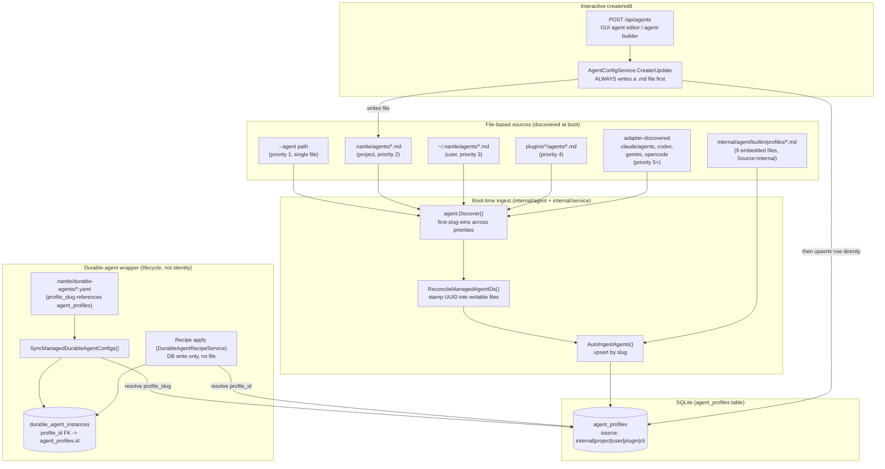

# 01 — Agent Definition & Configuration

## 1. Purpose

This subsystem answers "how does an agent come to exist as a row Nanite can dispatch, chat as, or launch?" Nanite recognizes an "agent" through exactly one canonical runtime table, `agent_profiles` (identity, system prompt, tools, skills, permissions), plus one optional wrapper table, `durable_agent_instances` (runtime/lifecycle metadata for an agent that runs unattended on a schedule or long-lived basis, pointing back at an `agent_profiles` row). Every `agent_profiles` row is produced by one of a small number of producers — embedded Go files compiled into the binary, Markdown files with YAML frontmatter discovered on disk at boot, or a direct API/GUI write — and every producer funnels through the same two choke points: `internal/agent.Discover()` + `AutoIngestAgents()` at boot, or `AgentConfigService` for interactive writes. This document traces those producers, the precedence between them, and where the DB and the filesystem can end up disagreeing. It deliberately does not cover how a defined agent is turned into a running process/session (see `02-boot-process.md`, `03-launch-paths.md`, `09-durable-agents-runtime.md`).

A large source of project confusion is that the same directory name, `.nanite/`, and even the same subdirectory, `.nanite/agents/`, is shared by two unrelated systems in this repo: a **developer-tooling framework** (originally a separate project called "agentrc", absorbed into the Nanite binary and renamed) that lets a human boot a Claude Code session persona for *working on* the Nanite codebase, and Nanite-the-product's **own runtime agent definition pipeline**. Section 6 (Taxonomy note) disambiguates this precisely, including how it differs from Claude Code's own Task/Agent-tool subagents (out of scope entirely).

## 2. Key entry points/files

**File discovery & parsing (`internal/agent/`)**
- `internal/agent/discovery.go:32-97` — `Discover()`: scans 6 tiers in priority order (CLI flag → project `.nanite/agents/` → user `~/.nanite/agents/` → `plugins/*/agents/` → adapter-discovered external formats), first-slug-wins.
- `internal/agent/parser.go:16-102` — `Definition` struct: the typed shape of an agent `.md` file's YAML frontmatter (id, name, slug, model, tools, skills, mcpServers, constraints, toolPermissions, roleTools/roleSkills, contextPolicy, durable, activationMode/class/defaultState, procedures) plus the Markdown body as `SystemPrompt`.
- `internal/agent/parser.go:179-221` — `ParseMD`/`ParseMDFile`: requires the file to start with a `---` YAML frontmatter block; files without one fail to parse (directory scan logs a warning and skips them silently; the `--agent` CLI flag path fails hard).
- `internal/agent/convert.go:34-133` — `Definition.ToProfile()`: maps a parsed `Definition` to `store.AgentProfile`. `CanonicalID()` (line 34) uses the stamped `id:` frontmatter UUID if present, else the deterministic `file-<slug>` identity.
- `internal/agent/source_class.go:14-108` — `ManageClass` (managed / internal / plugin / external) and `Classify()`: the single source of truth for whether the GUI/API may edit an agent in place, based on `agent_profiles.source` + whether its file lives under a configured writable root.
- `internal/agent/managed_files.go:42-178` — `EnsureManagedDirs`/`EnsureManagedConfigDirs` (creates `agents/` and `durable-agents/` subdirs), `WriteManagedAgentProfile` (serializes a profile back to a `.md` file), `InjectFrontmatterID` (stamps a UUID into an unstamped file).
- `internal/agent/adapter.go:12-45` — `CLIAgentAdapter`/`AgentComposer` interfaces used by the priority-5+ "external ecosystem" discovery tier (e.g. `.claude/agents/`, codex/gemini/opencode conventions) — see §6 for why this is easy to confuse with Claude Code's own subagents.
- `internal/agent/builtin/profiles.go:38-118` — `InternalProfiles()`: parses the 9 embedded `.md` files under `internal/agent/builtin/profiles/*.md` (backend, background-job, default, hint-selector, planner, researcher, reviewer, system-architect, worker), stamping `Source="internal"`. Parse failures here are fatal at boot (build-level bug), unlike the silent-skip behavior for on-disk discovery.

**Ingestion & write path (`internal/service/`)**
- `internal/service/container.go:392-471` — boot-time wiring: `EnsureHomeDirs` → `Discover()` → append `InternalProfiles()` + `MuxOrchestratorAgent()` (devmode-only) → `NewClassification` → `ReconcileManagedAgentIDs` → `AutoIngestAgents`.
- `internal/service/ingest.go:24-102` — `AutoIngestAgents()`: upserts every discovered `Definition` into `agent_profiles` by slug; validates `tools`/`roleTools` against the live MCP tool catalog; warns on a hardcoded `model:` field.
- `internal/service/agent_config.go:28-378` — `AgentConfigService`: the single shared write path for GUI/API/CLI agent mutations (`Create`, `Update`, `Delete`, `CopyToManaged`). **`Create` (line 131) always materializes a `.md` file** at `<managedRoot>/agents/<slug>.md` before touching the DB — there is no DB-only agent creation path in this service. `ReconcileManagedAgentIDs` (line 349) stamps UUIDs into writable-but-unstamped files at boot.
- `internal/service/managed_durable_configs.go:24-378` — `ManagedDurableAgentConfig` (the `.nanite/durable-agents/*.yaml` schema), `discoverManagedDurableAgentConfigs` (line 267, scans only the project config root, not the user home), `SyncManagedDurableAgentConfigs`/`syncManagedDurableAgentConfig` (lines 102/156, resolves `profile_slug` against an existing `agent_profiles` row and upserts a `durable_agent_instances` row), `SaveManagedDurableAgentConfig` (line 363, the API-facing write path — always file-backed).
- `internal/service/durable_agent_recipes.go:58-1409` — `DurableAgentRecipe` catalog schema (a *different* YAML/JSON shape from `.nanite/durable-agents/*.yaml`; loaded from `cfg.DurableAgentRecipeCatalogPaths`, not `.nanite/`) and `Apply()` (line 191), which creates a `durable_agent_instances` row **directly via the store, with no YAML file ever written** (see §3, §5).
- `internal/service/durable_agents.go:146-158` — `durableAgentService.Create()` → `store.CreateDurableAgentInstance()`, the DB write both the file-backed and recipe-apply paths ultimately share.
- `internal/agentvalidation/validation.go` — `ValidateAgentConfig()`: blocking/warning validation run by the API create/update handlers before any write.
- `internal/agentregistry/agent_source.go` — unrelated to *importing* agent definitions; this is Nanite *exporting* itself as a resolvable "agent-source" handle in a cross-app registry (`agentlaunch`) so other apps can call back into `agent_source_resolve` and get a live-composed Nanite agent body. One-way, outbound, no body ever leaves via this path except on demand.

**HTTP API surfaces**
- `internal/api/agents.go:15-142` — `handleListAgents`, `handleCreateAgent` (defaults `source="user"` when omitted, rejects `source="internal"` from callers), routes through `AgentConfigService`.
- `internal/api/durable_agents.go:20-96` — `handleCreateDurableAgent` → `saveManagedDurableInstance` → always calls `service.SaveManagedDurableAgentConfig` (file-backed).
- `internal/api/durable_agent_recipes.go:11-115` — list/get/dry-run/apply endpoints over the recipe catalog.
- `internal/api/agent_builder.go` — an LLM-advisor-assisted "propose an agent profile" dry-run/draft/review flow (backs the `.nanite/agents/agent-builder.md` durable agent's own stated job).

**Store / schema**
- `internal/store/agents.go:37-126` — `AgentProfile` Go struct mirroring the `agent_profiles` table (identity, prompt, tools/skills/permissions, FU-28 multi-agent columns `urn`/`activation_mode`/`class`/`default_state`, `durable` flag, ingestion provenance `source`/`source_ref`/`imported_at`/`origin_system`).
- `internal/store/durable_agents.go:12-135` — `DurableAgentInstance` struct and lifecycle/class/status constants; `ProfileID` is the FK back to `agent_profiles.id`.
- `internal/store/migrations/060_internal_profiles_file_sot.sql`, `061_eject_non_internal_agent_profiles.sql`, `072_agent_profiles_durable.sql`, `073_agent_profiles_multi_agent.sql`, `085_agent_boot_plans.sql` — schema evolution for the columns above; see §4/§8 for the boot-time-wipe behavior these encode.
- `internal/store/store.go:67-169` — `migrate()`: there is **no `schema_migrations` tracking table** in this codebase; every `.sql` file under `internal/store/migrations/` re-executes on every process boot (explicitly documented in code comments). This matters directly for agent persistence — see §8.

**Dev-tooling boot system (separate mechanism, not Go code)**
- `.nanite/config.yaml` — the `agents:` block (nanite-backend, nanite-frontend, nanite-plugin-dev, nanite-planner, nanite-reviewer, nanite-reviewer-backend, nanite-reviewer-frontend) consumed only by the CLAUDE.md "Boot `<agent>`" convention, never by Go code.

## 3. Flow

### 3.1 File-based agent_profiles (the common case)

At every process boot (`cmd/nanite/main.go` → `service.NewContainer`), after the DB has already been opened and migrated:

1. `agent.EnsureHomeDirs("")` creates `~/.nanite/agents/` if missing (no-op otherwise).
2. `agent.Discover()` walks, in order: a `--agent <path>` CLI flag (if given, single file, fatal on parse error) → `<workingDir>/.nanite/agents/*.md` (`Source="project"`) → `~/.nanite/agents/*.md` (`Source="user"`) → `plugins/*/agents/*.md` (`Source="plugin"`) → adapter-discovered external-ecosystem files (`.claude/agents/`, codex/gemini/opencode conventions) via `AdapterRegistry.DiscoverAll`. First slug seen wins; a file that fails to parse (e.g. missing frontmatter) is logged and dropped from directory scans.
3. `builtin.InternalProfiles()` appends the 9 embedded profiles (`Source="internal"`), and `builtin.MuxOrchestratorAgent()` conditionally appends one more (devmode builds only).
4. `agent.NewClassification()` builds the writable-root list (project managed config root + user `~/.nanite`).
5. `ReconcileManagedAgentIDs()` stamps a UUID into any writable-but-unstamped file's frontmatter (idempotent; adopts the existing DB row's ID if the slug is already known, else mints one).
6. `AutoIngestAgents()` upserts every `Definition` into `agent_profiles` by slug — this is the *only* place file content becomes DB content. Per-file failures are logged (not fatal); an aggregate error line lists every failed slug.

The DB is the runtime read path from here on: `agentServiceImpl` and the chat engine read `agent_profiles` rows, not files, for everything except a fallback list of file-discovered-but-not-yet-ingested definitions (`FileAgents`, used only to surface "this file exists but failed ingestion" in the GUI).

Interactive creation (GUI "New Agent", `POST /api/agents`, MCP agent-builder) does **not** bypass this: `AgentConfigService.Create()` always writes `<managedRoot>/agents/<slug>.md` to disk first (forcing `Source="user"` on the freshly-written definition, regardless of what the request specified), then immediately re-parses that same file and calls `IngestAgentDefinition` to upsert the DB row. The file is authoritative from the moment of creation onward; the DB row is a projection of it.

### 3.2 Durable-agent YAML (a lifecycle wrapper, not a definition)

`.nanite/durable-agents/*.yaml` (project-config-root only — see §8) does not define an agent's behavior. Each file is a `ManagedDurableAgentConfig`: `name`, `slug`, **`profile_slug`** (must resolve to an *existing* `agent_profiles.slug`), `lifecycle_class` (advisor/process/template/harness), `provider`/`model`/`runtime_kind`, `launch_source_type`/`launch_source_id`, `work_root`, `metadata`, and an optional `schedule` block. `SyncManagedDurableAgentConfigs()` (called from `container.go` *after* the file-based agent ingest pass above, so `profile_slug` lookups can resolve same-boot-created profiles) reads every such file, resolves `profile_slug` → `agent_profiles.id`, and upserts a `durable_agent_instances` row keyed by slug. If a schedule block is present, it also upserts a real `agent_schedules` row. Instances previously synced from a file that has since been deleted are archived (status flips to `archived`), not deleted — but only if they still carry `metadata.managed_source == "managed_file"` (see §3.3 for the case that doesn't).

A separate, unrelated YAML/JSON schema — `DurableAgentRecipe` (`kind`, `inputs`, `injections`, `wake_defaults`) — lives in files pointed to by `cfg.DurableAgentRecipeCatalogPaths` (not `.nanite/`). These are wizard *templates* ("create a project_advisor", "create a managed_cli_harness") that an operator fills in via `POST /api/durable-agent-recipes/:id/apply`; applying one compiles a `DurableAgentInstance` and calls `s.agents.Create()` directly against the store — **no `.nanite/durable-agents/*.yaml` file is ever written for a recipe-applied instance.**

### 3.3 The two durable-agent creation paths diverge in persistence

| Path | Code | Writes a `.nanite/durable-agents/*.yaml` file? | Survives across restarts via |
|---|---|---|---|
| `POST /api/durable-agents` (GUI "New Durable Agent") | `handleCreateDurableAgent` → `saveManagedDurableInstance` → `service.SaveManagedDurableAgentConfig` | Yes, always | File re-discovery + re-sync every boot |
| `POST /api/durable-agent-recipes/:id/apply` | `Apply()` → `s.agents.Create()` → `store.CreateDurableAgentInstance()` | No | The DB row itself — no file, no re-sync, and (because it never gets `metadata.managed_source="managed_file"` stamped) it is also never swept into `archived` status by the missing-file cleanup in `SyncManagedDurableAgentConfigs` |

### 3.4 Mermaid — how the paths relate and merge

### 3.5 Boot-order caveat that governs which rows survive

`cmd/nanite/main.go` calls `store.New()` (line 176) — which internally runs the migration pass, including `061_eject_non_internal_agent_profiles.sql`'s `DELETE FROM agent_profiles WHERE source NOT IN ('internal', 'project')` — **before** `service.NewContainer()` (line 380), which is what runs `Discover()`/`AutoIngestAgents()`. Because there is no migration-tracking table, that DELETE runs on *every single boot*, not just once. See §8 for the consequence this has for "user"-sourced rows.

## 4. Data model touched

| Store | Written by | Read by |
|---|---|---|
| `.nanite/agents/*.md` (project) | Hand-edited; `AgentConfigService.Create/Update/CopyToManaged`; `ReconcileManagedAgentIDs` (UUID stamp only) | `agent.Discover()` at every boot |
| `~/.nanite/agents/*.md` (user) | Hand-edited; `AgentConfigService` when `managedRoot` resolves to the user home | `agent.Discover()` at every boot |
| `internal/agent/builtin/profiles/*.md` (embedded, compiled into the binary) | Only by editing the Go module and rebuilding | `builtin.InternalProfiles()` — a rebuild+restart is the only way to change these; a running binary re-syncs the row's content (not its DB identity) on every boot |
| `.nanite/durable-agents/*.yaml` (project config root only) | Hand-edited; `service.SaveManagedDurableAgentConfig` (API create/update) | `discoverManagedDurableAgentConfigs` → `SyncManagedDurableAgentConfigs`, once per boot, **after** the agent-profile ingest pass |
| `agent_profiles` table | `AutoIngestAgents` (file→DB projection); `AgentConfigService` (interactive create/update, always paired with a file write); migrations 060/061/072/073 (see §8) | Everything else in the runtime — chat engine, dispatch, tool broker, GUI |
| `durable_agent_instances` table | `SyncManagedDurableAgentConfigs` (file-backed path); `DurableAgentRecipeService.Apply()` → `durableAgentService.Create()` (DB-only path, no file) | Durable-agent wake/lifecycle machinery (`09-durable-agents-runtime.md`) |
| `agent_schedules` table | `syncManagedDurableAgentSchedule()`, only when a `.nanite/durable-agents/*.yaml` file carries a `schedule:` block | Wake scheduler (out of scope here) |
| `agent_boot_plans` table (migration 085) | Separate per-agent "plant items"/"callbacks" API surface, keyed by `agent_id` FK into `agent_profiles` | Boot-directory materialization (`02-boot-process.md`) |
| `agent_projects` table | Simple many-to-many association between an `agent_profiles` row and a project entity | Project-scoping queries; **not** itself an agent-definition mechanism despite the name |
| `catalog_sources` table | Remote **plugin marketplace** registry (name/url/type/priority/public key) | Plugin install flow. **Not related to agent definitions** — included here only because the task brief flagged it as a place to check; it governs where *plugins* (which may bundle `agents/*.md`) come from, not agents directly |

**Reconciled row-count context:** the live DB's stated 28 `agent_profiles` rows is consistent with 9 embedded internal profiles + 19 of the 26 files under `.nanite/agents/` that carry YAML frontmatter (see the table in §5) — i.e., every currently-discoverable `internal`- and `project`-sourced definition, and nothing else, which is exactly what migration 061's every-boot DELETE would leave behind (§8).

**Does a file get imported into the DB?** Yes, always, for `agent_profiles` — there is no code path that creates a durable, boot-surviving `agent_profiles` row without a backing file (see §8 for why even the nominally-DB-only `POST /api/agents` path ends up file-backed within one boot cycle). **Does the DB win over files?** No — files are authoritative; `AutoIngestAgents` overwrites the DB row's content fields from the file on every boot ("editing a file under `profiles/` followed by a restart is equivalent to replace the row", per `internal/agent/builtin/profiles.go:1-12`). **Is there duplication?** Yes, by design: the file is the source of truth, the DB row is an indexed runtime projection of it — except for recipe-applied `durable_agent_instances`, which have no file counterpart at all.

## 5. Configuration & manual-setup points

- **Creating a new project-level chat/dispatch agent** requires either (a) hand-authoring a `.md` file with YAML frontmatter under `.nanite/agents/` (no schema validation until the next boot's `AutoIngestAgents` pass, or the API's `agentvalidation.ValidateAgentConfig` if created through the GUI/API instead), or (b) `POST /api/agents` / the GUI editor / the agent-builder advisor flow, all of which materialize the same kind of file under the hood.
- **Turning that profile into a background/scheduled durable agent** is a second, separate, manual step: either hand-author a companion `.nanite/durable-agents/<slug>.yaml` referencing the profile by `profile_slug`, or `POST /api/durable-agents` / apply a recipe through the GUI. Nothing does this automatically from a plain profile.
- **The two-directory-per-tier asymmetry**: `EnsureManagedDirs`/`EnsureManagedConfigDirs` create both an `agents/` and a `durable-agents/` subdirectory under both the user home (`~/.nanite/`) and the project config root — but `discoverManagedDurableAgentConfigs` (`internal/service/managed_durable_configs.go:267-278`) only ever scans the **project** config root's `durable-agents/` directory. A `~/.nanite/durable-agents/*.yaml` file (and `UserManagedDurableAgentPath` exists specifically to build a path into it) is never read by anything at boot.
- **Hardcoded `model:` fields** are actively discouraged (a loud `slog.Warn` fires per profile at every boot, per `internal/agent/parser.go:36-45` and `internal/service/ingest.go:83-87`) but nothing prevents authoring one; several profiles have historically done so and needed manual fixing when the pinned model was retired (per in-repo comments referencing CW-20260815-0021).
- **`roleTools`/`roleSkills` vs `tools:`**: the frontmatter's `roleTools`/`roleSkills` fields only seed the UI's "known tools/skills" display (`agent_known_tools`/`agent_known_skills` rows) — they have zero effect on what the agent can actually call at runtime. The real, enforced allowlist is `tools:` (or `toolPermissions:`). This distinction is easy to miss when hand-authoring a file and is called out explicitly in `.nanite/agents/orchestrator.md`'s own frontmatter comments.
- **`config/agents/` does not exist** in the current repo tree (verified: `config/` currently contains only `broker-skills/`, `think-hints/`, and `nanite.yaml`). It is referenced by an older audit doc (`docs/audits/2026-04-26-foundation/05-m1-agent-catalog-pointer.md`, dated 2026-04-26) as holding `worker.yaml`, and was one of this task's suggested starting points — that content has since been superseded entirely by the embedded `internal/agent/builtin/profiles/*.md` pipeline.
- **`.nanite/config.yaml`'s `agents:` block** (nanite-backend, nanite-frontend, nanite-plugin-dev, nanite-planner, nanite-reviewer*) is a fully separate, hand-maintained YAML list that has nothing to do with `agent_profiles` — see §6.

**`.nanite/agents/*.md` file census (26 files, checked directly against frontmatter presence):**

| File | Frontmatter? | Companion `.nanite/durable-agents/*.yaml`? |
|---|---|---|
| backend.md, frontend.md, planner.md, plugin-dev.md, plugin-dev-tasks.md, reviewer-backend.md, reviewer-frontend.md | No (plain Markdown) | n/a — not a Nanite `Definition` at all |
| agent-builder.md, agridd-project-manager.md, analyst.md, code-auditor.md, conductor.md, file-backend.md, project-manager.md, proxima.md, task-planner.md, torque-supervisor.md, torque-task-writer.md | Yes | No — profile only, dispatchable but not a standing background agent |
| atlas-curator.md, atlas-librarian.md, content-strategist.md, content-writer.md, ideation-partner.md, loom-curator.md, loom-weaver.md, orchestrator.md | Yes | Yes — same slug has a `.nanite/durable-agents/<slug>.yaml` |

## 6. Taxonomy note

There are exactly three ways an agent gets defined **inside Nanite's own product code**, plus one thing that looks related but is not.

1. **File-based `agent_profiles` definitions** — Markdown files with YAML frontmatter, discovered by `internal/agent.Discover()` from (in priority order) a CLI flag, `.nanite/agents/*.md` (project), `~/.nanite/agents/*.md` (user), `plugins/*/agents/*.md`, adapter-discovered external formats, and the compiled-in `internal/agent/builtin/profiles/*.md`. These are ingested into the `agent_profiles` table at every boot and are the source of truth for an agent's identity, system prompt, tools, and permissions.
2. **Durable-agent YAML** — `.nanite/durable-agents/*.yaml`, a thin lifecycle/runtime wrapper (provider, model, runtime kind, launch source, optional schedule) that points at an *existing* file-based definition by `profile_slug`. It never defines behavior on its own; it turns a profile into a standing/schedulable `durable_agent_instances` row.
3. **Database-backed `agent_profiles` rows** — the live SQLite table. In practice this is not a fourth independent mechanism: every row traces back to either an embedded file (source=`internal`) or an on-disk `.md` file (source=`project`/`user`/`plugin`/`cli`) via the same ingest pass. The one clean exception is a `durable_agent_instances` row created via the recipe-apply flow, which is genuinely DB-only (no YAML file), though it still points at a file-backed `agent_profiles` row for its actual persona.

**Adjacent but distinct**: `.nanite/config.yaml`'s `agents:` block and the plain-Markdown files under `.nanite/agents/` that lack YAML frontmatter (backend.md, frontend.md, planner.md, plugin-dev.md, reviewer-backend.md, reviewer-frontend.md) are consumed *only* by a CLAUDE.md prose convention ("If the user says Boot `<agent>`, look up `.nanite/config.yaml`…") that governs how a **human's Claude Code session boots a developer persona for working on the Nanite codebase**. No Go code in this repository reads that block or those files. This system happens to live in the same `.nanite/` directory and share the word "agent" because it was originally a separate framework ("agentrc") that got absorbed wholesale into the Nanite binary and renamed to match — it is not a fourth way to define a *chat-harness* agent, and the two vocabularies collide by directory-naming coincidence, not by design.

**Explicitly out of scope**: the local Claude Code agents/subagents launched via the Task/Agent tool during an interactive Claude Code session (`general-purpose`, `Explore`, `Plan`, `fork`, etc. — the mechanism that produced this very audit document) are an entirely separate concept with **no relationship to Nanite's own agent system**. They are ephemeral, in-process constructs of the Claude Code CLI/SDK itself, defined by Claude Code's own agent-type registry (optionally extended by a project's `.claude/agents/*.md` files), never touch `agent_profiles`, and are not read, written, or launched by any code in this repository. The one place the two vocabularies can textually brush against each other is that Nanite's adapter-discovery tier (`internal/agent/adapter.go`, priority 5+) is *capable* of importing `.claude/agents/*.md`-formatted **files** from a project directory as additional Nanite `agent_profiles` rows — but that is Nanite reading a file format that happens to also be used by Claude Code's own subagent convention, not any interaction with a live Claude Code subagent session.

## 7. Cross-references

- `02-boot-process.md` — how a defined `agent_profiles` row (or a boot-profile catalog entry) is turned into a running CLI subprocess with a populated system prompt and boot directory.
- `03-launch-paths.md` — the full enumeration of ways an agent session gets started (CLI launcher, chat API, scheduler wakes, A2A, Torque-initiated, etc.).
- `09-durable-agents-runtime.md` — what happens *after* a `durable_agent_instances` row exists: wake scheduling, session reuse policy, status state machine. This document covers only how that row gets created and what it points at.
- `05-context-broker-slot-system.md` — likely consumes `agent_profiles.system_prompt`/`context_policy` as slot content once an agent is running; not investigated here.
- `07-tool-calling-mcp.md` — likely the consumer of `agent_profiles.tools`/`tool_permissions`/`role_tools`, and of the `knownTools` validation `AutoIngestAgents` performs against the live MCP catalog.

## 8. Open questions

- **`061_eject_non_internal_agent_profiles.sql`'s comment-vs-code drift.** Migration `072_agent_profiles_durable.sql` states in its comment block: "Migration 061 already wipes source != 'internal' rows on every boot ... and the predicate is now gated on durable = 0" and "The same ALTER also runs idempotently at the top of migration 061." Reading `061_eject_non_internal_agent_profiles.sql` directly, its only statement is `DELETE FROM agent_profiles WHERE source NOT IN ('internal', 'project')` — no `durable` reference and no `ALTER TABLE` appear anywhere in that file. No other migration file modifies this predicate either (grepped across all of `internal/store/migrations/`). As written, the `durable` boolean column and the `Durable` field exposed on `POST /api/agents` do not affect whether a row survives the every-boot DELETE; only `source IN ('internal','project')` does.
- **Why "user"-sourced API-created agents appear to survive restarts anyway.** Given the migration ordering in §3.5 (migrations run before `Discover`/`AutoIngestAgents` on every boot), a row with `source='user'` created via `POST /api/agents` between restarts would be deleted by 061 on the next boot. It appears to survive in practice only because `AgentConfigService.Create` always writes a `.nanite/agents/<slug>.md` file, which `agent.Discover()`'s project tier re-classifies as `source='project'` and re-ingests later in the *same* boot sequence — i.e., persistence is an emergent side effect of where the file lands, not of the `durable` flag or any explicit "keep this row" logic. This was traced through code (`cmd/nanite/main.go` call order, `agent_config.go`'s hardcoded `Source="user"` at write time, `discovery.go`'s `Source="project"` tagging on re-scan) rather than observed against a running database.
- **The `~/.nanite/durable-agents/` directory is created but never read.** `EnsureManagedDirs`/`EnsureManagedConfigDirs` provision it and `UserManagedDurableAgentPath` builds paths into it, but `discoverManagedDurableAgentConfigs` only scans the project config root. Whether this is an intentional "not yet wired up" state or a genuine gap is not discoverable from the code alone.
- **`class`/`lifecycle_class` naming overlap.** `agent_profiles.class` (migration 073, FU-28 "multi-agent foundation": advisor/process/template/harness) and `durable_agent_instances.lifecycle_class` (same four string constants, `DurableAgentClassAdvisor` etc.) use an identical vocabulary on two different tables tied to the same conceptual agent. Nothing in the code inspected enforces or checks that the two stay consistent for a given profile/instance pair.
- **Two divergent durable-agent creation paths with different persistence semantics** (§3.3) are both live in the API surface (`POST /api/durable-agents` vs. recipe-apply) with no visible flag or documentation distinguishing "this one leaves a file behind, this one doesn't" from the caller's perspective.
- **`config/agents/`'s disappearance is undocumented in-repo.** It's referenced by name in this project's own CLAUDE.md-adjacent task briefing and by an April 2026 audit doc, but no migration note or changelog entry explaining its removal/supersession by `internal/agent/builtin/profiles/` was found during this pass.
- **Silent-skip on malformed `.nanite/agents/*.md` files.** A file dropped into `.nanite/agents/` without YAML frontmatter (or with malformed frontmatter) is silently excluded from the agent registry with only a `slog.Warn` — there is no GUI-visible error surfaced for this case unless someone is watching server logs at boot.
