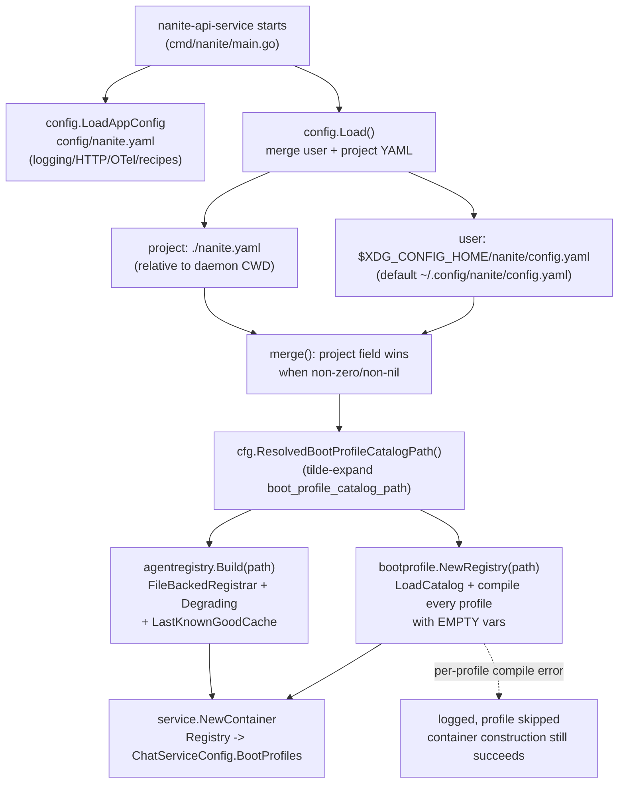
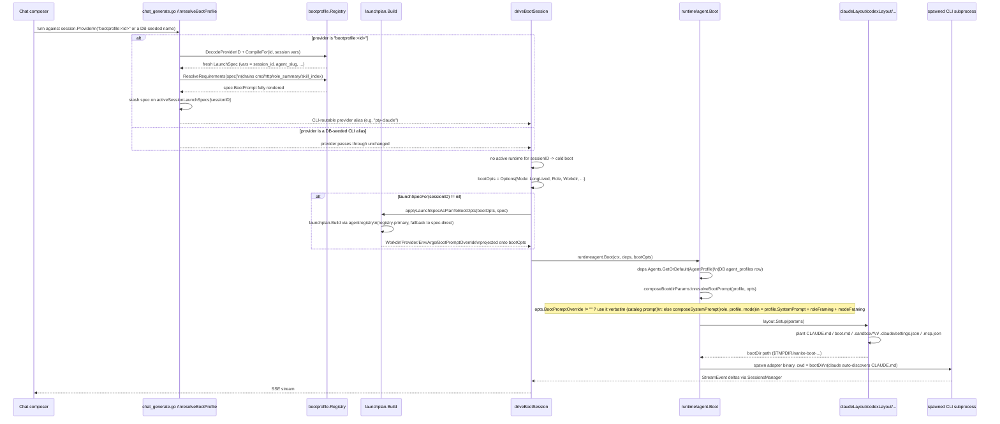

# 02 — The Boot Process

## 1. Purpose

"Booting" in Nanite means turning an agent definition (a DB-seeded `agent_profiles` row, optionally paired with a file-based "boot profile" catalog entry) into a running CLI subprocess (`claude` / `codex` / `opencode`) with a populated system prompt and an ephemeral working directory on disk. There are two boot prompt sources that converge on one spawn mechanism: (a) the **default path**, which composes a system prompt from the DB agent profile's `SystemPrompt` field plus role/mode framing, used for every CLI-backed chat session; and (b) the **boot-profile catalog path**, an optional, file-backed override system that compiles a richer, multi-section prompt from operator-authored YAML (or GUI-authored "meta harnesses") and substitutes it in wholesale. Both paths terminate in the same `agent.Boot` call, which materializes a per-session boot directory (`CLAUDE.md`, `.claude/settings.json`, `.mcp.json`, etc.) and spawns the CLI process against it. This document also separately notes a same-named-but-unrelated convention: this repository's own `.nanite/` directory and `boot-prompt.md` file, which is tooling for structuring *human-operator* Claude Code sessions working on the Nanite codebase — not part of the product being audited.

## 2. Key entry points/files

**Config loading**
- `internal/config/config.go` — `Config` struct, `Load()` / `LoadFrom()`, user+project YAML merge (`merge()`), `~` expansion helpers.
- `internal/config/layout.go` — XDG on-disk layout resolution (`ResolveLayout`) via `go-apppaths`.
- `internal/config/appconfig.go` — separate `AppConfig` (from `config/nanite.yaml`) for HTTP/OTel/logging/artifacts/recipe-catalog tunables.

**Boot-profile catalog (compile-time)**
- `internal/bootprofile/profile.go` — `Profile` / `Launch` / `SlotSource` / `Catalog` YAML schema.
- `internal/bootprofile/loader.go` — `LoadCatalog`, per-file `LoadProfile` / `LoadLaunch`, validation.
- `internal/bootprofile/compiler.go` — `Compile`, `LaunchSpec`, `renderDefaultPrompt` (the default 7-ish-section prompt template).
- `internal/bootprofile/registry.go` — `Registry` (cache of compiled `LaunchSpec`s), `EncodeProviderID`/`DecodeProviderID` (`bootprofile:<id>`), `CompileFor` (session-scoped recompile).
- `internal/bootprofile/requirements.go` + `agentcontext_adapter.go` — deferred-slot (`cmd`/`http`/`role_summary`/`skill_index`) resolution via the shared `agentkit/agentcontext/resolvers` package.

**Chat-runtime hookup (per-turn)**
- `internal/service/chat_bootprofile_resolve.go` — `resolveBootProfile` (decode provider id → `CompileFor` → `ResolveRequirements` → stash spec).
- `internal/service/chat_boot_drive.go` — `driveBootSession` (the actual boot/turn driver), `applyLaunchSpecToBootOpts` (legacy direct overlay), `applyLaunchSpecAsPlanToBootOpts` (live path, routes through `launchplan.Build`).
- `internal/service/chat_bootprofile_recovery.go` — `recoveryPreBootHook`, re-resolves against the *current* catalog on crash-recovery relaunch.
- `internal/launchplan/launchplan.go` — `Build`, the shared plan-assembly seam (`agentlaunch.PlanFromLaunch`) used by both the chat path and the standalone `nanite launch` CLI.
- `internal/agentregistry/registry.go` — `Registry`/`Build`, the shared "directory registrar" for runtime-binding resolution (degrades to spec defaults when absent/unreachable).

**Runtime spawn**
- `internal/runtime/agent/agent.go` — `Boot`, `Options`, `effectiveProvider`.
- `internal/runtime/agent/prompt.go` — `composeSystemPrompt`, `resolveBootPrompt`, `ResolveSystemPrompt`, `roleFraming`, `modeFraming`.
- `internal/runtime/agent/bootdir.go` — `Layout` interface, `composeBootdirParams`.
- `internal/runtime/agent/bootdir_claude.go` (+ `bootdir_codex.go`, `bootdir_opencode.go`) — per-provider file-planting shape.

**Operator/GUI authoring surface**
- `internal/api/meta_harnesses.go` — `GET/POST/PUT/DELETE /api/meta-harnesses`, writes catalog YAML + calls `Registry.Reload()`.
- `ui/src/components/settings/MetaHarnessManager.tsx` — Settings-page UI for the above.
- `internal/api/providers.go` — surfaces compiled `LaunchSpec`s as `bootprofile:<id>` rows in the provider/model dropdown.

**Dead/parallel surfaces**
- `internal/store/agent_boot_plans.go` + `internal/api/agent_boot_plans.go` — a separate, fully-built "plant items + callbacks" CRUD API and DB table (`agent_boot_plans`, migration `085_agent_boot_plans.sql`) that is **not wired into any boot path** (see §7).
- `.nanite/config.yaml`, `.nanite/boot-prompt.md` — unrelated meta-dev-session convention (see §7).

**Existing doc**
- `docs/boot-profile-cli-harness.md` — prior operator-facing writeup of the catalog system. Largely accurate on mechanics; some claims are now stale (see §7).

## 3. Flow

### 3a. Startup: config load and catalog compile

Notes on this stage:
- `internal/config.Config` fields (`Role`, `BootProfiles []string`, `WritePaths`, `ProtectedPaths`, `HooksDir`, `Defaults.BootProfiles`) are parsed and merged but — apart from `Role` being logged once at startup — **none of them are read anywhere else in the codebase** (verified by grep). The only config field that actually drives the boot-profile system is `BootProfileCatalogPath` / `WorkflowDefinitionsPath` / `DevToolsAllowedPaths` / `Vanta` / `Executor`.
- `bootprofile.NewRegistry` and `agentregistry.Build` both read the **same** `boot_profile_catalog_path` directory but for different purposes: the former compiles the Nanite-specific `Profile`+`Launch` YAML into `LaunchSpec`s (prompt content); the latter builds a generic runtime-binding registrar from the external `agentkit/agentlaunch` module (resolves which "runner" binding to use, with a spec-default fallback — it does not touch prompt content).
- A missing/empty catalog path is explicitly "inert" at every layer (`Catalog.IsEmpty`, `Registry.IsEmpty`, `agentregistry` inert mode) — no error, the dropdown just shows only DB-seeded providers.

### 3b. Per-turn boot: from provider selection to a running process

Key mechanics behind the diagram:

- **`resolveBootPrompt` is the single override hook** (`internal/runtime/agent/prompt.go`) shared by all three provider layouts (claude/codex/opencode). `Options.BootPromptOverride` — set only when a boot-profile `LaunchSpec` is in play — wins verbatim over the role/mode-composed default. This means a catalog-authored profile *replaces*, not appends to, the DB agent profile's `SystemPrompt`.
- **Claude specifically never receives the prompt over stdin.** For the streaming-stdio runtime, `agent.Boot` deliberately clears `BootPrompt`/`BootMode` before calling `SessionsManager.Start` (raw prompt text on stdin would break claude's NDJSON parser) — the prompt only reaches the agent by being planted into `<bootDir>/CLAUDE.md`, which claude auto-loads from its spawn cwd.
- **`applyLaunchSpecAsPlanToBootOpts` is the live code path** (not the older `applyLaunchSpecToBootOpts`, which now only runs as its internal fallback when `launchplan.Build` errors). It converts the compiled `bootprofile.LaunchSpec` into a shared `agentlaunch.LaunchPlan` via the external `agentkit/agentlaunch` module, resolving the runtime binding (which CLI runner to use) through the shared `agentregistry.Registry` with an explicit fallback to the spec's own provider when the registry has no entry or is unreachable. `Env`, `Args`, and `BootPrompt` are documented as intentionally NOT registry-resolvable and are always taken from the spec directly, "byte-identical" to the pre-Phase-F overlay.
- **Mid-session slot regen**: if the assembled slot set changes between turns (`slotsChangedFor`), `regenerateBootDirSlots` rewrites `CLAUDE.md`/`agent-context.md` in place and sends a re-read instruction, using the same `ResolveSystemPrompt` resolution (override-first) so a regenerated prompt doesn't silently drop the catalog content.
- **Crash recovery** (`recoveryPreBootHook`, `chat_bootprofile_recovery.go`) re-derives the `LaunchSpec` from the registry's *current* cached catalog (not a snapshot from the original boot) before every broker-dispatched relaunch, then calls the same `applyLaunchSpecAsPlanToBootOpts` helper used on first boot. A profile deleted from the catalog while a session is live makes the next recovery attempt fail permanently (`ErrProfileNotFound`); the broker escalates and the session is not self-healing.

## 4. Data model touched

| Store | What | Notes |
|---|---|---|
| `~/.config/nanite/config.yaml` (or `$XDG_CONFIG_HOME/nanite/config.yaml`) | user-level `Config` YAML | base layer of the merge |
| `./nanite.yaml` (relative to the daemon's CWD) | project-level `Config` YAML | overlay layer; only non-zero/non-nil fields override |
| `config/nanite.yaml` | `AppConfig` (separate schema — logging/HTTP/OTel/artifacts/recipes) | loaded independently of `config.Load()` |
| `<boot_profile_catalog_path>/boot-profiles/*.yaml` | `bootprofile.Profile` | identity + slots; catalog-keyed by `id` |
| `<boot_profile_catalog_path>/launches/*.yaml` | `bootprofile.Launch` | provider/workdir/env/args/boot_mode; catalog-keyed by `id` |
| `<boot_profile_catalog_path>/<any file>` | static-slot source content | referenced by `static` slot `path:`, resolved relative to the catalog root |
| `agent_profiles` (SQLite, via `internal/store`) | DB agent profile row (`SystemPrompt`, `DefaultProvider`, `Slug`, `Name`, `Description`) | consumed by the default (non-catalog) prompt path; also the fallback identity `agent.Boot` resolves via `deps.Agents.GetOrDefault` even when a catalog spec is in play |
| `sessions.provider` column | either a DB-seeded provider name or the encoded `bootprofile:<id>` string | the load-bearing routing pin for both normal dispatch and crash recovery; rewriting it outside the documented restart path desyncs recovery routing (per `docs/boot-profile-cli-harness.md`) |
| `agent_boot_plans` table (migration `085_agent_boot_plans.sql`) | plant-items + callbacks document, versioned per `agent_id` | **not consumed by any boot code path** — see §7 |
| `$TMPDIR/nanite-boot-<provider>-<sessionID>-r<runID>-XXXXXX/` | ephemeral per-session boot dir (`CLAUDE.md`, `boot.md`, `.sandbox/*`, `.claude/settings.json`, `.mcp.json`) | planted by `Layout.Setup`/`Populate`, cleaned up on stop/failure |
| `.nanite/config.yaml`, `.nanite/boot-prompt.md` | agent-role definitions + session-state note for **this repo's own dev-session tooling** | not part of the product's runtime boot path — see §7 |

## 5. Configuration & manual-setup points

Concrete, hand-authored or operator-driven setup this system requires:

1. **`boot_profile_catalog_path` must be set** in either `~/.config/nanite/config.yaml` or `./nanite.yaml` for the entire boot-profile feature to activate at all — otherwise it's structurally inert (dropdown shows only DB-seeded providers, `resolveBootProfile` short-circuits). Requires a `nanite-api` restart to pick up a newly-set path (no config hot-reload).
2. **Catalog directory layout is hand-rolled per the doc's schema**: `<root>/boot-profiles/<id>.yaml` + `<root>/launches/<id>.yaml`, one file per entry, matched by shared `id`. Duplicate IDs across the whole catalog abort the load.
3. **Two authoring paths exist for catalog entries**, not just hand-editing YAML:
   - Direct file edit under the catalog root (full schema access: `slots` map including `static`/`cmd`/`http`/`role_summary`/`skill_index`, `template`, `mcp_servers`).
   - `GET/POST/PUT/DELETE /api/meta-harnesses` (backed by `internal/api/meta_harnesses.go`, surfaced in the Settings page as `MetaHarnessManager.tsx`) — writes profile+launch YAML into the same catalog root and calls `Registry.Reload()` in-process (**no restart needed** for this path). The GUI form only exposes identity/launch fields (id, display name, provider, workdir, role, project, work_root, tracking_root, boot_mode, args, env, mcp_servers) and auto-stamps a minimal single-line `agent` text slot (`"You are {{lineage_alias}}.\n"`) — it cannot author `static`/`cmd`/`http`/`role_summary`/`skill_index` slots or a multi-section prompt. Richer prompts still require hand-editing the YAML file the API wrote.
4. **`{{var}}` substitution is strict** — an unresolved variable aborts the compile with the missing name(s). Authors must know the identity/profile-inline/session-scoped variable taxonomy (`docs/boot-profile-cli-harness.md` §"Variable substitution").
5. **Dropdown visibility requires vars-free slot bodies.** `Registry.Reload` compiles every profile with empty caller vars to populate the dropdown; a profile whose slot text references a session-only var (e.g. `{{session_id}}`) will compile fine per-session but silently never appear in the dropdown.
6. **`cmd`/`http`/`role_summary`/`skill_index` slots require external resources to exist at boot time** (a script on `$PATH`, a reachable HTTP endpoint, a role markdown file, a skill directory) — a resolver failure aborts the boot with a pointed per-slot error.
7. **Catalog reload after a manual YAML edit** (bypassing the meta-harness API) has no dedicated HTTP route today; an operator must either trigger it indirectly through the meta-harness endpoints (which call `Reload()` as a side effect of any write) or restart `nanite-api`.
8. **The default (non-catalog) boot path also needs a DB `agent_profiles` row** — `agent.Boot` always calls `deps.Agents.GetOrDefault(opts.AgentProfile)` regardless of whether a catalog spec is present; a catalog profile only overrides the *prompt content*, not the underlying agent-profile lookup.
9. **Two runtime-config artifacts under the CI's/operator's own control are unrelated to this system**: `.nanite/config.yaml` (agent/role/skill definitions for *human-operator* Claude Code sessions against this repo, via the `Boot <agent>` convention in `CLAUDE.md`) and `.nanite/boot-prompt.md` (a short hand-generated/skill-generated session-continuity note, refreshed via the `boot-prompt` skill). These are meta-development tooling, not part of the Nanite product's runtime.

## 6. Cross-references

- **01-agent-definition-and-config** — the sibling doc for how `agent_profiles` rows and agent identity are defined; this doc assumes that model and focuses on how it's *turned into a running process*. The two boot inputs (DB `agent_profiles.SystemPrompt` vs. catalog `LaunchSpec.BootPrompt`) are complementary, not alternatives — `effectiveProvider`/`GetOrDefault` always resolve a DB profile even when a catalog override wins the prompt content.
- **launch-paths** — likely covers the standalone `nanite launch` CLI subcommand (`cmd/nanite/launch_cmd.go`, `internal/launcher/launcher.go`), which shares the `launchplan.Build` seam with the chat boot-profile path (Phase F unification) but is a distinct process entry point. Also likely covers durable-agent launches, which record `boot_profile` as one of six `launch_source_type` enum values (`api_chat`, `cli_harness`, `boot_profile`, `durable_advisor`, `process_tick`, `task_template_run`) in migrations `080`–`082` — provenance tagging, not a separate boot mechanism this doc did not trace further.
- **chat-engine-orchestration** — `driveBootSession` is the CLI counterpart to the streaming-provider chat loop; this doc covers only its boot/cold-start branch, not per-turn `SendInput`/streaming mechanics beyond what's needed to show where the boot prompt lands.
- **context-broker-slot-system** — the `SlotAssemblyResult` / `slotsChangedFor` machinery referenced in `driveBootSession`'s mid-session regen branch is that subsystem's territory; this doc treats it as an external trigger for `regenerateBootDirSlots`.

## 7. Open questions

- **`agent_boot_plans` appears to be dead infrastructure.** A full DB table (migration `085`), store layer (`internal/store/agent_boot_plans.go`), and HTTP CRUD + dry-run-preview API (`internal/api/agent_boot_plans.go`, `GET/PUT/DELETE /api/agents/{id}/boot-plan`, `POST .../dry-run`) exist for a "plant items + callbacks" model that is structurally similar in *intent* to the boot-profile catalog's slot system, but grep across the whole runtime path (`agent.Boot`, `composeBootdirParams`, `Layout.Setup`, `driveBootSession`, `bootprofile.*`) turns up zero consumers of `GetAgentBootPlan`/plant items/callbacks. Combined with the task brief's note that the table has 0 rows in the live DB, this reads as a shipped-but-unwired feature; unclear whether it's mid-migration toward replacing the catalog system, an abandoned parallel design, or waiting on a not-yet-written consumer.
- **Several `internal/config.Config` fields are parsed and merged but apparently never read elsewhere**: `Role` (logged once, nothing branches on it), `BootProfiles []string` and `Defaults.BootProfiles []string` (distinct from the unrelated `ChatServiceConfig.BootProfiles *bootprofile.Registry` field that happens to share a name), `WritePaths`, `ProtectedPaths`, `HooksDir`. Whether these are forward-looking placeholders, remnants of a removed feature, or genuinely wired somewhere this search missed is not resolved here.
- **`docs/boot-profile-cli-harness.md` is stale in at least two places verified against current code:**
  1. It states `cmd`/`http`/`role_summary`/`skill_index` slot sources are "Stubbed" and surface `ErrRequirementUnsupported` (both in the main doc and in `examples/boot-profiles/README.md`). Current code (`internal/bootprofile/agentcontext_adapter.go`, dated CW-20260515-0026) wires all four through real shared resolvers (`resolvers.NewCmdResolver`, `HTTPTextResolver`/`HTTPJSONResolver`, `RoleSummaryResolver`, `SkillIndexResolver`); `ErrRequirementUnsupported` is now reserved for a genuinely unrecognized `Type` string, not the four listed kinds.
  2. It states the applied-overlay is `applyLaunchSpecToBootOpts` and that catalog-reload-after-edit requires restarting `nanite-api` (used as the smoke-test manual procedure). Current code's live path is `applyLaunchSpecAsPlanToBootOpts` (the S5 Phase F launch-plan seam), and the meta-harness HTTP API (`/api/meta-harnesses`) reloads the registry in-process without a restart — though that route only covers profiles it created/edited itself, so a raw hand-edited YAML file still has no dedicated reload endpoint.
- **A doc-comment / code mismatch inside `chat_bootprofile_recovery.go`**: the function-level comment above `recoveryPreBootHook` (lines ~53–54) says it "applies the fresh LaunchSpec via `applyLaunchSpecToBootOpts`," but the function body (line ~140) actually calls `s.applyLaunchSpecAsPlanToBootOpts`, with an inline comment there explicitly noting it's "the same helper the normal-boot path uses (S5 Phase F)." The behavior is internally consistent (both boot and recovery use the Phase F helper); only the higher-level docstring lagged the refactor.
- **Two same-catalog-root registries with different failure semantics.** `bootprofile.Registry` treats a per-profile compile failure as "skip that profile, keep the rest" (best-effort). `agentregistry.Registry` is described as degrading to a "last-known-good cache" on registrar unreachability. Both read the identical `boot_profile_catalog_path`, but it was not verified in this pass whether a catalog edit that breaks one (e.g. a YAML syntax error) is guaranteed to leave the other in a *consistent* state relative to it, since they are two separate ingestion codepaths (`LoadCatalog` vs. whatever `agentregistry.Build`'s `FileBackedRegistrar` walks).
- **Vocabulary collision between two unrelated "boot" systems.** This repository is both the *product* (Nanite, the chat harness) and a project developed *using* a same-named "nanite" meta-tooling convention (`.nanite/config.yaml` agent/role/skill definitions, the `Boot <agent>` phrase in `CLAUDE.md`, and the `boot-prompt` skill that regenerates `.nanite/boot-prompt.md`). These share terminology ("boot," "agent," "config.yaml") with the product's own boot-profile catalog system but are structurally and operationally unconnected — one boots a human operator's Claude Code coding session against this repo; the other boots a headless CLI subprocess inside the running product. `.nanite/boot-prompt.md`'s content (dated 2026-05-26, referencing PR #220 and specific ticket IDs) is itself stale relative to the current session date, which is expected for a manually-refreshed continuity note but worth flagging since the task brief pointed at this file as a "boot" convention to examine.
