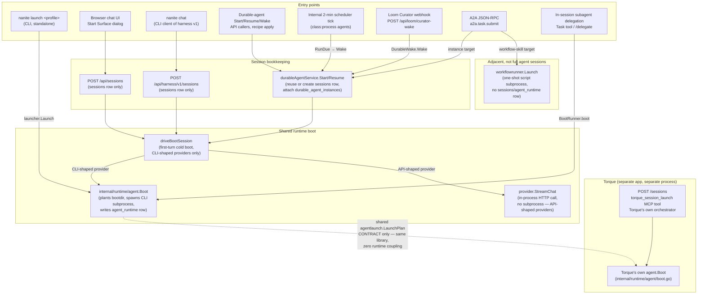

# Launch Paths — How a Nanite Agent Session Actually Starts

> **Correction (2026-08-17, post-review):** "PTY" below describes the CLI-wrapped subprocess path loosely. No real pseudo-terminal is allocated in production — see `06-provider-llm-roundtrip.md`'s correction note for the full detail.

## 1. Purpose

Nanite is agent-agnostic infrastructure for running coding-agent CLIs (Claude, Codex, OpenCode) and API-backed chat sessions under a shared harness — chat history, tool broker, MCP integration, envelopes. Over time, several independent ways to *start* an agent session have accumulated: a CLI subcommand, a chat-server HTTP API, a headless CLI client of that API, scheduler-driven "durable agent" wakes, an external callback webhook, an A2A protocol front door, and in-session subagent delegation. A sibling app, Torque, also launches Claude/Codex/OpenCode agents on its own initiative, using the same low-level launch libraries Nanite uses — this document traces exactly how far that sibling relationship goes, since it turns out to be narrower than "Torque launches Nanite agents" suggests. This document enumerates every distinct entry point as it exists today, traces where each one converges (or doesn't) on Nanite's shared runtime boot mechanism, and records the data/state each path touches. It does not evaluate whether this is the right number of entry points or recommend consolidating any of them.

## 2. Enumeration of launch paths

### 2.1 `nanite launch <profile-id>` — standalone CLI launcher

- **Trigger:** An operator (or CI) runs `nanite launch <profile-id>` from a shell.
- **Code:** `cmd/nanite/launch_cmd.go` (`cmdLaunch`) → `internal/launcher` (`launcher.Plan` / `launcher.Launch`) → `internal/runtime/agent.Boot`.
- **What it does:** Loads a boot-profile catalog (`--catalog` flag or agentrc `boot_profile_catalog_path`), compiles the profile through the same `internal/bootprofile` compiler the chat server uses, resolves deferred slots, projects the result onto the shared `agentlaunch.LaunchPlan` vocabulary (`internal/launcher/planbridge.go`), validates it, and calls `agent.Boot` directly.
- **Session result:** A foreground (or `--no-wait` background) OS process running a CLI provider (claude/codex/opencode), with its own `agent_runtime` row. **No `nanite serve` process is required** — this launcher opens its own SQLite store connection. `--dry-run` compiles and validates only, without opening a store or starting anything.
- **Documented explicitly** (`docs/standalone-launcher.md`) as an *additional*, non-replacing path: "Nanite's primary launch path — the chat runtime's boot-profile dropdown — is unchanged."

### 2.2 Browser chat UI — session create + first-turn cold boot

- **Trigger:** A user opens the Nanite web UI, picks a workspace/agent/provider (including a `bootprofile:<id>` row) in the "Start Surface" dialog, and sends the first message.
- **Code:** `POST /api/sessions` (`internal/api/sessions.go:handleCreateSession`) creates a `sessions` row only — no process starts yet. The first user turn goes through `POST /api/messages` → chat generation (`internal/service/chat.go:launchGeneration`) → on the first turn, if the resolved provider is CLI-shaped (`chat.IsCLIProvider`), `internal/service/chat_boot_drive.go:driveBootSession` calls `runtimeagent.Boot` (same `agent.Boot` as §2.1). If the provider is a plain HTTP/API provider (Anthropic/OpenAI API), no subprocess is booted at all — the LLM is called in-process via `provider.StreamChat`.
- **Boot-profile-catalog variant:** Selecting a `bootprofile:<id>` row is *not* a separate endpoint — it's the same `POST /api/sessions` call with `provider` set to `"bootprofile:<id>"`. On first turn, `chatServiceImpl.resolveBootProfile` compiles the profile, stashes a `bootprofile.LaunchSpec` keyed by session ID, and `driveBootSession` projects it onto `runtimeagent.Options` via `applyLaunchSpecAsPlanToBootOpts` (which itself builds and validates an `agentlaunch.LaunchPlan` — the same shared plan type §2.1 produces). See `docs/boot-profile-cli-harness.md` for the full compile pipeline.
- **Session result:** A `sessions` row plus, for CLI providers, a long-lived CLI-wrapped subprocess (structured stream-json over pipes, not a real PTY) and `agent_runtime` row; for API providers, no subprocess — just chat rows.

### 2.3 `nanite chat` — CLI client of the same HTTP control plane

- **Trigger:** An operator runs `nanite chat --workspace <id> [--agent ...]` from a shell.
- **Code:** `cmd/nanite/chat_cmd.go` (`cmdChat`). Auto-starts `nanite serve` if not already running (`ensureServeRunning`, unless `--no-autostart`), then talks to it exactly like any other client of the **GUI-agnostic control plane** at `POST /api/harness/v1/sessions` (`internal/api/harness_v1.go:handleHarnessV1CreateSession`) and `POST /api/harness/v1/sessions/{id}/turns`.
- **What differs from §2.2:** `handleHarnessV1CreateSession` explicitly rejects `runtime_kind`, `work_root`, and `durable_agent_id` on session create — those must go through the durable-agent endpoints (§2.4) instead. Otherwise this converges on the identical first-turn cold-boot path as §2.2 (`driveBootSession` → `agent.Boot`), because it is fundamentally the same session/message/generation pipeline, just reached over a documented v1 API instead of the browser's ad hoc `/api/sessions` + `/api/messages` pair.
- **Session result:** Same as §2.2 — a `sessions` row, and (for CLI providers) a subprocess — but driven from a terminal REPL instead of the browser, and requires a running `nanite serve` (auto-started if absent).

### 2.4 Durable-agent Start / Resume / Wake — API-triggered

- **Trigger:** Any caller of `POST /api/durable-agents/{id}/start`, `/resume`, or `/wake` (also mirrored under `/api/harness/v1/durable-agents/{id}/...`). In practice this is reached by: an operator action in the UI, applying a durable-agent recipe (`POST /api/durable-agent-recipes/{id}/apply` → `Create` + optional immediate `Start`), or an external caller. Note: `/start-request` and `/resume-request` are a *different*, smaller operation — `durableAgentService.RequestStart`/`RequestResume` (`internal/service/durable_agents.go:496,589` — `RequestResume` does call through to the real `Resume`, but `RequestStart` only flips `status` to `start_requested` and stops; see §7) — not full launches by themselves.
- **Code:** `internal/api/durable_agents.go` → `internal/service/durable_agents.go` (`durableAgentService.Start` / `Resume`). Resolves a `DurableAgentLaunchPolicy` from the instance's `lifecycle_class` (advisor/process/template/harness), reuses or creates a `sessions` row per the resolved `SessionPolicy` (`reuse_latest_or_create` / `fresh_per_wake` / `fresh_one_shot` / `reuse_managed`), attaches it to the `durable_agent_instances` row, and — if `WakePayload.Prompt` is non-empty — delivers it as a real user turn via `ChatService.HandleMessage` (the same first-turn path as §2.2/2.3).
- **Session result:** A `sessions` row (new or reused) that then cold-boots exactly like §2.2 on its first delivered turn, if the instance's runtime kind is CLI-shaped; a plain API call otherwise. `durable_agent_instances.status` transitions `sleeping → starting → active`.

### 2.5 Durable-agent Wake — internal scheduler tick (`class:process` agents)

- **Trigger:** An in-process goroutine ticker started inside `nanite serve` itself (`cmd/nanite/main.go`, `lc.Go("durable-agent-wake-tick", ...)`), firing every 2 minutes.
- **Code:** Calls `container.DurableWake.RunDue(ctx, ...)` (`internal/service/durable_wake.go:RunDue`) in-process — lists `class:process`/`class:template` instances, checks each against its `agent_schedules` row (cron or one-shot) for due-ness, and calls the same `Wake` → `durableAgentService.Start` path as §2.4 for anything due.
- **Also externally triggerable:** `GET /api/durable-agent-wake/due` (inspect) and `POST /api/durable-agent-wake/run-due` (force a pass) exist as API endpoints — the code comment in `durable_agent_wake.go` notes the internal ticker was added later because the mechanism "previously had no internal ticker and depended entirely on an external caller."
- **Session result:** Same convergence as §2.4 — a fresh (`fresh_per_wake`) session per tick for process-class agents (e.g. a nightly Atlas Curator run).

### 2.6 Loom Curator callback wake — external webhook from Fragments Engine

- **Trigger:** Fragments Engine's `CallbackDestinationExecutor` POSTs a `{generator, fragment}` payload to a fixed Nanite URL on a matched ingest route, fire-and-forget.
- **Code:** `POST /api/loom/curator-wake` (`internal/api/loom_curator_wake.go:handleLoomCuratorWake`). This is a **purpose-built decode target**, distinct from the generic `POST /api/durable-agents/{id}/wake` (§2.4), because FE's payload shape (`{generator, fragment:{...}}`) doesn't match the generic `DurableAgentStartRequest` shape — pointing FE at the generic endpoint would silently drop every field. It resolves the fixed `loom-curator` instance by slug, renders the fragment identity into prompt text (`buildLoomCuratorWakePrompt`), and calls the same `DurableWake.Wake` as §2.4/2.5.
- **Session result:** Same convergence — a `durable_agent_instances`-scoped session wake.

### 2.7 A2A JSON-RPC — external agent-to-agent protocol front door

- **Trigger:** An external A2A-protocol client POSTs `a2a.task.submit` to `POST /api/a2a/jsonrpc`.
- **Code:** `internal/api/a2a_jsonrpc.go:handleTaskSubmit` → `internal/service/a2a_task_manager.go:TaskManager.SubmitTask`. The `TaskManager` doc comment states explicitly it "does NOT create a third parallel execution substrate" — it classifies the task's `target` and routes to exactly one of two existing paths: `WorkflowLauncher.Launch` (a workflow-skill target — see §2.9) or `DurableWake.Wake` (a `msg://agent/<authority>/<id>` instance target — §2.4/2.5). It also writes its own `a2a_tasks` bookkeeping row.
- **Session result:** Whatever the routed-to path produces; A2A itself is a protocol adapter, not an independent boot mechanism. Per the code's own comment, this endpoint is not yet spec-verified against the live A2A spec and has no external client today (CW-20260814-0016 finding, still open as of this writing).

### 2.8 In-session subagent delegation (`Task`/delegate)

- **Trigger:** A running agent (in any session from §2.2–2.6) calls its delegate/subagent tool, or a caller hits `POST /api/sessions/{id}/delegate` / `/delegate-aggregate`.
- **Code:** `internal/api/messages.go:handleDelegateTask` → the `subagent` service → `internal/service/subagent_runner_boot.go:BootRunner.Run` → `BootRunner.boot` → `runtimeagent.Boot` (same `agent.Boot` as every other CLI-shaped path). `BootRunner.createChildSession` creates a **child** `sessions` row (or a `subagent_runs` row, per the existing subagent-run tracking) linked to the parent session.
- **Session result:** A nested/child agent process, tracked with `parent_session_id` on its `agent_runtime` row (per the schema comment in migration `050_agent_runtime.sql`) so it's distinguishable from a top-level launch.

### 2.9 Workflow-runner launch — external script process (LangGraph/CrewAI-style), boundary case

- **Trigger:** `POST /api/workflows/runs` (`handleRunWorkflow`), or an A2A task routed to a workflow-skill target (§2.7).
- **Code:** `internal/workflowrunner/launch.go:Launch`. The package's own header comment states this is "deliberately its own launch path, NOT a reuse of `internal/runtime/agent.Boot`" — it spawns a one-shot external script process (Python LangGraph/CrewAI, or a stand-in test script) that calls back into Nanite via `workflow_execute_llm_step` / `workflow_execute_tool_step` / `workflow_verify_step` MCP tools, rather than booting a CLAUDE.md-injected coding-agent boot directory.
- **Session result:** An OS subprocess with its own `.mcp.json` and input file, tracked as a `workflow run` (not a `sessions` row, not an `agent_runtime` row) — included here as a boundary case because it is launched by Nanite and is agent-shaped in spirit, but is explicitly *not* the same "Nanite agent session" the other eight paths converge on.

### 2.10 Torque-orchestrated launch — a parallel runtime, not a call into Nanite

- **What this actually is, per direct inspection of the Torque repository (`/Users/chrispian/dev/hollis-labs/apps/torque`):** Torque does **not** invoke Nanite's HTTP API, shell out to the `nanite` binary, or import any Nanite Go package. `grep`ing the entire Torque `internal/` tree for `hollis-labs/nanite`, a Nanite port/URL, or `nanite launch`/`nanite serve` invocations returns nothing in non-test code, and Torque's `go.mod` has no dependency on the `nanite` module at all. Torque instead has its **own, independent, parallel agent-boot runtime** — `internal/runtime/agent/boot.go` (`agent.Boot`, doc comment: "the unified entry point for spawning an agent session... Replaces cliexec.Run + sessionmgr.Manager.Launch + the planstart SendInput dance") — built on the **same shared low-level libraries** Nanite also depends on: `github.com/hollis-labs/agentkit/agentlaunch/{launcher,providerplant,sessionshim}` and `github.com/hollis-labs/go-providers/provider` (the same CLI-adapter library that ultimately spawns Claude/Codex/OpenCode processes for Nanite too). Torque's own `internal/launchprofile` package doc is explicit about the boundary: "The package is Torque-native — it does not bolt Tether/Nanite catalogs into Torque."
- **Confirmed first-hand in Torque's own engineering notes** (`artifacts/CW-20260517-0038/fix-plan.md`): "Torque dispatches agents through `internal/runtime/agent/Boot` → go-agent-launch → a single `claude`/`codex`/`opencode` subprocess. Torque has no notion of mux subagents... The nanite/mux `subagent_spawn` parent-ID requirement is an **external constraint** that does not apply to torque-orchestrated runs." This is Torque's own team documenting, for their own operators, that agents launched inside a Torque run should not assume Nanite-shaped IDs or Nanite runtime semantics.
- **Triggers on the Torque side** (all converge on the same `agent.Boot`, per `internal/runtime/agent/manager.go`'s comment "Launch from Manager onto the package-level `agent.Boot()` entry point"):
  - `POST /sessions` on Torque's own HTTP server (`internal/httpserver/sessions.go:launchSession`) — an operator or external caller starts a Torque-managed agent session directly.
  - An MCP tool, `torque_session_launch` (`internal/mcpadapter/session_tools.go`), exposed on Torque's MCP server — this is the same tool visible as `mcp__mux__torque_session_launch` to any MCP client (including, in principle, an agent running inside a Nanite session that has the Torque/mux MCP server configured) that wants to start a Torque-managed agent remotely.
  - Torque's own sequential plan-execution orchestrator (`internal/orchestrator/orchestrator.go`, "V0... hands the resolved values to `agent.Manager.Boot`") — Torque's task/sprint system launching worker agents on its own initiative as it walks a plan.
- **What "same shared contract" means in practice:** per `docs/phase6-shared-launch-adoption.md` (Nanite-side), "Both apps validate against the same `agentlaunch.LaunchPlan` contract, so a plan that validates for Torque validates for Nanite" — but this is a **format/validation compatibility statement**, not a runtime call relationship. Torque assembles its own `LaunchPlan` (`internal/runtime/agent/launchplan.go`) from its own `LaunchProfile`/`TaskLaunchOverlay` model and runs it through Torque's own `launcher.Compile`/`launcher.Prepare`/`providerplant.Plant` (the shared bootdir planter Nanite's own runtime deliberately does **not** use — see §5). The two apps are siblings that independently consume the same agent-launch ecosystem libraries, not a parent/child orchestration pair.
- **Session result:** A CLI-provider subprocess (claude/codex/opencode) spawned and supervised entirely by Torque's own process, tracked in Torque's own `sqlstore` persistence — never a row in Nanite's `sessions`, `durable_agent_instances`, or `agent_runtime` tables, and not visible to `nanite serve` at all.

## 3. Flow

Note: Torque is drawn as a separate subgraph, not converging into Nanite's `agent.Boot`, because it doesn't — see §2.10. The dotted line is a shared-library/contract relationship (both apps independently build and validate `agentlaunch.LaunchPlan` values), not a call graph edge.

## 4. Data model touched

| Launch path | `sessions` | `durable_agent_instances` / `durable_agent_instance_sessions` | `agent_runtime` (+ checkpoints) | `subagent_runs` | `a2a_tasks` | Process-level state |
|---|---|---|---|---|---|---|
| `nanite launch` (§2.1) | — | — | Yes (`id`, `pid`, `mode`, `provider`, `state` lifecycle `launching→running→done/failed/orphaned`) | — | — | Foreground/background OS process; own SQLite connection |
| Browser UI create+turn (§2.2) | Yes (created on `POST /api/sessions`) | — (unless durable) | Yes, only for CLI-shaped providers | — | — | CLI-wrapped subprocess for CLI providers (not a real PTY); none for API providers |
| `nanite chat` (§2.3) | Yes (via harness v1) | — | Yes, only for CLI-shaped providers | — | — | Same as §2.2, reached via `nanite serve`'s HTTP API |
| Durable-agent Start/Resume/Wake (§2.4) | Yes (reused or created per `SessionPolicy`) | Yes — instance row transitions `sleeping→starting→active`; session attached via `durable_agent_instance_sessions` with a `relation` (`primary`/`wake`/`run`/`harness`) | Yes, if resulting session cold-boots a CLI provider | — | — | Same as §2.2 downstream |
| Scheduler tick wake (§2.5) | Yes (`fresh_per_wake`) | Yes, same as §2.4; also reads/writes `agent_schedules` (`last_fired_at`, `fired_count`) | Same as §2.4 | — | — | Same as §2.2 downstream |
| Loom Curator webhook (§2.6) | Yes | Yes, resolved by fixed `slug: loom-curator` | Same as §2.4 | — | — | Same as §2.2 downstream |
| A2A JSON-RPC (§2.7) | Indirect, via routed path | Indirect, via routed path (instance targets) | Indirect | — | Yes — `a2a_tasks` bookkeeping row per submission | Indirect |
| Subagent delegation (§2.8) | Yes (child session) | — | Yes, with `parent_session_id` set | Yes (`subagent_runs` tracks the run/approval lifecycle) | — | Nested subprocess |
| Workflow-runner (§2.9) | — | — | — | — | — (unless reached via A2A) | One-shot external script subprocess, not a Nanite `agent_runtime` row |
| Torque-orchestrated launch (§2.10) | **None** — never touches Nanite's DB | **None** | **None** | — | — | Subprocess supervised entirely by Torque's own process, tracked in Torque's own `sqlstore`, not Nanite's |

`durable_agent_events` (an audit-log table, `internal/service/durable_agents.go`'s `recordEvent`) is written on essentially every state transition across §2.4–2.6, independent of the table above.

## 5. Configuration & manual-setup points

- **Boot-profile catalog root** (`boot_profile_catalog_path` in agentrc config, `internal/config/config.go`) is the single config knob shared by §2.1 (`nanite launch --catalog`, defaults to this) and §2.2 (dropdown surfacing via `internal/bootprofile`). A catalog is a directory of `boot-profiles/<id>.yaml` + `launches/<id>.yaml` pairs (see `examples/boot-profiles/`).
- **Meta-harness CRUD** (`GET/POST/PUT/DELETE /api/meta-harnesses`, `internal/api/meta_harnesses.go`) is an operator-facing UI for authoring those same catalog YAML files through the API instead of hand-editing them on disk — it is configuration tooling for §2.1/§2.2, not a launch path of its own.
- **Loom Curator's webhook target is hardcoded to a fixed slug** (`loomCuratorInstanceSlug = "loom-curator"`, `internal/api/loom_curator_wake.go`) and a hardcoded workspace id (`loomCuratorWakeWorkspaceID = "default"`, justified by the single-workspace consolidation migration `087_consolidate_personal_workspace.sql`). Every new external-webhook-triggered durable agent following this pattern needs its own purpose-built decode handler and route, by the file's own admission — the generic `/api/durable-agents/{id}/wake` endpoint can't accept an arbitrary caller's payload shape.
- **The durable-agent scheduler tick is hardcoded at a 2-minute interval** inside `cmd/nanite/main.go`, chosen (per its comment) to "match stale-worker-reaper's cadence" — not independently configurable per-agent or per-schedule beyond the cron/one-shot spec on each `agent_schedules` row.
- **A2A method names are self-described as unverified** against the live A2A spec (`internal/api/a2a_jsonrpc.go` comment, CW-20260814-0016) — the endpoint exists and routes correctly today, but "no external A2A client consumes this endpoint yet."
- **The standalone launcher (`nanite launch`) deliberately does not use `providerplant.Plant`** (the shared `go-agent-launch` bootdir planter) — `docs/standalone-launcher.md` explains Nanite's bootdir content (envelope schema, agent-context doc, subprocess-spawn MCP descriptor) diverges byte-for-byte from what that shared planter renders, so Nanite's own per-provider `Layout` implementations plant instead, riding only the shared path-safety primitives. This is the same divergence noted for Torque in §2.10 — both apps consume the shared `agentlaunch` library at different layers, by explicit design.

## 6. Cross-references

- **Boot-process** (sibling doc, prompt-compilation internals: how `CLAUDE.md` / agent-context / slot content gets assembled) — this document deliberately stayed on the "what triggers a launch and what process starts" side of the line; see that doc for `bootprofile.Compile`, `ResolveRequirements`, and slot assembly internals referenced only by name above (§2.2, §2.6).
- **Durable-agents-runtime** (sibling doc) — owns the full `durable_agent_instances` lifecycle state machine (`sleeping/starting/active/paused/.../archived`), `lifecycle_class` semantics (`advisor`/`process`/`template`/`harness`), and `SessionPolicy` behavior only summarized here (§2.4–2.6).
- **Agent-definition-and-config** (sibling doc) — owns `agent_profiles`, boot-profile YAML schema, and the recipe system (`durable_agent_recipes`) whose `apply` action is one of the triggers folded into §2.4.

## 7. Open questions

- **"Torque orchestrates launching Nanite agents remotely" does not match what the code does.** The framing that motivated this audit subsystem assumes Torque reaches into Nanite's runtime. Direct inspection (§2.10) shows the opposite: Torque runs its own complete, independent copy of the agent-boot pipeline (own `agent.Boot`, own `LaunchProfile`/`LaunchPlan` assembly, own session store), sharing only low-level libraries (`agentkit`, `go-providers`) with Nanite — not Nanite's process, API, database, or `agent_runtime`/`sessions` rows. Torque's own fix-plan doc for a related integration bug states this outright: "Torque has no notion of mux subagents... The nanite/mux `subagent_spawn` parent-ID requirement is an external constraint that does not apply to torque-orchestrated runs." Whether the "Torque launches Nanite agents" mental model exists because an earlier version of the system worked that way, because of the shared branding/vocabulary (both call it "agent launch," both produce a Claude/Codex/OpenCode subprocess), or because a different, not-yet-built integration is planned, is not stated anywhere found in either repo — it reads as a plausible but currently inaccurate assumption about the architecture.
- **How many of these launch paths are actually independent, versus front doors onto the same two or three underlying mechanisms?** By code-level inspection, essentially everything that results in a full "Nanite agent session" converges on exactly two primitives: `internal/runtime/agent.Boot` (for CLI-shaped providers) and `provider.StreamChat` (for API-shaped providers) — reached via either a `sessions` row + first-turn cold boot, or a `durable_agent_instances` row + `Start`/`Resume`. The *proliferation* is in the number of distinct triggers and HTTP/CLI/webhook surfaces that lead into those two convergence points, not in the number of runtime mechanisms.
- **The generic durable-agent wake endpoint (`POST /api/durable-agents/{id}/wake`) cannot serve an arbitrary external caller's payload shape**, per `loom_curator_wake.go`'s own doc comment — each new external system that wants to wake a durable agent apparently needs a purpose-built decode handler + fixed route (as Loom Curator got). Whether this is meant to be the durable pattern for future integrations, or whether the generic endpoint was under-specified, isn't stated anywhere in the code.
- **The durable-agent wake system had a documented bug window**: the CW-20260817 code comment in `loom_curator_wake.go` states the callback wake was "reported done" in an earlier ticket but never actually delivered a real agent turn (only `Facts`, not `Prompt`, was populated) until a later fix. A second, separately documented bug (also CW-20260817, in `durable_wake.go`'s `wakeSkipReason` comment) meant `class:process` agents (Loom Curator, Atlas Curator, Torque Supervisor) were wakeable exactly once ever, because nothing ever transitioned `status` back out of `active`. Both are described as fixed in the current code, but their existence suggests this subsystem's wake semantics were exercised for the first time fairly recently and are still being hardened.
- **A2A JSON-RPC method names are explicitly unverified against the live spec** and have no consuming client yet — it's a launch path that exists in code and is routed to real execution paths, but its production-readiness as an *external* entry point is an open question the code itself raises.
- **`RequestStart` and `RequestResume` are asymmetric.** `RequestResume` (`internal/service/durable_agents.go:589`) calls straight through to the real `Resume` — it's a same-behavior alias reached via a different route. `RequestStart` (`internal/service/durable_agents.go:496`) only sets `durable_agent_instances.status` to `start_requested` and returns — nothing else in the codebase was found that later transitions a `start_requested` instance into an actual `Start` call. `wakeSkipReason` (`durable_wake.go`) does treat `start_requested` as "already active" (blocking a concurrent wake), so the flag has *some* downstream read effect, but no writer was found that turns the flag into a real launch. Whether an external caller (an operator UI action, or Torque) is expected to follow up with the real `/start` call, or whether this is a vestigial half-wired endpoint, isn't stated in the code.
- **Tether** is referenced in `docs/phase6-shared-launch-adoption.md` and `docs/standalone-launcher.md` as a third orchestrator ("Tether-managed launch") alongside Torque, described as building its own `agentlaunch.LaunchPlan` to hand to Nanite, with its own Phase 4 shared-launch adoption "in review" at time of writing. This document did not investigate Tether's side of that relationship — only Torque was in scope per the assignment — so it's unclear whether Tether is a live, exercised launch path today or a designed-but-not-yet-adopted one.
- **The workflow-runner path (§2.9) and the A2A protocol (§2.7) both explicitly say, in their own code comments, that they are NOT new parallel execution substrates** — but they exist as distinct packages with distinct process-spawn code (`workflowrunner.Launch` uses `os/exec` directly rather than `agent.Boot`). Whether "not a new substrate" (in the sense of "routes to an existing path") is the same claim as "not a new launch mechanism" (in the sense of "no new code that spawns a process") is worth noting as a real distinction this audit surfaced, not a contradiction — A2A truly does route to one of two existing paths, while workflow-runner is a third, smaller, intentionally-separate spawn mechanism that happens to share no data model with the other two.
