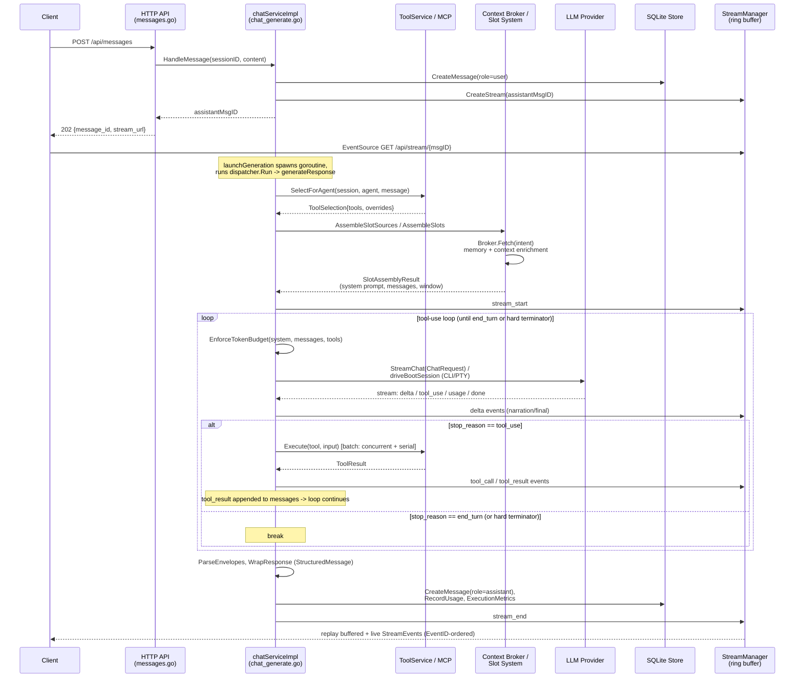

# Chat Engine Orchestration

> **Correction (2026-08-17, post-review):** "PTY" below describes the CLI-wrapped subprocess path loosely. No real pseudo-terminal is allocated in production — see `06-provider-llm-roundtrip.md`'s correction note for the full detail. The `IsCLIProvider`/`IsPTYProvider` string-matching functions described in §5 are real and accurately described (they do pattern-match on `pty`-prefixed provider-name strings) — what's inaccurate is treating "PTY" as a description of the runtime mechanism rather than a legacy naming convention.

## 1. Purpose

Once a session exists and a message arrives, something has to actually run the conversation: assemble the prompt, call the model, interpret what comes back, execute any tools the model asked for, feed the results back in, decide when to stop, and persist/stream the result. That "something" is the chat engine — in practice `chatServiceImpl.generateResponse` in `internal/service/chat_generate.go`, a ~2,000-line function that is the single place every turn (interactive chat, LLM-triggered subagent, REST-triggered delegation, or a durable agent's scheduled wake) ultimately runs through. `internal/chat/` (the package explicitly called out in `CLAUDE.md` as "orchestration, context, delegation") is **not** a second engine — it is a passive helper library: typed request/response shapes, envelope parsing/validation, the slash-command registry, the per-turn slot-source builder that the engine calls into, tool-list partitioning, and a handful of pure string-formatting helpers (universal rules block, sanitization, structured-message wrapping). Every actual decision — when to stop, which tools to run, when to call the provider, what to persist — is made in `internal/service`, not `internal/chat`.

## 2. Key entry points/files

- `internal/api/messages.go:14` — `handleSendMessage`, the HTTP entry point (`POST` → `a.Services.Chat.HandleMessage`); returns `202 {message_id, stream_url}` immediately, before generation runs.
- `internal/service/chat.go:727` — `chatServiceImpl.HandleMessage`: persists the user message, allocates the assistant message ID + SSE stream, fires the `message.sent` plugin hook, then hands off.
- `internal/service/chat.go:621` — `launchGeneration`: builds a cancellable context, registers it in the `inFlightGen`/`activeGen` registry (a new message to the same session cancels the prior generation — "session takeover"), and spawns a goroutine.
- `internal/service/chat.go:642` — `runGeneration`: the goroutine body; calls `s.dispatcher.Run(genCtx, dispatcher.Request{...}, ch)`, the single "dispatcher door" (CW-20260512-0121) shared by chat, subagent, delegation, and durable-agent-wake callers alike.
- `internal/service/chat_dispatcher_runner.go` — `chatRunnerAdapter`/`newChatRunnerAdapter`: the glue that lets `internal/dispatcher`'s generic runner call the unexported `chatServiceImpl.generateResponse` from outside the `service` package.
- `internal/service/chat_generate.go:124` — `generateResponse`, the actual turn loop.
- `internal/service/chat_loop_state.go` — `loopState`, `shouldStop`, `resolveIterationLimits`, `checkSoftMaxTurnsWarning` — loop bounds and termination logic.
- `internal/service/chat_tool_executor.go` — `preCheckTools`, `executeToolBatch`, `executeSingleTool`, `postProcessToolResults` — the tool-call handling inside each loop iteration.
- `internal/service/chat_strategy.go` — `planStrategyForTurn`: pre-loop soft turn-budget planning.
- `internal/service/chat_broker_dispatch.go` — `attemptBrokerDispatch`: pre-loop agent-broker routing consultation.
- `internal/service/chat_route_dispatch.go` — `attemptRouteDispatch`: pre-loop classifier-driven dispatch-executor consultation.
- `internal/service/chat_reflexes.go` — `evaluateAndInjectReflexes`: turn-start DB-backed reflex evaluation.
- `internal/service/chat_subagent_inbox.go` — `evaluateAndInjectSubagentResults`: turn-start delivery of queued subagent results.
- `internal/service/delegation.go` — `DelegateTask`/`DelegateAndAggregate`: explicit REST-triggered delegation (separate from the LLM's own `subagent_spawn` tool).
- `internal/service/subagent_runner.go:228` — `ChatRunner.Run`: the LLM-triggered subagent path (child session, same `generateResponse`).
- `internal/service/durable_agents.go`, `internal/service/durable_agent_runtime_controller.go` — durable-agent lifecycle wrapper; a "wake" is a synthetic `HandleMessage` call through the identical path.
- `internal/service/container.go:352` — `NewContainer`: the single DI constructor that wires every dependency `generateResponse` uses.
- `internal/chat/context_client.go` — `ContextClient.AssembleSlotSources`, `EnforceTokenBudget`: the context-assembly handoff and the token-budget gate, called by the service layer.
- `internal/chat/tool_partition.go`, `internal/chat/envelope.go`, `internal/chat/structured.go`, `internal/chat/commands.go`, `internal/chat/universal_rules.go`, `internal/chat/sanitize.go` — passive helpers consumed by the service layer (tool essential/lazy split, envelope block parsing, assistant-message wrapper, slash commands, the position-0 universal-rules content, tool-error redaction).

## 3. Flow

### 3.1 Request in, generation kicked off (synchronous, fast)

A client `POST`s to the message endpoint. `handleSendMessage` (`internal/api/messages.go:14`) decodes the request, parses an `effort` scalar into the request context, and calls `ChatService.HandleMessage(ctx, sessionID, content)`. `HandleMessage` (`chat.go:727`) persists the user turn as a `store.Message` row, allocates an assistant message ID, calls `StreamManager.CreateStream(assistantMsgID, sessionID)` to open the SSE ring buffer for that message, fires the `message.sent` plugin hook, and calls `launchGeneration`. `launchGeneration` builds a cancellable `context.WithCancel`, registers `(sessionID, ctx, cancel)` in the in-flight-generation registry (a second `HandleMessage` call for the same session cancels the first — this is also how a subagent's own generation gets its own independent entry), and spawns `runGeneration` as a goroutine via the process lifecycle manager. `HandleMessage` then returns the assistant message ID synchronously; the HTTP handler responds `202 {message_id, stream_url}` **before generation has produced any output** — the client is expected to open an `EventSource` against `stream_url` to receive the turn as it happens.

### 3.2 Pre-loop setup

`runGeneration` calls `s.dispatcher.Run(genCtx, dispatcher.Request{...}, ch)`, which — via `chatRunnerAdapter` — invokes `generateResponse(ctx, sessionID, assistantMsgID, userContent, ch)`. This single function is also the destination for delegation, subagent, and durable-agent-wake callers (§3.5), distinguished only by a `CallerType` tag threaded through the dispatcher request. Before the tool-use loop starts, `generateResponse` does, in order:

1. **Session/agent/mode resolution** — loads the session, then `agentServiceImpl.resolveForSession` resolves the effective `*store.AgentProfile` + `*store.AgentMode` (session binding → user-settings default → fallback agent; profile lookup by file-based ID or DB row; model/provider override cascade; reject if `agent.Status == "disabled"`). `chat.ParseAgentConstraints(agent.Constraints)` parses the per-agent JSON blob into the loop's turn/idle/fail-cap bounds (§3.4).
2. **Model/provider resolution** — `session.Model` → `agent.DefaultModel` → `store.ResolveProviderAndModel`; provider name resolved via boot-profile decoding and `chat.InferProvider`. CLI/PTY-aliased providers (`chat.IsCLIProvider`) are flagged here and take a different call site later in the loop (§3.3).
3. **Tool-calling/MCP handoff (selection)** — `s.tools.SelectForAgent(ctx, sessionID, agentID, userContent, workspaceID, contextWindowSize)` (`ToolService`, `internal/service/tool.go:56`) returns a `*ToolSelection{Tools, OverrideBlock, Progressive, Catalog}`. `ToolService` itself wraps `toolclient.ToolClient` and `internal/mcp.Manager` — the engine only sees the selection contract, not MCP transport details. Session-mode tool overrides (`internal/service/mode_tool_overrides.go`) and, if `NANITE_TOOLS_LAZY_LOAD=true`, `chat.PartitionTools` (essential-vs-lazy split, `internal/chat/tool_partition.go`) are applied on top of the selection.
4. **Context-broker/slot-system handoff** — `s.assembleTurnContext` calls `s.context.AssembleSlots(...)`, which itself calls `chat.ContextClient.AssembleSlotSources` (`internal/chat/context_client.go:141`). This builds a `SlotSources` struct sourcing 13 named content regions (Universal, System, Memory, Agent, Mode, Rules, Permissions, Workspace, Session, Context, UserContext, plus the Tools slot filled in by the service layer and the Conversation/Messages slot) — including its own handoff at `context_client.go:243`, `cb.ContextBroker.Fetch(ctx, intent)` into `internal/contextbroker.Broker`, for Memory/Context enrichment. The service layer then composes these into a `Window` following the fixed `internal/context.SlotOrder` (14 slots total, `internal/context/slot.go:102`), each with a SHA-256 cache key so the provider can place `cache_control` markers at slot boundaries. The result is a `*SlotAssemblyResult{Messages, SystemPrompt, Window, Blocks, ToolCache}`.
5. **Turn-start context injection** — `s.evaluateAndInjectReflexes` (reflex handoff, §3.6), the reminder engine, and `s.evaluateAndInjectSubagentResults` (delivery of any queued `kind=subagent_result` inbox messages left by a completed subagent, §3.5) can all mutate `SlotUserContext` and force a slot-window rebuild.
6. `stream_start` is emitted on the SSE channel; presence is broadcast; `s.enforceBudgetOrCompact` runs the pre-loop token-budget gate/compaction.
7. **Classification and routing (no LLM call)** — `classifyAndAttach` (`internal/classify` package) derives `ScopeTier`, `ExecutionPattern`, and a `RouteDecision` from the message + tool availability. `s.attemptBrokerDispatch` (`chat_broker_dispatch.go:183`) then consults an external deterministic broker (`agentkit/broker`) and logs the decision; `s.attemptRouteDispatch` (`chat_route_dispatch.go:81`) separately consults the classifier's route and may invoke a `dispatch.DispatchExecutor`. Both are explicitly documented in their own source comments as **informative, not prohibitive** — neither one currently prevents the main loop below from running (see §7).
8. **Strategy planning** — `planStrategyForTurn` (`chat_strategy.go:51`) matches the input against a static reflex catalog (`promptrouter.BuiltinReflexes()`/`Match`, a *different* "reflex" concept than step 5's DB-backed reflex engine — see §7) and sets a soft per-turn `MaxTurns` hint, logged to `strategy_decisions`.

### 3.3 The tool-use loop

`for ls.iteration = 0; ; ls.iteration++` (`chat_generate.go:802`). Each iteration:

- Checks `ls.checkSoftMaxTurnsWarning()` (telemetry/SSE only — never stops the loop) and `ls.shouldStop()` (the actual hard terminators, §3.4); a stop optionally runs one final no-tools LLM call (`earlyStopSynthesis`) before emitting a `chat-loop-terminated` envelope and breaking.
- Runs `chat.EnforceTokenBudget(systemPrompt, messages, tools, ceiling)` (`internal/chat/context_client.go:790`) — a four-step reduction cascade (prune old tool results → drop trailing tools → drop oldest messages → refuse) that runs before every provider call, not just the first.
- **Provider/LLM-round-trip handoff** — if `chat.IsCLIProvider(providerName)`, calls `s.driveBootSession(...)` (`chat_boot_drive.go`), which routes into the external CLI/PTY agent-runtime subsystem instead of a direct HTTP call. Otherwise calls `prov.StreamChat(provCtx, llmtypes.ChatRequest{SystemPrompt, SlotBlocks, Messages, Model, Tools, CacheHints})` on the `llmcontracts.Provider` interface. Both return the same `<-chan llmtypes.StreamEvent` shape and are consumed by one identical `streamLoop` `select` (`chat_generate.go:1351`) switching on `delta`/`tool_use`/`usage`/`thinking`/`error`/`done`.
- **Loop-continuation decision**: once the stream closes, `if stopReason != "tool_use" || len(toolUseBlocks) == 0 { break }` — any stop reason other than `tool_use` with at least one tool-use block ends the loop. This is the entire branching logic; there is no separate boolean flag.
- **Tool-calling/MCP handoff (execution)** — `s.preCheckTools` (permission/blocked/concurrency-safety pre-check) produces `[]toolPlan`; `s.executeToolBatch` (`chat_tool_executor.go:340`) fans concurrent-safe tools out over a `sync.WaitGroup` and runs serial-only tools sequentially; `s.executeSingleTool` (`:453`) is the actual dispatch point — a handful of meta/scratchpad tool names (`request_tools`, `fetch_tool_result`, `search_tool_result`, `scratchpad_write/read/clear`) are handled in-process, bypassing MCP entirely (`internal/service/chat_scratchpad.go:14`); everything else goes through `s.tools.Execute(toolCtx, agentID, name, input)` (`ToolService`, wrapping `toolclient`/`internal/mcp.Manager` — the tool-calling/MCP handoff). `s.postProcessToolResults` runs stuck-loop detection (`internal/loopdetect`), output truncation, and envelope capture.
- Tool results are appended as a `user`-role `ChatMessage` with `tool_result` content blocks and the loop re-enters — this append **is** the continuation mechanism feeding the next provider call.
- Sad paths: a provider-stream error is classified via `ctxpkg.IsCompactRecoverable` — recoverable errors (context overflow, rate-budget refusal) trigger `s.recoverFromContextOverflow` (drop enrichment slot → summarize oldest history → strip tool blocks, up to 2 attempts) or `pauseAndMaybeRetryRateBudget` (`chat_rate_budget_pause.go:131` — auto-retries once, then ends the turn cleanly with a `user_action_needed` signal rather than a fatal error); non-recoverable errors and idle-timeout stalls call one of several `persistPartialAssistant*` variants (`chat_generate.go`, several call sites) so a failed turn still leaves a durable message row; an open Anthropic circuit breaker (`internal/llm/anthropic`) emits `circuit_open` and breaks.

### 3.4 Termination — the only mechanisms that actually stop the loop

`chat_loop_state.go` defines four independent bounds, all parsed from `AgentConstraints` (`internal/chat/engine.go:13`) with hardcoded defaults, and clamped/overridden by the strategy planner:

| Bound | Default | Behavior |
|---|---|---|
| `RunawayFailCap` | 10 | **Hard.** Consecutive tool failures/denials → stop, run `earlyStopSynthesis`, emit `chat-loop-terminated`. |
| `HardCeiling` | 200 | **Hard.** Absolute iteration count backstop. |
| `IdleTimeoutSeconds` | 900 (300 for subagent callers) | **Hard.** No provider/tool activity for this long → stop, persist partial. |
| natural `stop_reason == "end_turn"` | n/a | Clean completion. |
| `MaxTurns` | 75 | **Soft.** Crossing it fires a one-time `chat-loop-budget-soft-warning` (devmode-gated SSE; always logged) — the loop keeps running. |
| `ConsecutiveFailCap` | 3 | **Soft.** Drives a `tool_warning` SSE at `level=critical` — does not stop the loop. Clamped so `RunawayFailCap >= ConsecutiveFailCap`. |

Code comments note that a prior per-call wall-clock deadline and a per-agent `MaxTimeSeconds` field were both deliberately removed after they caused a distinct "0 seconds" bug class; the bounds above are the complete replacement set.

### 3.5 Delegation and subagent handoffs (durable-agents-runtime boundary)

Three structurally distinct "run another agent" surfaces exist, and all three converge on the same `generateResponse` via the shared dispatcher door rather than a separate execution engine:

- **Explicit REST delegation** — `DelegateTask`/`DelegateAndAggregate` (`internal/service/delegation.go`), reachable via `POST /api/sessions/{id}/delegate` and used internally by `internal/worker.Manager`. Creates a worker `store.Session` tagged `{"delegation":true, "parent_session_id":...}`, posts the task as a user message, calls `s.dispatcher.Run(ctx, dispatcher.Request{..., CallerType: CallerSubagent}, ch)`, and **synchronously drains the returned channel itself** (a `select` loop capped at 5 minutes) — the calling HTTP request blocks for the full worker turn. `DelegateAndAggregate` additionally calls `internal/chat.Orchestrator.Decomposer.DecomposeTask` (`delegation.go:248`) — a dedicated LLM call that decides whether to split a message into parallel sub-tasks before delegating each one.
- **LLM-triggered subagent** — the model calls the `subagent_spawn` tool; `subagent_runner.go:228` (`ChatRunner.Run`) resolves the role to an `*store.AgentProfile`, creates a child session, registers path-grant lineage, posts the prompt, and drives one turn via the same dispatcher path — but drains the stream itself into a `subagent.Result`, running two subagent-only safety checks (`detectFabrication`: tools ran, none succeeded, yet non-empty narrative text; `zeroOutputRun`: nothing emitted at all → stalled).
- **Durable agents** — `internal/service/durable_agents.go` is a lifecycle/scheduling wrapper (state machine: Sleeping/Starting/Active/Paused/Stopped/Failed) with no execution engine of its own: a wake calls `DurableAgentRuntimeController.SendMessage`, whose only production implementation (`durable_agent_runtime_controller.go:8`) forwards straight to `ChatService.HandleMessage` — "the same path a human's chat message takes."

A completed subagent's result reaches its parent through `AgentConstraints.SubagentCompletionPolicy` (`internal/chat/engine.go:45`, values `render_and_wait`/`auto_summarize`/`batch`), resolved per-call via a cascade (session-metadata override → agent-profile default → global default `render_and_wait`) and enforced by `subagent_reactor.go`'s `ReactToCompletion`: only `auto_summarize` proactively calls `chat.TriggerHarnessTurn` to kick a fresh parent turn immediately; the other policies rely on `evaluateAndInjectSubagentResults` (§3.2 step 5) picking up the queued `agent_messages` row at the start of whatever turn runs next.

### 3.6 Reflex handoff

`s.evaluateAndInjectReflexes` (`chat_reflexes.go:14`) is called once, turn-start, before the tool-use loop. It evaluates a DB-backed condition→action rule engine (`internal/agent/reflexes`) and can inject reminder text or a tool-choice nudge into `SlotUserContext`, forcing a system-prompt rebuild. One action kind (`halt_session`) bypasses this injection path entirely and calls `store.MarkSessionHalted` directly. This is a distinct mechanism from the `promptrouter` reflex catalog consulted by the strategy planner and broker-dispatch layers (§3.2 steps 7–8) — see §7.

### 3.7 Post-loop and output

Once the loop breaks, `generateResponse` assembles `finalContent`, applies output/plugin filters, parses `nanite-envelope` fenced blocks (`chat.ParseEnvelopes`), creates `EnvelopeInstance` rows for interactive card types only, wraps the result via `chat.WrapResponse` into a `StructuredMessage`, persists the assistant `store.Message` row, records `token_usage`/`execution_metrics`, emits `stream_end`, and fires `EmitResponseComplete` plus async `autoTitle`/`autoTags` goroutines. The SSE channel closes but the ring buffer is retained for a 60-second reconnect grace window (§4).

### 3.8 Sequence diagram

## 4. Data model touched

- **`sessions`** (`internal/store/migrations/001_schema.sql:83`) — read for resolution; `last_activity`/`message_count` bump on message create. Compaction fields are owned by the context/compaction subsystem, not the turn loop directly.
- **`messages`** (`001_schema.sql:123`) — the engine's primary write target: one `CreateMessage` for the inbound user turn (`HandleMessage`) and one for the completed assistant turn (end of `generateResponse`), read via `ListMessages`/paginated variants for context assembly. The schema's `role` `CHECK` constraint originally listed only `user|assistant|system|tool`; `chat.RoleEnvelopeResponse` ("envelope_response") is a fifth logical role value stored in the same column, added by rebuilding the constraint in migration `008_messages_envelope_response_role.sql` rather than by a typed/versioned role field.
- **Streaming deltas are never persisted as rows.** They exist only in `StreamManager`'s in-memory, per-message ring buffer (`internal/service/stream.go`, capacity 256 events, `EventID`-keyed) until the producer channel closes; the buffer is then retained for a 60-second grace window (`ScheduleCleanup`) so a reconnecting client can replay the tail via `?from=<lastEventID>`. The one exception is `persistPartialAssistant*` (several call sites in `chat_generate.go`, exercised by `persist_partial_assistant_test.go`): on cancellation, budget-exceeded, provider-error, or idle-stall exits, whatever `fullContent` had accumulated is written as a partial `store.Message` row so a failed turn still leaves a durable trace. A page reload with no active SSE connection reads the persisted `messages` rows directly — there is no "replay the stream from the database" path; `HasLiveStreamForSession` is the explicit signal the frontend uses to tell "still generating in this process" apart from "interrupted by a restart" (the in-memory ring buffer is empty after any process restart).
- **`session_events`** (`internal/store/migrations/016_session_events.sql`) — an append-only event log (`event_type`, `channel`, `envelope_pointer_json`). The turn loop's own direct writes are limited to synchronous pre-/post-compaction rows via `CompositeEmitter.EmitPreCompact`/`EmitPostCompact` (written synchronously, not via the fire-and-forget goroutine pattern used for other emitters, so compaction ordering is guaranteed); `message_sent`/`received`/`acked`/`resolved` rows are written by `internal/messaging`, not by the chat engine directly.
- **`agent_messages`** (renamed from `a2a_messages`) — the addressable inbox table subagent completions and agent-to-agent messages land in; `evaluateAndInjectSubagentResults` reads unread `kind=subagent_result` rows for the session/agent and immediately Acks each one after injecting it into `SlotUserContext`, so a result is delivered exactly once.
- **`envelope_instances`** — written only for interactive envelope types that need a persisted, user-actionable row (approval/elicitation cards). Ephemeral signal envelopes emitted by the loop itself (`chat-loop-terminated`, `chat-loop-budget-soft-warning`, `notify_pause`, `rate_budget_pause`) are explicitly stream-only and never persisted.
- **`execution_metrics`** and **`token_usage`** — one row each per turn, written once at turn end (`store.RecordUsage`, `store.ExecutionMetrics`), never mid-turn.
- **`agent_broker_decisions`** and **`strategy_decisions`** — one row per turn from the pre-loop broker-dispatch and strategy-planning steps (§3.2), independent of whether either decision changed anything about the turn.
- **`event_log`** — reflex-engine action matches are logged here (`reflex_action` entries) in addition to being injected into the prompt.

## 5. Configuration & manual-setup points

- **`AgentConstraints`** (`internal/chat/engine.go:13`) — a JSON blob parsed out of `agent_profiles.constraints` (`MaxTurns`, `HardCeiling`, `ConsecutiveFailCap`, `RunawayFailCap`, `IdleTimeoutSeconds`, `SubagentCompletionPolicy`, `MessageWakePolicy`); zero-value/empty JSON means "use hardcoded defaults." This is the sole per-agent lever over loop bounds and completion-wake behavior — there is no separate typed config table for it.
- **CLI/PTY provider detection is a string-prefix convention, not a typed field.** `chat.IsCLIProvider`/`chat.NormalizeCLIProvider` (`internal/chat/engine.go:254-303`) pattern-match on `pty`, `pty-*`, `sub-*` provider-name strings; the function's own doc comment lists four independent call sites that must stay in sync (`chat_generate.go`'s CLI bypass, the bootdir layout dispatcher, the PTY-adapter factory's `shouldUsePTY`, and `agent_deps.go`'s `stripRegistryPrefix`). `chat_bootprofile_resolve.go`'s `cliRoutableProvider` adds a second convention on top: synthesizing `"pty-" + spec.Provider` for boot-profile-catalog entries whose alias doesn't already satisfy `IsCLIProvider`.
- **`internal/service/mode_tool_overrides.go`** applies a generic per-mode allow/deny `ToolOverrideSpec`, with one hardcoded exemption: `request_tools`/`fetch_tool_result`/`search_tool_result` always pass through regardless of mode policy, so an agent's escape hatches can never be hidden by mode config.
- **`internal/service/tool_execution_rules.go`** re-validates the agent's tool allowlist and permissions at *execute* time (not just at selection time), and fails open (`allowed=true`) if the tool service or agent-reader dependency is nil or the agent lookup errors — logged as a warning, not blocked.
- **`internal/service/chat_scratchpad.go`** hardcodes a 3-name switch (`scratchpad_write`/`read`/`clear`) that is handled entirely in-process against `loopState`, bypassing the MCP/`toolclient` transport every other tool goes through.
- **`internal/service/chat_boot_drive.go`** is the densest cluster of hardcoded branching, all gated on CLI/PTY providers only: cold-boot vs. warm-session vs. slot-changed-refresh (three-way branch on session existence and whether slot content changed since the CLI process was booted); legacy bare-provider vs. boot-profile-`LaunchSpec`-backed option precedence (`applyLegacyCLIProviderToBootOpts` vs. `applyLaunchSpecToBootOpts`/`applyLaunchSpecAsPlanToBootOpts`, with caller-supplied fields winning over spec fields, spec `Env` overlaid, spec `Args` appended); `bootSessionRole` resolves the CLI runtime's role string with mode slug taking priority over agent slug; resume-vs-fresh-boot is keyed on a stored `AgentRuntimeProviderSessionID` flag.
- **`internal/service/chat_bootprofile_resolve.go`** branches on a provider-name string convention: providers spelled `bootprofile:<id>` (checked via `bootprofile.IsProviderID`) reroute through boot-profile catalog compilation; every other provider string passes through unchanged.
- **Devmode gating is a repeated pattern**, not a single switch: `chat_loop_budget_soft_warning.go`'s SSE emission, and other soft-signal envelopes, check `NANITE_DEVMODE` env or `user_settings.developer_mode` before emitting to the wire — always logging regardless, so the underlying signal exists in telemetry even when no client ever sees it.
- **Feature flags read directly from environment variables** at call time (no central flag registry): `NANITE_THINK_BLOCK_V1` / `NANITE_THINK_BLOCK_V2_ENABLED` (think-tool prompt block version, `internal/chat/context.go`, `hint_dispatch.go`), `NANITE_TOOLS_LAZY_LOAD` (tool essential/lazy partitioning, `internal/chat/tool_partition.go`).
- **`AutoRecallConfig`** (`internal/chat/auto_recall_settings.go`) is parsed from a JSON blob inside `agent_profiles.settings` — sharing a column with unrelated per-profile dials (e.g. a `debug` flag) rather than having dedicated columns.
- **Rate-budget auto-retry depends on a concrete-type assertion.** `chat_rate_budget_pause.go`'s wait-time calculation only works when the resolved provider is the concrete `*anthropic.Client` (via its `RateTracker`); for every other provider the same code path computes a zero wait and immediately rechecks, so `auto_retry` silently degrades toward `user_action_needed`-equivalent behavior without an explicit branch distinguishing the two cases.
- **`internal/service/container.go:352`** (`NewContainer`) is the single composition root: one constructor wires ~40 service fields in explicit dependency waves (domain services → context/tool services → the chat service itself, which receives ~20 of the already-built dependencies → post-chat wiring for subagents/durable agents, which wrap the already-constructed `ChatService` rather than getting a separate engine). There is no separate DI framework; wiring order is significant and manually sequenced in source.

## 6. Cross-references

- **context-broker-slot-system** — everything behind `ContextClient.AssembleSlotSources` and `s.context.AssembleSlots`: the 14-slot `SlotOrder`, cache-key computation, compaction, and the `internal/contextbroker.Broker.Fetch` memory/context enrichment call this doc only names as a handoff.
- **provider-llm-roundtrip** — everything behind `prov.StreamChat`/`driveBootSession`: the `llmcontracts.Provider` interface, per-provider adapters (Anthropic/OpenAI/Ollama/CLI-subprocess bridge — not a real PTY, see that doc's correction note), the circuit breaker, and the CLI subprocess flow this doc only names as a handoff.
- **tool-calling-mcp** — everything behind `ToolService.SelectForAgent`/`Execute`: MCP server trust tiers, `toolclient`, progressive discovery, and the tool-result cache this doc only names as a handoff.
- **durable-agents-runtime** — the full durable-agent lifecycle state machine, wake scheduling, and the `DurableAgentRuntimeController` this doc treats only as "a wake is a synthetic `HandleMessage` call" (§3.5).
- **reflexes-internal-tooling** — the DB-backed reflex engine (`internal/agent/reflexes`, `chat_reflexes.go`) this doc treats only as a turn-start context-injection call (§3.6).
- **broker-strategy-steering** — the `agentkit/broker` agent-broker consultation (`chat_broker_dispatch.go`), the classifier-driven route dispatch (`chat_route_dispatch.go`), and the `internal/classify` package this doc treats only as pre-loop, non-short-circuiting consultations (§3.2 steps 7–8).

## 7. Open questions

- **Two existing internal docs describing this exact subsystem (`docs/architecture/chat-system/04-chat-harness-and-loop-orchestration.md`, `docs/architecture/chat-system/09-session-and-slot-management.md`) reference file paths and structures that no longer match the code.** `04` cites `internal/chat/budget.go` and `internal/chat/loop_circuit.go` for `EnforceTokenBudget` and circuit-breaker logic; neither file exists — the function lives in `internal/chat/context_client.go` and the circuit breaker lives in `internal/llm/anthropic`. `09` documents an "11-slot model"; the current `internal/context/slot.go` `SlotOrder` has 14 entries (Universal, Permissions, and Workspace were added later and are not reflected in that table). A separate, fairly detailed 13-file doc set already covers much of this same territory at varying freshness; this audit doc and that set will eventually need reconciling.
- **Multiple "soft" turn-budget mechanisms exist that don't actually limit anything by themselves.** `AgentConstraints.MaxTurns` (default 75) and the strategy planner's `MaxTurns` hint both only trigger a one-time warning/telemetry signal; the loop's real stopping power comes entirely from `RunawayFailCap`, `HardCeiling`, `IdleTimeoutSeconds`, and natural `end_turn`. Code comments note a prior wall-clock deadline and per-agent `MaxTimeSeconds` field were removed after causing a distinct "0 seconds" bug class — worth noting since "soft" limits reading as real limits at a glance is exactly the kind of thing that produced that prior incident.
- **Three independently-coded "run another agent" surfaces converge on the same execution path but don't share a request/result type.** Explicit REST delegation (`chat.DelegationRequest`/`DelegationResult`), LLM-triggered subagents (`subagent.Result`, with fabrication/zero-output detection unique to that path), and durable agents (a `store.DurableAgentInstance` state machine with no execution engine of its own) all end up calling `generateResponse` through the shared dispatcher door, but each has its own types, its own draining logic, and its own completion-signaling mechanism.
- **"Reflex" names two unrelated mechanisms.** A DB-backed condition→action rule engine (`internal/agent/reflexes`, evaluated once per turn, mutates `SlotUserContext`, with one action kind that bypasses that path entirely and mutates session state directly) and a static `promptrouter.BuiltinReflexes()`/`Match` catalog (consulted independently by the strategy planner for turn-budget hints and by the broker-dispatch signal builder for routing hints) share the same vocabulary but have no code-level relationship.
- **The pre-loop broker-dispatch and route-dispatch consultations are both explicitly "informative, not prohibitive" today.** Every turn still runs the full chat-direct LLM loop regardless of what either decision layer concludes; their concrete effect at present is a logged decision row, an SSE event, and (for a non-chat broker verdict) a synthesized `task_execute` tool call layered onto the normal loop — not an actual routing branch. Both sites' own comments defer short-circuit behavior to an unspecified future milestone.
- **Several SSE event types the loop emits are, per the existing `docs/architecture/chat-system` gap tracker, not currently subscribed to by the frontend** (`chat-loop-budget-soft-warning`, `rate_budget_pause`, `notify_pause`; `subagent_run_status_changed` is unverified). This pass did not independently re-check the frontend to confirm current status — it is carried here as a pointer into that doc set's own gap log (`G-SSE-UNSUBSCRIBED`, `G-SUBAGENT-STATUS`), not a fresh finding.
- **The tool essential/lazy "hot-swap" partitioning primitive (`chat.PartitionTools`, `SlotFlags.LazyLoad`) is fully implemented but gated behind `NANITE_TOOLS_LAZY_LOAD`, off by default** — the architecture referenced in the code's own comments (`G-HOT-SWAP-DEAD` tag) is present but not active in the observed default configuration.
