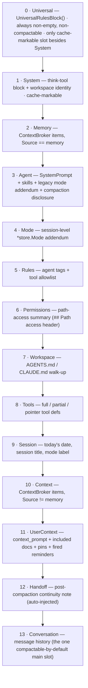
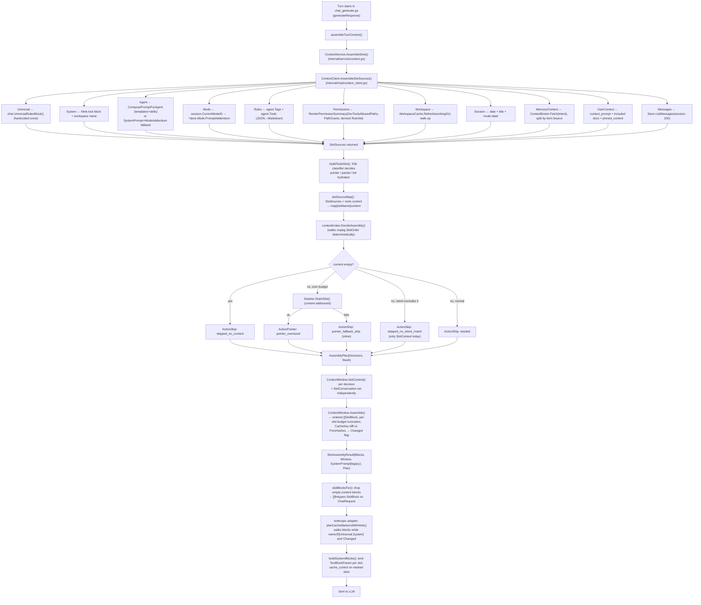

# Context Broker / Slot System

> System audit — code architecture. Describes the subsystem that assembles
> the prompt (system content + conversation + tools) sent to the LLM on
> every dispatched turn, as it exists in the codebase today. Not a review;
> no recommendations.

## 1. Purpose

Every LLM call needs a system prompt built from several independent
ingredients — universal harness rules, think-tool scaffolding, the agent's
own persona, the active mode, policy/permission text, project-local
conventions, the tool catalog, session metadata, retrieved memory/context,
user-authored pins, and the running conversation. Left unmanaged, that
assembly tends toward one of two failure modes: either it's a single
concatenated string that changes shape slightly every turn (breaking
provider-side prompt caching, since Anthropic's cache keys on a stable byte
prefix), or it's assembled inconsistently across the different places a
turn can originate (chat UI, sync subagent call, async subagent call,
background job), so agents see different grounding depending on how they
were invoked.

The slot system solves both problems by giving every ingredient a fixed,
named, ordered position ("slot") in the payload. A slot's *position* is
structural and stable — the same slot always sits in the same place in the
wire payload, regardless of dispatch flavor. A slot's *content* is what
varies turn to turn. This separation is what lets the Anthropic adapter
plant `cache_control` markers on a knowable prefix, lets budget/compaction
logic reason about "this named region" instead of a monolithic string, and
lets every dispatch flavor (chat, sync subagent, async subagent,
background_agent) share one assembly path so none of them silently skips
grounding content the others get.

## 2. Key entry points/files

- `internal/context/INVARIANTS.md` — the six load-bearing contracts this doc explains in plain terms.
- `internal/context/slot.go` — slot name constants, `SlotOrder` (canonical position list), `DefaultBudgets()`, `DefaultCompactable()`, the `Slot`/`SlotBlock` types.
- `internal/context/window.go` — `ContextWindow`: holds per-turn slot state, enforces per-slot budgets/truncation, computes cache keys, and `Assemble()`s the ordered `[]SlotBlock` sent downstream.
- `internal/context/compaction.go` — the escalating-stages pipeline that shrinks the conversation slot (and related slots) when the window is over budget.
- `internal/context/handoff.go` / `handoff_stash.go` / `handoff_envelope.go` — the `SlotHandoff` payload contract (self-authored continuity note across compaction).
- `internal/contextbroker/assembly.go` — `DecideAssembly`: the per-turn decider that turns a slot-name→content map into an ordered `AssemblyPlan` of ship/skip/pointer decisions.
- `internal/contextbroker/stash.go` — `SlotStasher` interface + `DeterministicArtifactID`: the oversized-slot pointer/stash mechanism.
- `internal/contextbroker/broker.go`, `source_memory.go`, `source_conduit.go`, `source_pcc.go`, `source_session.go`, `intent.go` — the `Broker.Fetch` content-retrieval path (memory/context enrichment) and intent classification, upstream of the decider.
- `internal/chat/context_client.go` — `ContextClient.AssembleSlotSources`: the function that actually reads agent/session/workspace/permission/workspace-file state and produces the raw per-slot strings (`SlotSources`).
- `internal/chat/universal_rules.go` — the hardcoded `universalRulesBlock` constant that becomes `SlotUniversal`'s content on every dispatch.
- `internal/service/context.go` — `contextServiceImpl.AssembleSlots`: the composition point that calls `AssembleSlotSources`, builds the Tools slot, calls `DecideAssembly`, writes the plan into a `ContextWindow`, and returns a `SlotAssemblyResult`.
- `internal/service/chat_generate.go` — `assembleTurnContext` (per-turn call site), `slotBlocksFor` (projects `SlotBlock` → provider `llmtypes.SlotBlock`), and the `request_build` slog block that logs every slot's token count.
- `internal/llm/anthropic/cache_plan.go` — `stablePrefixSlotPriority`, `planCacheMarkersWithHints`, `collectStablePrefixSlots`: where cache-marker placement is decided from the slot blocks.
- `internal/llm/anthropic/params.go` — `buildSystemBlocks`/`buildTools`/`buildMessages`: where the cache plan is turned into actual `cache_control` fields on the wire request.
- `internal/service/slot_invariants_test.go` — the test file that encodes and exercises all six invariants across all four dispatch flavors; the clearest worked examples of the contract.
- `internal/permission/summary.go` — `RenderPermissionSummary`, the renderer feeding `SlotPermissions`.
- `internal/workspace/` (via `wsutil.Cache`) — the AGENTS.md/CLAUDE.md walk-up feeding `SlotWorkspace`.

## 3. Flow

### 3.1 Assembled prompt shape (wire payload)

`SlotOrder` in `internal/context/slot.go` defines fourteen named positions.
Not every slot ships every turn — an empty-content slot is dropped from the
wire (`ContextWindow.Assemble` skips it, `slotBlocksFor` double-checks it) —
but the *positions that do ship* always appear in this relative order:

Cacheable-prefix slots (`SlotUniversal`, `SlotSystem`) are the only ones
ever eligible for an Anthropic `cache_control` marker; everything else may
still land inside the cached bytes incidentally (if unchanged) but is never
deliberately marked. `INV1`'s "5-7 slots typical" figure is the minimal
working-session shape: Universal + System + Agent + Rules + Conversation is
the floor; Permissions/Workspace/Memory/Context/Mode/Tools/UserContext/
Handoff add on top when their sources have content.

### 3.2 Assembly flowchart (per turn)

### 3.3 Narrative

**Where a turn's assembly starts.** `chat_generate.go`'s `generateResponse`
calls `assembleTurnContext`, which delegates to
`ContextService.AssembleSlots` (`internal/service/context.go`). This single
call site is shared by chat turns, sync subagent turns, async subagent
turns, and background-agent turns — they differ in the `CallerType` stamped
on the context (via `dispatcher.WithCallerType`) and in which agent/session
row gets loaded, not in which assembly function runs.

**Populating the universal slot.** `SlotUniversal` is not read from any
per-agent or per-session state — it is sourced verbatim from the Go
constant `universalRulesBlock` in `internal/chat/universal_rules.go` via
`chat.UniversalRulesBlock()`. This is deliberate: earlier, universal
grounding/refusal rules were bound to a specific agent-prompt-template
assignment, so any profile without that assignment (subagents,
auto-discovered profiles) got zero grounding — the documented "c160
fabrication regression." Making the content a hardcoded function return
(rather than DB-stored) means every dispatch flavor gets the same block
with no registration step required.

**Populating mode-specific and agent-specific slots.** `SlotAgent` is built
by `assembleAgentSlotContent`, which prefers a prompt-template composition
(`store.ComposePromptForAgent`, pulling in a skill list) and falls back to
raw `agent.SystemPrompt` + legacy `mode.PromptAddendum` concatenation when
no template is assigned. `SlotMode` is separate and newer: it carries only
the *session-scoped* `*store.Mode.PromptAddendum` (resolved from
`session.CurrentModeID` in `chat_generate.go` before slot assembly runs).
The distinction matters because two sessions on the same agent profile can
be in different modes and must render different `SlotMode` content on the
very next turn — mode is a session attribute, not an agent attribute, and
`SlotAgent`'s legacy `AgentMode` addendum is a different, older mechanism
that still rides inside the Agent slot for back-compat.

**Cache markers.** Cache-marker placement is decided independently of the
broker, downstream in the Anthropic adapter. `planCacheMarkersWithHints`
(`internal/llm/anthropic/cache_plan.go`) walks the assembled `SlotBlocks` in
order, from position 0, and greedily includes each slot in the marker list
only while its name is in the hardcoded `stablePrefixSlotPriority = [SlotUniversal, SlotSystem]`
list AND the slot's `Changed` flag (computed by `ContextWindow.Assemble` by
diffing this turn's `CacheKey` against `PrevHashes`) is false. The walk
**stops** — does not skip past — the first slot outside that list or the
first `Changed=true` slot. So in practice: turn 1 never gets a slot marker
(everything is "changed" relative to no prior state); turn 2+ gets a marker
on Universal and, if System is also unchanged, a second marker on System.
If System text or the workspace name changes turn-to-turn, only Universal
gets marked. Markers are capped at 4 total (Anthropic's hard limit) shared
with the `tools` marker and `recent_message` markers; under pressure,
`recent_message` markers drop first, then slot markers drop from the tail
(System before Universal) — Universal, at position 0, is the last thing to
lose its marker.

**Pointer/stash in practice.** When a slot's estimated token count exceeds
its `DefaultBudgets()` ceiling (e.g. `SlotWorkspace` budget 4000, or
`SlotMemory` budget 2000), `DecideAssembly` calls the injected `SlotStasher`
with `(SessionID, SlotName, Content)` before deciding anything else. The
stash write is content-addressed (`DeterministicArtifactID` hashes those
three inputs with NUL separators), so re-running the same turn's oversized
AGENTS.md walk-up produces the same `art-stash-<16 hex>` ID and therefore a
byte-identical `<ref:artifact_id=..., tokens=N, available via dev_read>`
pointer string across turns — the pointer envelope itself stays inside the
cacheable prefix even though the underlying content is too big to inline.
If the stash write fails (no stasher wired, or a backend error),
`DecideAssembly` falls back to shipping the full content inline
(`ActionShip`, `ReasonTag=pointer_fallback_ship`) rather than emit a
pointer referencing nothing — this is stated as an explicit atomicity
contract in both `stash.go`'s package comment and `assembly.go`'s doc
comment.

**Where the decision gets consulted for content the LLM can read back.**
Skipped-slot content isn't discarded — it's written into
`AssemblyPlan.Stash[slotName]` (an in-process map) for the current call; the
artifact-store copy (when the stash write succeeded) is the durable,
cross-process way the agent retrieves it later via a `dev_read`-style tool
call referencing the `artifact_id`.

## 4. The six invariants, explained plainly

**INV1 — Stable sent shape.** Every turn, regardless of dispatch flavor,
produces exactly one decision per entry in `SlotOrder`, in that exact
order — `len(plan.Decisions) == len(SlotOrder)` and
`plan.Decisions[i].SlotName == SlotOrder[i]`. This holds even when most of
those decisions are `ActionSkip` with empty content; the *decision* still
exists at that position. What varies turn-to-turn is which subset of those
14 positions has non-empty content and therefore reaches the wire — the
test suite (`invariantStableSentShape`) treats 5-14 non-empty wire blocks as
the acceptable range, with 5 (Universal+System+Agent+Rules+Conversation) as
the observed floor for a minimal session. This matters because the
downstream cache-marker walk and the `request_build` telemetry both assume
they can index into a fixed-length, fixed-order sequence — a slot silently
dropped in one dispatch path but not another would desync that assumption
without an obvious symptom (no crash, just degraded cache hit rate and
inconsistent grounding). Enforced by `invariantStableSentShape` in
`internal/service/slot_invariants_test.go`; the decider's unconditional
walk over `input.SlotOrder` in `assembly.go` (regardless of whether
`Sources` has an entry) is the code mechanism that makes this true.

**INV2 — Universal slot always at position 0.** Position 0 in `SlotOrder`
is `SlotUniversal`, and its content is never sourced from anything
session/agent-specific — it's always exactly `chat.UniversalRulesBlock()`,
the hardcoded grounding/refusal/verification/narration rules. Because the
content is a constant (not a DB row that could be missing or empty for a
given agent), this slot can't accidentally end up empty the way an
agent's `SystemPrompt` or a workspace file could. The invariant is really
about *connection*, not content risk: it exists to catch a future refactor
that disconnects `SlotSources.Universal` from `UniversalRulesBlock()`, or
that reorders `SlotOrder` so something else lands first. Enforced by
`invariantUniversalAtPositionZero`, which checks both the plan position and
that the content is byte-identical to `chat.UniversalRulesBlock()`.

**INV3 — Cache marker priority.** Only two slots are ever eligible to carry
an Anthropic `cache_control` marker: `SlotUniversal` and `SlotSystem`, in
that priority order, and only when unchanged since the prior turn. This is
a closed list (`stablePrefixSlotPriority` in `cache_plan.go`) — there's no
fallback rule that extends markers further into the slot sequence even if,
say, `SlotAgent` also happens to be unchanged this turn. The reasoning
given in the code is that Anthropic caps requests at 4 `cache_control`
blocks total, so marker placement has to be deliberate about which prefix
bytes are worth "spending" a marker on, and per-turn-dynamic slots
(mode, memory, permissions-once-they-change, tools, session, context,
conversation) would invalidate a marker's offset the moment their content
shifts — better to never plant one there than to plant one that
constantly misses. Enforced at the broker layer by
`invariantCacheMarkerPriority` (checking `Compactable` flags and that both
anchor slots ship non-empty `ActionShip` content) and at the wire layer by
`TestCacheMarkerPriority_UniversalSlotFirst_LoadBearing` /
`TestCacheMarkerPriority_NeverOnDynamicContent` in
`internal/llm/anthropic/cache_marker_priority_test.go`.

**INV4 — Mode-aware content swap correctness.** `SlotMode` is keyed to
`session.current_mode_id`, not to the agent profile. Two sessions running
the same agent can be in different modes and get different `SlotMode`
bodies; flipping one session's mode mid-conversation changes that
session's `SlotMode` content on the very next assembled turn, while the
slot's *position* in `SlotOrder` (and every slot before it —
Universal/System/Memory/Agent) stays untouched. The invariant is really two
claims bundled together: (a) mode changes actually propagate without a
restart, and (b) they propagate *without disturbing the cacheable prefix*
— since `SlotMode` sits after `SlotAgent` and before `SlotRules` in
`SlotOrder`, and the only slots eligible for cache markers are Universal
and System (both ahead of Mode), a mode swap never invalidates a marker.
Enforced by `invariantModeAwareContentSwap`, which re-points
`session.current_mode_id` between two sentinel-bearing modes and asserts
the resulting `SlotMode` content and position both behave as described;
also pinned by `Test_ModeIsSessionAttribute_*` and `Test_ModeChangeMidSession_*`
in `internal/service/mode_session_attr_test.go`.

**INV5 — Pointer/stash determinism.** When `DecideAssembly` substitutes a
pointer for an oversized slot, the exact same `(SessionID, SlotName,
Content)` triple must always produce the exact same `artifact_id` — and
therefore the exact same pointer envelope string — no matter how many
times or in what process the assembly runs. This is what lets an oversized
slot (e.g. a large AGENTS.md walk-up) still participate in prompt caching
even though its real content is too big to inline: the *pointer text* is
small and stable, so it behaves like any other stable slot content for
cache purposes, even though what it points to is dynamic-sized. The
determinism is achieved by hashing the three inputs (session, slot name,
content bytes) with SHA-256 and truncating — no timestamp, PID, or UUID
inputs — so it's a pure function. Enforced by
`invariantPointerStashDeterminism`, which runs `DecideAssembly` twice with
identical input and asserts identical `ArtifactID`/pointer text/stash
content; the deliberate-violation counterpart
(`TestSlotInvariants_DeliberateViolation_PointerNonDeterministic`) proves a
counter-based (non-deterministic) stasher gets caught.

**INV6 — Permission visibility.** When an agent has any effective path
constraint — either the binary-level `dev_tools_allowed_paths` allow-list
or session-scoped `PathGrants` (including grants inherited from a parent
session in a subagent lineage) — `SlotPermissions` renders those
constraints as human-readable Markdown under a stable `## Path access`
header, rather than leaving the model to infer what it can and cannot
reach. The documented motivation is a specific regression: before this
slot existed, a child session could inherit a path grant mechanically (the
`PathGrants` lineage system worked) but had no *language* describing that
grant in its prompt, so when the agent guessed a path and the guess failed
it would conclude "I have no access at all" and fabricate an answer instead
of trying the actual granted path or asking. The slot closes that gap by
making the constraint substrate part of the wire payload. Enforced by
`invariantPermissionVisibility` (checks for the header and specific
granted-path text) and by the renderer-shape tests
`TestAssembleSlotSources_PermissionsSlot_*` in
`internal/chat/context_client_permissions_test.go`; subagent deny
inheritance specifically is pinned by `TestDeriveSubagentRuleSet_ThreeLevelChain`
and `TestChatRunner_ThreeLevelChainPropagatesDenies`.

## 5. Data model touched

`AssembleSlotSources` and its downstream callers read from (and hand off
to) several other subsystems rather than owning this state themselves:

- **Agent definition** — `store.AgentProfile` (`SystemPrompt`, `Tags`,
  `Tools`, `Slug`) and prompt templates via `store.ComposePromptForAgent`
  (skills list embedded). Legacy `*store.AgentMode` for the agent-scoped
  mode addendum still rides inside `SlotAgent`.
- **Session-level mode** — `*store.Mode` resolved from
  `session.CurrentModeID` via `store.GetMode`/`GetSessionMode`, feeding
  `SlotMode` independently of the agent-scoped mode above.
- **Memory / dynamic context** — `contextbroker.Broker.Fetch(intent)`
  returns a `ContextPacket` whose items are split by `item.Source ==
  "memory"` into `SlotMemory` vs `SlotContext`. The broker's own fetch
  sources (`source_memory.go`, `source_conduit.go`, `source_pcc.go`,
  `source_session.go`) are a sibling subsystem this doc treats as a
  handoff, not something to explain here.
- **Permissions** — `permission.RuleSet` (derived per-subagent via
  `DeriveSubagentRuleSet`), the binary-scoped `DevToolsAllowedPaths`, and
  `permission.PathGrants` (own + lineage-inherited), rendered by
  `permission.RenderPermissionSummary`.
- **Workspace files** — `internal/workspace.Cache.Refresh(sessionID,
  workingDir)` walks up from the session's resolved working directory to
  the nearest `.git` root, concatenating `AGENTS.md`/`CLAUDE.md`/
  `NANITE.md`/`.nanite/rules.md` files found along the way.
- **Tool catalog** — resolved tool definitions are passed in (already
  selected/filtered upstream) and turned into `SlotTools` content by
  `contextServiceImpl.buildToolsSlot`, which additionally consults a
  `stash.Manager` + `intent.Classifier` (the "S3b tool-cache pipeline") to
  decide pointer/partial/full hydration — a sibling mechanism, not detailed
  here.
- **User-authored context** — `store.GetSessionContextPrompt`,
  `store.GetIncludedDocuments`, `store.ListPinnedContent` feed
  `SlotUserContext`; the reminder engine (`internal/service/chat_generate.go`)
  and reflex engine (`chat_reflexes.go`) can inject additional text into
  this same slot mid-turn, requiring a re-`Assemble()` (see
  `chat_generate.go`'s comment about the c121 bug where a stale
  `slotResult.Blocks` caused an injected reminder to never reach the wire).
- **Conversation history** — `store.ListMessages(sessionID, 200)`, capped
  and independently owned by `SlotConversation` (the only slot the
  assembly *decider* has no authority over — messages are always
  serialized and set directly on the `ContextWindow` in
  `contextServiceImpl.AssembleSlots`, bypassing `DecideAssembly`).
- **Post-compaction continuity** — `SlotHandoff`'s `HandoffPayload`
  (`internal/context/handoff.go`) is validated/capped separately and
  auto-injected by the compaction pipeline; the slot-map builder
  (`slotSourceMap` in `internal/service/context.go`) explicitly passes an
  empty string for it and leaves population to the `ContextWindow` after
  compaction runs.

## 6. Configuration & manual-setup points

- **Adding a new slot requires four coordinated hand-edits, with no
  fallback.** `internal/context/doc.go`'s package comment states this
  explicitly: a new slot must be added to `SlotOrder`, `DefaultBudgets`,
  `DefaultCompactable`, and (if it should ever be cache-markable)
  `stablePrefixSlotPriority` in `internal/llm/anthropic/cache_plan.go` — "no
  contiguous-walk fallback past the priority list." Missing one of these
  doesn't error; it silently under-budgets, mis-classifies compactability,
  or leaves the slot permanently unmarkable for caching.
- **`shouldSkipForIntent` is a single hardcoded branch.** Today the only
  intent-driven skip rule in `DecideAssembly` is: skip `SlotContext` when
  `intent.Type` is `IntentReviewSession`, `IntentRecallDecision`, or
  `IntentResumeTask`. The code comments describe this as intentionally
  narrow/pre-launch ("Sprint 3 once we have the cross-sprint coordination
  signal") — no other slot has an intent-based skip rule yet, and the
  function has a `switch` over exactly one slot name.
- **Per-slot token budgets are hardcoded constants** in
  `DefaultBudgets()` (e.g. Universal 550, System 2000, Workspace 4000,
  Handoff 1500) — there is no runtime/config override path visible in this
  package; changing a budget means editing the Go source.
- **`universalRulesBlock` is a Go string constant**, not a DB row or config
  file — changing the universal rules requires a code change and redeploy,
  not a migration or admin action. The doc comment explicitly notes two
  *other* artifacts (migration 058's seed content, and
  `internal/mcp/self_tools.go`'s `subagent_spawn` tool description) that
  should be manually kept in sync when this block's failure-handling
  language changes, but are not automatically kept in sync.
- **Workspace/permission slots degrade silently to empty on missing
  wiring.** `ContextClient.WorkspaceCache`, `WorkingDirForSession`,
  `PathGrants`, and `DevToolsAllowedPaths` are all optional fields — if any
  is nil, `buildWorkspaceSlotContent`/`buildPermissionsSlotContent` return
  empty strings and the corresponding slot is skipped with no error or
  warning beyond a debug/warn log line. This is a manual composition-root
  wiring responsibility (whoever constructs `ContextClient`).
- **Mode-aware content depends on two separate mode mechanisms
  coexisting.** `SlotMode` (session-scoped `*store.Mode`) and the legacy
  `AgentMode` addendum embedded inside `SlotAgent` are both still live
  code paths — a caller must resolve and pass both `mode *store.AgentMode`
  and `sessionMode *store.Mode` into `AssembleSlotSources`/`AssembleSlots`
  for full mode behavior; passing only one silently loses the other's
  contribution.
- **Cache-marker eligibility is a closed, manually maintained list.**
  `stablePrefixSlotPriority` doesn't derive from `DefaultCompactable()` or
  any other slot metadata — it's an independent `[]string` literal in a
  different package (`internal/llm/anthropic`) that must be kept in sync by
  hand with `internal/context`'s slot definitions, per the "How to evolve
  the contract" section of `INVARIANTS.md` (step 4).

## 7. Cross-references

- **chat-engine-orchestration** — owns `chat_generate.go`'s outer turn
  loop (tool-use iteration, streaming, reminder/reflex evaluation) that
  calls into slot assembly; also owns the `dispatcher.CallerType` tagging
  this subsystem's tests rely on for cross-flavor coverage.
- **provider-llm-roundtrip** — owns everything downstream of
  `slotBlocksFor`: `llmtypes.ChatRequest`/`SlotBlock`, the Anthropic
  adapter's `buildMessageParams`/`buildSystemBlocks`/`buildTools`, and the
  actual `cache_control` wire format — this doc only describes the
  cache-*planning* logic (`cache_plan.go`), not the SDK-level request
  construction.
- **agent-definition-and-config** — owns `store.AgentProfile`, agent
  prompt templates, and `store.ComposePromptForAgent`, which
  `assembleAgentSlotContent` depends on for `SlotAgent`'s primary content.
- **skills-and-knowledge** — owns `buildSkillListForSessionWithIntent` /
  `skillbroker`, whose output is embedded into `SlotAgent`'s composed
  prompt; also owns the `ContextBroker.Fetch` memory/context sources that
  populate `SlotMemory`/`SlotContext`.
- **Tool selection / tool-cache pipeline** (S3b, `internal/tool/stash`,
  `internal/tool/intent`) — a likely sibling subsystem of its own: it
  decides pointer/partial/full hydration for `SlotTools` and is invoked
  from inside `contextServiceImpl.AssembleSlots` but has its own
  classifier, stash manager, and session-memoized hydration state not
  covered here.
- **Compaction pipeline** (`internal/context/compaction.go`) — a likely
  sibling: it operates on the same `ContextWindow` this doc describes,
  post-assembly, to bring the conversation slot back under budget and to
  populate `SlotHandoff`.
- **Permission / path-grants system** (`internal/permission`) — a likely
  sibling: this doc only describes how its output is *rendered into a
  slot*, not how `RuleSet`s are derived, resolved, or inherited across a
  subagent lineage.

## 8. Open questions

- `shouldSkipForIntent` currently branches on exactly one slot
  (`SlotContext`) for exactly three intent types. It's unclear from the
  code alone whether other slots (Memory, Workspace, Tools) are expected to
  eventually gain intent-driven skip rules, or whether the single-slot
  scope is a durable design choice rather than a "not yet built" gap — the
  comments read as the latter but nothing enforces it either way.
- The universal rules block, the mode-aware slot, the legacy `AgentMode`
  addendum inside `SlotAgent`, and the compaction disclosure appended to
  `SlotAgent` are four different mechanisms that each add "framing text"
  to the prompt through different code paths, two of which target the same
  slot (`SlotAgent` carries both the legacy mode addendum and the
  compaction disclosure, while `SlotMode` carries the newer session-mode
  addendum separately). The comments describe this as an intentional
  back-compat coexistence, but it means a reader has to check three
  separate slots/functions to know the full "identity + mode" text an
  agent receives.
- `DecideAssembly`'s oversized-slot pointer path is driven purely by a
  per-slot token *budget* ceiling (`DefaultBudgets()`), independent of the
  slot's `Compactable` flag — a non-compactable, identity-class slot
  (e.g. `SlotWorkspace`, budget 4000) can still be pointer-substituted if
  its content is large, which is a different code path than the
  compaction pipeline's later, budget-driven shrinking of the conversation
  slot. Both mechanisms produce "smaller content" but via different
  triggers (per-slot ceiling at assembly time vs. total-window overage at
  compaction time), and it's not obvious from the code whether they're
  meant to be understood as one layered system or two independent
  safety valves.
- `SlotConversation` is explicitly carved out of `DecideAssembly`'s
  authority ("the decider doesn't have authority over conversation
  messages") and is set directly on the `ContextWindow` by
  `contextServiceImpl.AssembleSlots`. This means `AssemblyPlan.Decisions`
  — which INV1 pins as "one decision per `SlotOrder` entry" — necessarily
  includes a `SlotConversation` decision that doesn't reflect how that
  slot's actual wire content gets set. The invariant test suite does not
  appear to separately assert what `Action`/`Content` value `SlotConversation`
  carries in the plan (only its position), so it's unclear whether a
  future decider that started giving `SlotConversation` a real skip/ship
  decision would be silently overridden.
- Reminder/reflex mid-turn injection into `SlotUserContext`
  (`chat_generate.go`, guarding against the "c121 bug") requires callers to
  manually remember to re-run `Window.Assemble()` and rebuild the legacy
  `SystemPrompt` after mutating a slot post-assembly. The code comment
  flags this as a once-real bug class rather than something structurally
  prevented — nothing in the type system stops a future injection site
  from mutating `slotResult.Window` without refreshing `Blocks`/
  `SystemPrompt` the same way.
