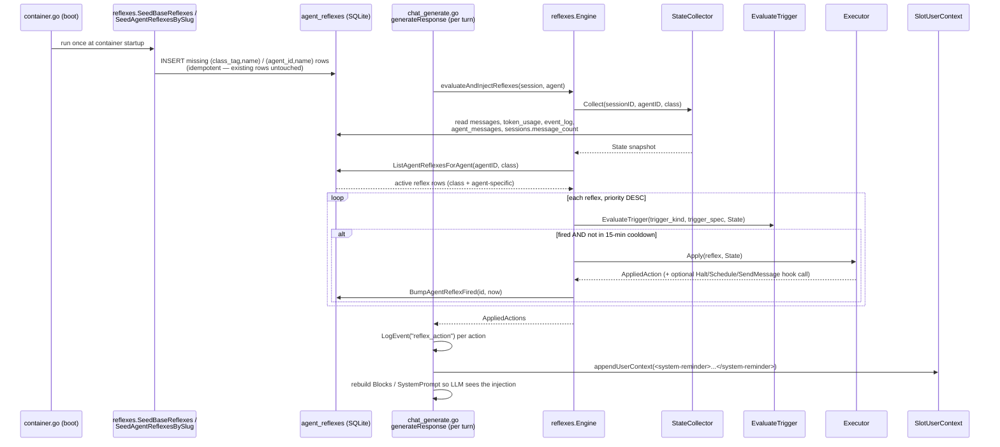

# 08 — Reflexes & Internal Tooling

## 1. Purpose

A **reflex**, in Nanite's actual code (`internal/agent/reflexes`, package doc, FU-30), is a **DB-backed, non-LLM predicate/event/interval rule that Nanite's own Go code evaluates once per turn, outside the model's tool-calling loop, and that can inject text into the next prompt, force/nudge a tool choice, send a message, add a schedule, or halt the session.** The model never decides whether a reflex fires — the `reflexes.Engine` reads a windowed snapshot of recent session signals (token counts, tool-call counts, message text, unread mail, tick count) straight from SQLite and runs a small interpreted trigger AST against it. If the trigger evaluates true, the engine's `Executor` stages an action; today that mostly means text gets silently prepended to the agent's next system-context block as a `<system-reminder>`, with no tool call and no entry in the model's own turn transcript. This is the precise sense in which reflexes are "automatic and proactive": they are host-side circuit-breakers/nudges that run whether or not the model calls any tool, and the model cannot invoke, skip, or negotiate with a reflex directly (it can only react to the reminder text it produces).

This is a **different concept** from two other things in the codebase that also use reflex-flavored words:

- **`internal/promptrouter`** (formerly literally named `internal/reflex`, renamed to remove this exact collision) is a deterministic phrase-match dispatch router: it matches raw user input against a static catalog of `Reflex` structs (`researcher-mention`, `planner-mention`, `worker-execute`, etc.) to pick which sub-agent role/profile to dispatch a task to, *before* `nanite_execute_task` runs. It shares no code, schema, or runtime with `internal/agent/reflexes`; its match log is `playbook_match_log` (see §5). Code comments and file-level doc comments in the `reflexes` package explicitly warn about this collision.
- **The J11 "reminder engine"** (`internal/service/chat_generate.go`, `s.reminderEngine`, CW-20260426-0009) is a separate, structurally similar deterministic-trigger system (also injects `<system-reminder>` text into `SlotUserContext` once per turn) but is driven by a distinct `reminders` package/table, evaluated immediately before the reflex engine in the same turn. It is not covered by this document except where the two systems visibly interleave in `chat_generate.go`.
- **`internal/mcp` self-tools / MCP tool calling** (covered in the sibling doc `07-tool-calling-mcp.md`) is the model actively choosing to invoke a named tool inside its own turn. Reflexes are the opposite direction: the host injecting content the model did not ask for.

## 2. Key entry points/files

- `internal/agent/reflexes/types.go` — package doc (the authoritative "what is a reflex" statement), `State`/`MessageSignal`/`AppliedAction` types.
- `internal/agent/reflexes/engine.go` — `Engine.Evaluate` / `EvaluateState`: the per-tick orchestration (collect state → list active reflexes → evaluate → execute → bump `fired_count`).
- `internal/agent/reflexes/state.go` — `StateCollector.Collect`: builds the `State` snapshot from `messages`, `token_usage`, `event_log`, `agent_messages`, `sessions` tables.
- `internal/agent/reflexes/evaluator.go` — `EvaluateTrigger` / `evalPredicateNode`: the trigger-spec interpreter (AND/OR + ~13 leaf predicate kinds).
- `internal/agent/reflexes/executor.go` — `Executor.Apply`: turns a fired reflex into a concrete `AppliedAction` and calls an optional live hook (`Halt`, `Schedule`, `SendMessage`).
- `internal/agent/reflexes/seeds.go` — `BaseSeeds()` / `SeedBaseReflexes`: class-scoped (`process`/`advisor`/`template`) canonical reflex definitions, idempotently seeded at boot.
- `internal/agent/reflexes/loom_pilot_seeds.go` — `LoomPilotReflexSeeds()` / `SeedAgentReflexesBySlug`: a hand-written, agent-slug-scoped reflex pair for two specific named agents (Loom Weaver/Curator), the concrete worked example the task pointed at.
- `internal/agent/reflexes/loom_pilot_predicates_test.go`, `loom_pilot_seeds_test.go`, `evaluator_test.go` — executable spec of what fires and what doesn't.
- `internal/store/agent_reflexes.go` — persistence for `agent_reflexes` and `pending_reflexes` (CRUD, idempotent count-by-name helpers, propose/approve/reject flow).
- `internal/store/reflex_log.go` — persistence for `playbook_match_log`; belongs to `promptrouter`, not to `internal/agent/reflexes` (see §5).
- `internal/service/chat_reflexes.go` — `evaluateAndInjectReflexes`: the actual per-turn call site that wires the engine into chat generation and formats `AppliedAction`s into a `<system-reminder>` block.
- `internal/service/chat_generate.go` (~L582-587) — where `evaluateAndInjectReflexes` is invoked during `generateResponse`, right after the J11 reminder engine and right before subagent-inbox injection.
- `internal/service/container.go` (~L911-950) — engine construction, `Halt` hook wiring (marks session halted + logs event), and boot-time seeding calls (`SeedBaseReflexes`, `SeedAgentReflexesBySlug`).
- `internal/api/reflexes.go` + routes in `internal/api/api.go` (~L133-140) — operator REST surface: CRUD on `/api/agents/{id}/reflexes`, `/api/reflexes/validate`, and `/api/pending/reflexes` review endpoints.
- `ui/src/components/settings/agents/AgentReflexesPanel.tsx` — the operator-facing settings UI backed by that REST surface.
- `internal/store/agent_procedures.go`, `internal/mcp/self_tools_procedure.go` — a related-but-distinct mechanism (§4.2).
- `internal/store/agent_known_tools_reaper.go`, `agent_known_tools_reaper_test.go` — a related-but-distinct maintenance job (§4.1).

## 3. Flow

**Definition/seeding.** Reflexes reach `agent_reflexes` one of three ways: (a) boot-time idempotent seeding from a Go-coded list (`BaseSeeds()` for class-wide defaults, or a bespoke `AgentReflexSeed` slice like `LoomPilotReflexSeeds()` for specific agent slugs), (b) direct operator authoring via the REST API / settings UI, or (c) the `pending_reflexes` propose→approve pipeline (present as a full DB table + REST API, but see §5/§8 — no code path currently inserts into `pending_reflexes`). Seeding is idempotent: `SeedBaseReflexes` counts existing `(class_tag, name)` rows and only inserts what's missing, and `SeedAgentReflexesBySlug` does the same per `(agent_id, name)` after resolving the target agent's slug to its `agent_profiles.id` — so operator edits to priority/status, and engine-bumped `fired_count`/`last_fired_at`, survive every reboot.

**Evaluation.** Once per turn, inside `generateResponse` (`chat_generate.go`), `evaluateAndInjectReflexes` calls `Engine.Evaluate(ctx, sessionID, agentID, agentClass)`. The engine's `StateCollector` builds a fresh `State`: the last N (default 5) assistant messages with their token/cache/tool-call/envelope signals, the last N user messages, up to 50 recent `event_log` rows, unread `agent_messages` count, and the session's `message_count` as a tick counter. `Engine.ListAgentReflexesForAgent` then loads every **active** row where either `agent_id IS NULL AND class_tag = <agent's class>` (base/class reflexes) or `agent_id = <this agent>` (agent-specific reflexes), ordered by `priority DESC`. Each row's `trigger_kind`/`trigger_spec` JSON is run through `EvaluateTrigger`: `predicate` recursively interprets an AND/OR tree of leaf checks (tool-call counts over a window, cache-read counts, regex matches over user/assistant/all text, identical-output-window for echo/drift detection, output-growth-window for escalating-language detection, entity-mention, tool/envelope-name presence-or-absence, mail-unread count, prefix-token pressure); `event` checks for a named event in the recent `event_log` slice (or the special-cased `mail_received` derived from unread count); `interval` fires when the session tick count is an exact multiple of `every_n_ticks`. A reflex that fired within the last 15 minutes (`recentlyFired`, hard-coded in `engine.go`) is skipped even if its trigger still evaluates true, to avoid re-nagging every turn.

**Firing.** For each reflex whose trigger evaluates true and isn't in cooldown, `Executor.Apply` parses `action_spec` and dispatches on `action_kind`: `inject_reminder` and `force_tool_choice` just return the parsed spec (no live hook — the caller reads `Spec.body`/`Spec.tool_name` back out); `halt_session` calls the optional `Halt` hook, which in `container.go` marks the session halted in the store and logs a `session_halted` event; `add_schedule` and `send_message` call their respective optional hooks if wired. `Engine.EvaluateState` then bumps `fired_count`/`last_fired_at` on the DB row (best-effort — failure doesn't abort the tick), optionally routes the state/action through plugin filter hooks (`FilterReflexState`, `FilterReflexAction`) and emits `EmitReflexFired`/`EmitReflexActionStaged` plugin events, and returns the full `AppliedActions` slice to the caller. Back in `chat_reflexes.go`, `evaluateAndInjectReflexes` logs one `reflex_action` `event_log` row per fired action, formats every `inject_reminder`/`force_tool_choice` action into a single `<system-reminder>\n...\n</system-reminder>` block via `formatReflexReminder`, and appends it into `slotResult`'s `SlotUserContext` slot — then `chat_generate.go` re-derives `slotResult.Blocks`/`SystemPrompt` so the injected text actually reaches the LLM payload for that turn (not just the DB). `force_tool_choice` is explicitly "soft" today: it renders as an imperative or preference sentence in the same reminder channel rather than as a provider-level `tool_choice` API parameter, because the underlying LLM request type has no such field yet; only reflexes whose `action_spec` sets `enforce:true` or `mode:"hard"` get the imperative phrasing.

## 4. Related internal maintenance

### 4.1 Known-tools reaper (`internal/store/agent_known_tools_reaper.go`)

`ReapExpiredAgentKnownTools` and `ReapExpiredAgentKnownSkills` are TTL sweeps over `agent_known_tools` / `agent_known_skills` — per-agent "activated tool/skill roster" tables (FU-7d) with `pinned`, `activation_count`, `last_used_at`, and a nullable `ttl_seconds`. Each function deletes rows where `pinned = 0 AND last_used_at IS NOT NULL AND ttl_seconds IS NOT NULL AND last_used_at + ttl_seconds < now` — i.e., a non-pinned tool/skill that hasn't been used recently enough falls out of the agent's known-tool roster; pinned rows and rows with no TTL configured (the role-seed default) are immortal. `agent_known_tools` itself is populated elsewhere (`internal/api/agent_capabilities.go`, `internal/service/ingest.go`, `internal/store/agent_known_tools.go` via `InsertAgentKnownTool`/`BumpActivation`), so the roster mechanism is actively used.

**The reap functions themselves have no production caller.** A repo-wide search finds `ReapExpiredAgentKnownTools`/`ReapExpiredAgentKnownSkills` referenced only in their own defining file, the `AgentStateStore` interface declaration (`agent_state_store.go`), and their unit tests (`agent_known_tools_reaper_test.go`) — no goroutine, ticker, cron job, HTTP handler, or self-tool invokes them anywhere in `internal/service` or elsewhere. `container.go` wires up two *other*, unrelated periodic reapers (a runtime-agent orphan reaper and a subagent-runs reaper), but nothing schedules this one. It is implemented, tested, and interface-exposed, but appears unwired/dormant.

### 4.2 `agent_procedures` — not a reflex

`agent_procedures` (`internal/store/agent_procedures.go`) stores free-form, named procedure bodies keyed by `(agent_id, name)` — e.g. `boot`, `checklist`, `answer_with_sources`, `propose_kb_update`. Rows are written by `internal/service/ingest.go`'s `seedProcedures`, sourced from an agent profile's `procedures:` frontmatter in its `.nanite/agents/*.md` file, and read back by the `procedure_get` self-tool (`internal/mcp/self_tools_procedure.go`), which fetches `GetAgentProcedure(ctx, callerAgentID, name)` and returns the body as plain tool-result text.

This is **not** part of the reflex system and is **not** predicate/event-triggered: a procedure is inert documentation until the agent itself decides to call `procedure_get` with a specific name — i.e., it is normal, model-initiated, LLM-driven tool calling (the subject of `07-tool-calling-mcp.md`), not a reflex. The connection to reflexes is only conceptual: several `agent_reflexes` action-spec bodies (e.g. the Loom pilot's `check_before_answer`/`capture_on_discovery`) explicitly tell the agent to go follow one of its own named procedures ("per your own `answer_with_sources` procedure") — the reflex is the automatic nudge, the procedure is the manually-invoked runbook it's nudging the agent toward.

## 5. Data model touched

**`agent_reflexes`** (14 rows live) — one row per reflex definition.
- `id` (`rfx-<ulid>`), `agent_id` (nullable FK to `agent_profiles`; NULL for class-scoped rows), `class_tag` (nullable; set only when `agent_id` is NULL — `process`/`advisor`/`template` in current seed data)
- `name` — human-readable key, unique per `(agent_id|class_tag, name)` by seeding convention (not a DB constraint)
- `trigger_kind` ∈ `predicate|event|interval`, `trigger_spec` — JSON AST/params (see §3)
- `action_kind` ∈ `inject_reminder|force_tool_choice|send_message|halt_session|add_schedule`, `action_spec` — JSON params (`body`/`urgency`, `tool_name`/`enforce`/`mode`, `reason`, etc.)
- `status` ∈ `active|paused|expired` (only `active` rows are evaluated)
- `priority` (int, evaluation order and reminder ordering), `fired_count`, `last_fired_at` (drives the 15-min cooldown), `created_at`, `created_by` (`system` for seeded rows, `operator` / `operator:<name>` for API-created rows)
- Live data: 11 class-scoped rows from `BaseSeeds()` (6 `process`, 3 `advisor`, 2 `template`) + 3 agent-scoped rows from `LoomPilotReflexSeeds()` (2 on Loom Weaver, 1 on Loom Curator). Only one row (`evidence_claim_without_tools`) has ever fired (`fired_count=3`) as of this audit.

**`pending_reflexes`** (0 rows) — a propose/review staging table: `id` (`prfx-<ulid>`), `proposed_by`, `proposed_at`, `target_agent_id`, `name`, `trigger_kind`/`trigger_spec`, `action_kind`/`action_spec`, `rationale`, `status` ∈ `pending|approved|rejected`, `reviewed_at`, `reviewed_by`. `ApprovePendingReflex` transactionally inserts a new `agent_reflexes` row and flips status to `approved`; `RejectPendingReflex` records a reason in `reviewed_by`. The full write→list→approve/reject path is implemented in `internal/store/agent_reflexes.go` and exposed over REST (`GET/POST /api/pending/reflexes...`), but the doc comment's stated producer — "the `agent_reflex_propose` self-tool" — does not exist anywhere in the current MCP self-tool catalog (`internal/mcp/self_tools.go`); no code path currently inserts a row. This matches the observed 0 rows.

**`playbook_match_log`** (114 rows) — **belongs to `internal/promptrouter`, not to `internal/agent/reflexes`** (see §1). Columns: `id`, `session_id`, `turn_id`, `reflex_id` (a `promptrouter.Reflex.ID` string, e.g. `worker-execute`, `documentor-mention`, `reviewer-mention`), `priority`, `source` (always `"reflex"` in this package's usage), `matched_input_excerpt` (first 200 chars of raw input), `hint_tier`/`hint_pattern` (the `classify.ScopeTier`/`ExecutionPattern` in effect), `profile_slug`, `mode`, `matched_at`, plus `raw_input_text`/`sent_input_text` (populated only when a pre-dispatch rewrite changed the text — CW-20260816-0068). Every `reflex_id` value observed in the live table (`worker-execute` ×42, `documentor-mention` ×24, `reviewer-mention` ×20, `researcher-mention` ×12, `planner-large-task`/`planner-mention` ×6 each, `strategist-mention` ×4) is a `promptrouter.BuiltinReflexes()` catalog ID that also appears in `internal/chat/hints/hints.yaml`'s `reflex_id_in` lists — none of the 14 `agent_reflexes` row names/IDs appear here. The table logs promptrouter's phrase-match role-dispatch decisions, not `internal/agent/reflexes` firings.

**`agent_procedures`** (41 rows) — see §4.2 for full description. PK `(agent_id, name)`; `body` (free text, observed lengths 100–12,500+ chars), `scope` (`agent` for every live row; `shared` is a valid but currently-unused value), `created_at`/`updated_at`. 12 distinct agent IDs, most agents having a `boot` and/or `checklist` procedure plus 1-3 domain-specific ones (`answer_with_sources`, `propose_kb_update`, `classify_and_compile_fragment`, `build_agent`, etc.).

## 6. Configuration & manual-setup points

Two independent, coexisting authoring paths exist:

1. **Go seed files, hand-written per scope.** `BaseReflexSeed`/`BaseSeeds()` (`seeds.go`) is a reusable *pattern* — any new class-wide reflex is added by appending a literal to the `BaseSeeds()` slice, and `SeedBaseReflexes` handles idempotent insertion generically. `AgentReflexSeed`/`LoomPilotReflexSeeds()` (`loom_pilot_seeds.go`) is the same generic pattern (`SeedAgentReflexesBySlug` is fully reusable — it just resolves any `AgentSlug` via `GetAgentBySlug` and idempotently inserts) applied to a bespoke, one-off list of trigger/action specs handwritten for two specific named agents (Loom Weaver/Curator). The *mechanism* is reusable and requires no new code to add another agent-slug-scoped seed list; the *specific predicates* (regex vocabulary like `naniteWikiTopicPattern`, `discoveryLanguagePattern`, `wikiOrLoomToolPattern`) are bespoke, hand-tuned per agent's domain — there is no generator or template that derives a reflex from an agent profile automatically. Both seed lists only run at container boot (`container.go`), and `SeedAgentReflexesBySlug` is explicitly ordered to run after agent-profile ingestion (`agent.Discover` + `ReconcileManagedAgentIDs` + `AutoIngestAgents`) so `GetAgentBySlug` can resolve; a seed whose target agent isn't ingested yet is skipped with a warning and picked up on a later boot, not treated as fatal.
2. **REST API + settings UI, no code required.** `POST /api/agents/{id}/reflexes` (validated by `validateReflexDefinition`), `PATCH`/`DELETE .../reflexes/{reflexId}`, and `POST /api/reflexes/validate` (dry-run trigger evaluation against an operator-supplied fake `State`) let an operator define, edit, or test a reflex against any agent at runtime with no Go changes or redeploy — this path is backed by `ui/src/components/settings/agents/AgentReflexesPanel.tsx`. This is the generic, always-reusable path; the Go seed-file pattern exists specifically for reflexes that must exist idempotently from first boot (defaults every agent of a class gets, or a small fixed set the operator doesn't want to hand-recreate per environment).

The `pending_reflexes` propose→approve flow is a third, designed-but-currently-orphaned path (see §5/§8) — a full review UI/API exists on the consuming side but nothing produces rows into it today.

## 7. Cross-references

- `04-chat-engine-orchestration.md` (expected sibling, not yet observed in this audit pass) — the turn loop that `chat_generate.go`'s `generateResponse` belongs to; reflex evaluation is one step embedded in that per-turn sequence, alongside the J11 reminder engine and subagent-inbox injection.
- `07-tool-calling-mcp.md` — the LLM-facing tool-calling loop this document is explicitly *not* describing; `procedure_get` (§4.2) and the `force_tool_choice` reflex action both touch that surface without being part of it.
- `06-broker-strategy-steering.md` (expected sibling, not yet observed) — likely owns `internal/promptrouter`, `chat_strategy.go`, `chat_broker_dispatch.go`, and `playbook_match_log`, all of which surfaced during this investigation under reflex-adjacent naming but belong to the dispatch/role-assignment system, not `internal/agent/reflexes`.
- `09-durable-agents-runtime.md` — owns `agent_profiles`, agent classes (`process`/`advisor`/`template`), and the boot sequence (`agent.Discover`, `ReconcileManagedAgentIDs`, `AutoIngestAgents`) that `SeedAgentReflexesBySlug` depends on for slug→ID resolution.

## 8. Open questions

- `pending_reflexes` has a complete write-model (`InsertPendingReflex`), review workflow (`ApprovePendingReflex`/`RejectPendingReflex`), and REST API, but no code path in the current tree inserts a row — the doc comment in `agent_reflexes.go` attributes inserts to "the `agent_reflex_propose` self-tool," which does not exist in `internal/mcp/self_tools.go`. Whether this is a planned-but-unbuilt self-tool, a removed one, or a design that was superseded by the direct-CRUD REST path (§6) is not evident from the code.
- `ReapExpiredAgentKnownTools`/`ReapExpiredAgentKnownSkills` are fully implemented and unit-tested against a real TTL scenario (FU-7d) but have zero production call sites — no ticker/goroutine schedules them anywhere `container.go` wires up its other two reapers (runtime-agent orphan reaper, subagent-runs reaper). Whether TTL expiry on known-tools/skills rosters is simply not needed yet, was deferred, or is a genuine gap is not stated anywhere in the code.
- The `reflexes` package was briefly renamed `driftguard` and then renamed back, per its own package doc — the history is documented in-code but the rationale trail (CW-20260816-0062) lives outside this repo pass; worth noting only because it signals this naming space has already had at least one internal collision-driven renaming, on top of the still-live `promptrouter` vs `reflexes` vocabulary overlap.
- The Loom Curator/Weaver pilot's own `LoomPilotReflexSeeds` doc comment calls the choice of hosting these on Curator/Weaver "circular" (they maintain the wiki bundle the reflex is meant to protect, rather than being general consumers of it) and flags it explicitly as a first structural dry-run pending "a real tag-based `agent_reflexes` scope, or a genuine Nanite-dev-facing advisor agent" — i.e., the authors of this code already flagged the two-agent-slug pattern as provisional, not a long-term target shape. Stated as-is; no proposal evaluated here.
- `force_tool_choice`'s "soft" wiring (text nudge instead of a provider `tool_choice` parameter) is called out in `executor.go`'s own comment as blocked on `go-llm-types.ChatRequest` lacking a `tool_choice` field — current behavior for every `force_tool_choice` reflex is therefore always a reminder-channel sentence, never an actual API-level tool constraint, regardless of `enforce`/`mode` in the action spec (those only change the sentence's phrasing, not its enforcement mechanism).
