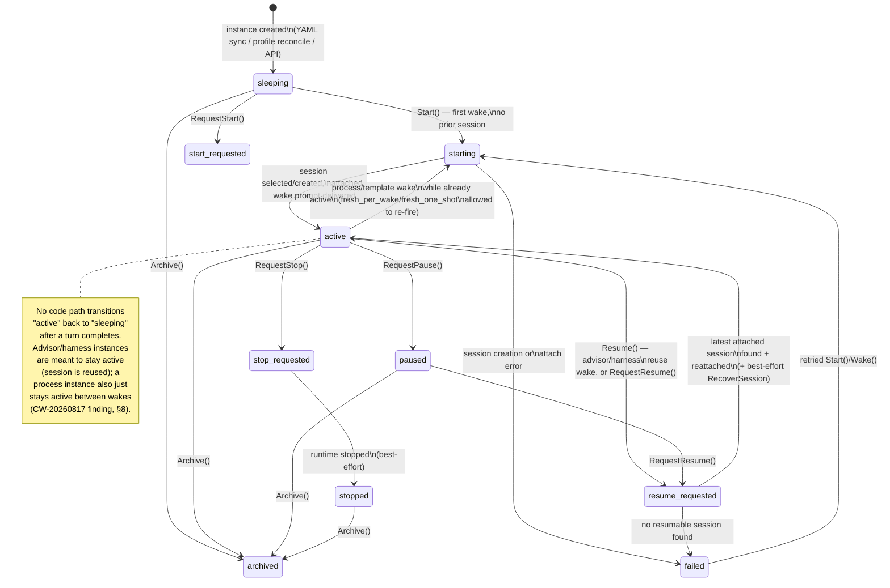

# Durable Agents Runtime

> **Correction (2026-08-17, post-review):** "PTY"/"PTY-backed" below describes the CLI-wrapped subprocess path loosely. No real pseudo-terminal is allocated in production — see `06-provider-llm-roundtrip.md`'s correction note for the full detail. This doesn't change this document's core finding (every observed durable-agent instance uses `runtime_kind: api`, disjoint from `agent_runtime`) — it only corrects what the *other* runtime kind (`streaming-stdio`/`subprocess`, the one no live durable agent currently uses) actually is under the hood.

## 1. Purpose

A normal Nanite chat session exists because a human (or an API caller acting on a human's behalf) opened it, and it runs turns because that caller sent messages into it. Nothing in the system decides on its own to start a session or to send it a message — the session is inert between turns and has no identity beyond "a row a client happens to be pointed at."

A **durable agent** is a persistent identity — `durable_agent_instances` — that exists independently of any single chat session and can be told to run *without* a human in the loop at that moment. It answers three questions a plain session cannot: (1) *which* configured agent identity is this, independent of whichever session currently belongs to it; (2) *when* should it run — on a cron/tick schedule, on an external callback, or on an explicit API call — with no browser tab open; and (3) what should happen to its session when it runs again later — reuse the same one, always start fresh, or run a disposable one-shot. Under the hood a durable agent's actual "thinking" step is not a different execution engine — waking it delivers a prompt into a session via the exact same `ChatService.HandleMessage` path a human's chat message takes. What is different is everything *around* that call: the identity that outlives any one session, the schedule/trigger machinery that decides when to call it, and the event/session bookkeeping that lets the next wake pick up where the last one left off.

This is distinct from two other things the project owner called out as confusable:
- **File-based / DB agent profiles** (`agent_profiles`, `.nanite/agents/*.md`) are personas/templates — system prompt, tools, procedures. A durable agent instance always points at one (`profile_id`), but the profile itself has no runtime state or schedule.
- **One-shot CLI/API launches** (the boot-profile CLI harness, `docs/boot-profile-cli-harness.md`) spin up a headless CLI-wrapped subprocess (`claude`, `codex`, …) for a single operator-selected session. Durable agents documented here are, in the observed instance data, `runtime_kind: api` — they run through the same in-process API chat/generation path as a normal chat turn, not a spawned subprocess. (The `agent_runtime` table tracks that separate CLI boot lifecycle, `runtime_kind` of `streaming-stdio` or `subprocess`, not a real PTY; live data shows zero overlap between its `parent_session_id`s and any durable-agent-owned session — see §5.)

## 2. Key entry points/files

- `internal/store/durable_agents.go` — `durable_agent_instances` / `durable_agent_instance_sessions` / `durable_agent_events` CRUD; the instance identity and status state machine.
- `internal/service/durable_agents.go` — `DurableAgentService`: `Create/Start/Resume/RequestStart/RequestStop/RequestPause/RequestResume`; `durableAgentLaunchPolicyFor` (lifecycle class → session-reuse policy); `deliverWakePrompt` (the seam into real chat turns).
- `internal/service/durable_wake.go` — `DurableAgentWakeService`: `ListDue`/`RunDue` (schedule polling), `Wake` (single-instance wake), `wakeSkipReason`/`wakeScheduleDue` (the gating logic).
- `internal/store/agent_schedules.go` — `agent_schedules` CRUD and firing-rule evaluation (`scheduleFires`, `GetDueSchedules`).
- `internal/store/agent_cycles.go` — `agent_cycles` CRUD (`InsertAgentCycle`/`CompleteAgentCycle`/`ListAgentCycles`). Defined but **not called from any production code path** — see §8.
- `internal/store/agent_runtime.go` — `agent_runtime` / `agent_runtime_checkpoints` CRUD; the CLI boot-lifecycle table (`runtime_kind`: `streaming-stdio`/`subprocess`, not a real PTY), distinct from the durable-agent control plane (see §5).
- `internal/service/managed_durable_configs.go` — YAML sync: `.nanite/durable-agents/*.yaml` → `durable_agent_instances` + `agent_schedules` rows at boot.
- `internal/api/durable_agent_wake.go` — generic wake HTTP surface: `/api/durable-agent-wake/{due,run-due}`, `/api/durable-agents/{id}/wake`, `/api/durable-agents/{id}/schedules/...`.
- `internal/api/loom_curator_wake.go` — a purpose-built wake endpoint (`POST /api/loom/curator-wake`) that adapts an external system's own payload shape into a `DurableAgentWakePayload`.
- `internal/api/api.go:152-214` — full durable-agent route table (CRUD, lifecycle actions, sessions, schedules, wake, harness/v1 mirror).
- `cmd/nanite/main.go:1094-1127` — the `durable-agent-wake-tick` background loop: calls `RunDue` every 2 minutes.
- `.nanite/durable-agents/*.yaml` — hand-authored instance definitions (`loom-curator.yaml`, `loom-weaver.yaml`, `atlas-curator.yaml`, …).
- `internal/store/migrations/078_agent_context_policy_and_cycles.sql`, `080…084_*.sql`, `070_agent_schedules.sql`, `050_agent_runtime.sql` — schema history and design-rationale comments for all tables in this subsystem.

## 3. Flow

### 3.1 Instance creation

A `durable_agent_instances` row can come from three sources, all converging on the same table:
1. **Managed YAML** — `.nanite/durable-agents/<slug>.yaml` is read by `SyncManagedDurableAgentConfigs` at container boot and upserted via `SyncDurableAgentInstanceConfig` (keyed by `slug`). If the YAML has a `schedule:` block, a matching `agent_schedules` row is also upserted, keyed by a deterministic hash of `profile_id + schedule.name` (`managedDurableAgentScheduleID`) so re-syncing on every boot doesn't duplicate or reset fire state.
2. **Profile reconciliation** — any `agent_profiles` row tagged `durable-agent` (or with `durable = true`) that has no matching instance gets one auto-created with id `legacy-profile-<profileID>` (`reconcileProfileBackedInstances`, called from `DurableAgentService.List`). Live data: 8 of 18 instances are `legacy-profile-*` rows.
3. **Explicit API** — `POST /api/durable-agents`.

### 3.2 Lifecycle-class → launch policy

Every instance has a `lifecycle_class` (`advisor` / `process` / `template` / `harness`) which `durableAgentLaunchPolicyFor` maps to a session policy:

| lifecycle_class | session_policy | attachment_relation | meaning |
|---|---|---|---|
| `advisor` | `reuse_latest_or_create` | `primary` | one long-lived session, reused across wakes |
| `process` | `fresh_per_wake` | `wake` | a brand-new session every wake (e.g. Loom Curator, Atlas Curator) |
| `template` | `fresh_one_shot` | `run` | disposable single-run session |
| `harness` | `reuse_managed` | `harness` | a managed, reused session (e.g. Orchestrator) |

### 3.3 Trigger → wake

A wake can be requested through any of these paths, all of which converge on `DurableAgentWakeService.Wake`:
- **Internal poll loop** — `durable-agent-wake-tick` calls `RunDue` every 2 minutes. `RunDue` → `ListDue` walks every non-archived instance whose lifecycle is `process` or `template` (`wakeManagedLifecycle`), lists its `agent_schedules` rows, and evaluates `wakeScheduleDue` per schedule (cron via `robfig/cron`, or one-shot via `fired_count == 0`).
- **External callback** — e.g. `POST /api/loom/curator-wake`, which Fragments Engine hits fire-and-forget when a fragment is routed. This endpoint decodes FE's own `{generator, fragment}` shape, resolves the instance by slug, and calls `Wake` directly with a rendered prompt.
- **Direct API** — `POST /api/durable-agents/{id}/wake` with an explicit `DurableAgentWakePayload`.
- **Lifecycle actions** — `RequestStart`/`RequestResume` etc. flow through `Start`/`Resume`, which are the same underlying launch machinery a wake uses (with `wake.Reason` defaulted to `lifecycle_start`/`lifecycle_resume` instead of `scheduled_wake`/`process_tick`).

Before actually launching, `Wake` checks `wakeSkipReason`: an `archived`/`paused`/`stopped` instance always skips; a mid-launch instance (`starting`/`start_requested`/`resume_requested`) skips as a concurrency guard; an `active` **advisor**-class instance skips (it has one session to reuse, so "active" means "busy"); a `process`/`template`-class instance is allowed to wake again even while `active`, because each wake gets its own fresh session — there is no reuse collision to guard against. It also requires a resolvable `workspace_id`, either caller-supplied or inherited from a prior attached session.

### 3.4 Cycle execution

Once past the skip check, `Wake` calls `DurableAgentService.Start` (first-ever/`process`+`template` wakes) or `Resume` (session-reuse wakes), which:
1. Flips instance status to `starting`/`resume_requested`, recording a `durable_agent_events` row at each transition.
2. Resolves the launch policy for the instance's `lifecycle_class`.
3. Selects or creates the session: reuse policies call `latestAttachedSession`; `fresh_per_wake`/`fresh_one_shot` always call `CreateSession` with `context_type: "durable_agent"`, `context_id: <instance ID>`.
4. Attaches the session (`AttachDurableAgentInstanceSession`) with the policy's relation (`wake`, `primary`, `run`, `harness`).
5. For `Resume` only: best-effort calls `DurableAgentRuntimeController.RecoverSession`, which evicts any stale runtime for the session *without* arming a fresh-boot flag, so the next turn cold-boots into recovery-pack + provider-resume rather than a blank slate.
6. Flips status to `active`, records `start_succeeded`/`resume_succeeded`.
7. **`deliverWakePrompt`** — if `WakePayload.Prompt` is non-empty, calls `ChatService.HandleMessage` on the session, i.e. injects the prompt as a genuine user turn and lets the normal async-generation path run. This is the only channel that reaches a running agent turn — `WakePayload.Facts`/`Metadata` are stored but not read by anything downstream at wake time (confirmed by grep; see §8).

From here the agent's turn executes exactly like a human-driven chat turn: same tool loop, same envelope system, same message persistence. There is no separate "durable agent execution engine."

### 3.5 Checkpoint / sleep / next trigger

There is **no explicit checkpoint step** and **no explicit sleep transition**. The durable state that persists is whatever the normal chat/session machinery already persists (messages, session status) plus the `durable_agent_instances`/`durable_agent_instance_sessions`/`durable_agent_events` rows the wake path wrote. The instance simply sits at `status: active` — indefinitely, for an advisor/harness instance, or until the next wake overwrites the session pointer, for a process/template instance — until something calls `RequestStop`/`RequestPause`/`Archive`, or another wake fires. Nothing transitions a `process`-class instance's status back to `sleeping` after its turn finishes; see §8 for the observed consequence of this.

### 3.6 State diagram

Every arrow above is also a `durable_agent_events` row (see §5) — the state diagram and the event log describe the same transitions from two angles.

## 4. What state persists between wakes

Concretely, using the live `loom-curator` instance (`696f3b80-dad3-4a0e-a98f-1845f352048f`, lifecycle_class `process`) as the running example:

- **The instance row itself** (`durable_agent_instances`): `status` (was `active`), `current_session_id` (the *most recent* wake's session — `069545a3-0bcf-49a2-9ee8-8d289e22a7a0` as of the last sample), `updated_at`. This is the only field a subsequent wake reads to decide skip/no-skip and to resolve a workspace.
- **The full session history, not just the latest** (`durable_agent_instance_sessions`): every session this instance has ever owned, each row keyed by `(instance_id, session_id)` with a `relation` (`wake`, `primary`, `run`, `harness`) and `attached_at`/`detached_at`. Loom Curator's rows show ten distinct `wake`-relation sessions attached between `2026-08-17T16:00` and `22:30` — one fresh session per wake, none ever detached. Nothing currently detaches old sessions for `fresh_per_wake` instances; they simply accumulate.
- **The lifecycle activity trail** (`durable_agent_events`): every status transition and wake attempt, with `status_before`/`status_after`, the `session_id` in play, and a small `metadata_json` blob (e.g. `{"reason":"callback:wiki_page"}`, `{"session_reused":"false"}`). Loom Curator alone has accumulated 40+ of the table's 122 total rows in about 19 hours of wall-clock time (the live callback-driven cadence is much higher than its scheduled cron tick).
- **The schedule's own fire bookkeeping** (`agent_schedules`): `fired_count` and `last_fired_at` on the one live row (`managed-schedule-27864b7b…`, Loom Curator's `lint-and-export` cron), which is what `wakeScheduleDue` consults to compute the next due instant. As of sampling, `fired_count = 0` and `last_fired_at` is empty — the cron schedule (`0 3 * * *`) had not yet fired since being seeded at `2026-08-17T03:48:37`.
- **Whatever the underlying chat session already persists** — messages, tool-call history, session status — via the ordinary session/message tables. A durable agent's actual memory of "what it did last time" lives here, not in any durable-agent-specific table.
- **Explicitly NOT persisted anywhere query-visible**: no compact "last cycle summary," no structured decision/open-items log. `agent_cycles` was built for exactly this (`output_summary`, `decisions_json`, `open_items_json`, `artifact_pointers_json`) but has zero rows in the live DB and no production writer (§8).

## 5. Data model touched

**`durable_agent_instances`** (18 live rows) — the identity/config/status row.
`id`, `name`, `slug` (unique, used to resolve by URL-stable name — e.g. `loom-curator`), `profile_id` (FK → `agent_profiles`, the persona), `lifecycle_class` (`advisor`/`process`/`template`/`harness`, drives session policy), `provider`/`model`/`runtime_kind` (captured at creation, "intentionally not updated by the metadata update path" per the type's doc comment — provider/model resolve to the runtime default at request time if left blank), `launch_source_type` (`api_chat`/`cli_harness`/`boot_profile`/`durable_advisor`/`process_tick`/`task_template_run` — descriptive of how it's meant to be launched), `work_root`, `status` (state-machine value, §3.6), `current_session_id`, `failure_reason`, `metadata_json` (free-form; managed-YAML instances stamp `managed_source`/`managed_config_path`/`managed_profile_slug` here), `created_at`/`updated_at`/`archived_at`.

**`durable_agent_instance_sessions`** (17 live rows) — the many-to-many join between an instance and every session it has owned, run, or attached to. Composite PK `(instance_id, session_id)`, `relation` (`owned`/`attached`/`spawned`/`primary`/`run`/`wake`/`harness`), `attached_at`/`detached_at` (nullable — a live row has `detached_at = NULL`). `ListDurableAgentInstanceSessionStates` LEFT JOINs this to `sessions` and to the most recent `agent_runtime` row for that session (for CLI/subprocess-launched sessions only — see below), surfacing `session_status`, `runtime_state`, `halted_at`/`halted_reason`.

**`durable_agent_events`** (122 live rows) — an append-only activity trail, one row per lifecycle transition or wake attempt: `event_type` (`created`, `start_requested`, `start_succeeded`, `start_failed`, `resume_requested`, `resume_succeeded`, `resume_failed`, `pause_requested`, `pause_succeeded`, `stop_requested`, `stop_succeeded`, `runtime_stop_succeeded`, `wake_requested`, `wake_started`, `wake_skipped`, `wake_failed`, `wake_completed` [defined but never emitted — grep shows no call site], `session_attached`, `archived`, `updated`), `status_before`/`status_after`, `session_id`, `source` (`api` or `runtime`), `message` (free text, e.g. a skip reason or error), `metadata_json`. Live breakdown: `start_requested` (33), `session_attached`/`start_succeeded` (18 each), `wake_requested`/`wake_started` (11 each), `start_failed` (7), `wake_skipped` (3) — includes a real `wake_skipped: "wake already active"` row from `2026-08-17T15:53:24Z`, captured while the CW-20260817 always-active-blocks-rewake condition (§8) was still live in production, before the process-class carve-out fix landed.

**`agent_schedules`** (1 live row) — per-agent scheduled directives. `id`, `agent_id` (FK → `agent_profiles.id` — **not** the durable-agent instance ID; `ListDue`/`ListSchedules` look this up by `inst.ProfileID`), `session_id` (nullable — empty applies to all of the agent's sessions), `name`, `schedule_kind` (`every_n_ticks`/`on_tick`/`cron`/`one_shot`/`on_event`), `schedule_spec` (kind-dependent — e.g. `"0 3 * * *"` for cron), `body` (the literal text delivered as the woken session's first user turn — Loom Curator's live row's body starts "Run your scheduled_lint_and_export procedure now: sweep the `nanite` wiki bundle only…"), `priority`, `status` (`active`/`paused`/`expired`), `expires_at`, `fired_count`, `last_fired_at`, `created_at`, `created_by` (`operator` or `managed_file`).

**`agent_runtime`** (32 live rows, 0 in `launching`/`running` — 17 `failed`, 15 `orphaned`) — this table is **not** the durable-agent control plane; it is the CLI boot-lifecycle table for `internal/runtime/agent.Boot` (CLI harness / boot-profile launches, `runtime_kind` of `streaming-stdio` or `subprocess` — not a real PTY, see this doc's correction note). Confirmed by direct query: zero rows in `agent_runtime` have a `parent_session_id` matching any `durable_agent_instance_sessions.session_id` in the live DB — every observed durable-agent instance uses `runtime_kind: api`, which never creates an `agent_runtime` row. The `ListDurableAgentInstanceSessionStates` LEFT JOIN to this table exists for the case where a durable agent *is* CLI/subprocess-backed, but no live instance currently is.

**`agent_cycles`** (0 live rows) — see §8; defined and migrated but has no production writer.

## 6. Configuration & manual-setup points

- **Defining a new durable agent** requires two hand-authored artifacts kept in sync by convention, not by validation: (1) an `agent_profiles` definition — `.nanite/agents/<slug>.md` with frontmatter (`durable: true`, `class: process|advisor|template|harness`, `activationMode: instance`, `defaultState`, `tools`, `contextPolicy`, `procedures`); and (2) `.nanite/durable-agents/<slug>.yaml` with `name`, `slug`, `profile_slug` (must match the profile's slug), `lifecycle_class`, `provider`/`model` (leaving `model` blank is the documented-safe choice — a pinned snapshot model string can silently 404 once Anthropic retires it; `loom-curator.yaml`'s own inline comment documents hitting exactly this), `runtime_kind`, `launch_source_type`, optional `metadata`, and an optional structured `schedule:` block.
- **`.nanite/durable-agents/*.yaml` is only synced at container boot** (`SyncManagedDurableAgentConfigs`, called once from `container.go`) — per `loom_curator_wake.go`'s own comment, adding a new YAML file requires an explicit service restart before it takes effect; there is no file-watch or hot-reload.
- **Wiring an actual schedule** requires the YAML's `schedule:` block (`name`, `kind`, `spec`, `body`, `priority`) — this is the only sync path that mints a real `agent_schedules` row; hand-editing `metadata.schedule` (a plain string, e.g. Atlas Curator's `schedule: nightly`) is purely a human-readable label and produces no schedule row at all. The schedule row ID is deterministically derived from `sha256(profile_id + ":" + schedule.name)`, so renaming the `schedule.name` field mints a brand-new row (old fire-count history orphaned) rather than updating in place.
- **Wiring an external callback trigger** (as opposed to a poll-driven schedule) requires a purpose-built API handler per external payload shape — `loom_curator_wake.go` exists because the generic `/api/durable-agents/{id}/wake` endpoint expects `DurableAgentStartRequest`'s exact JSON shape, and Fragments Engine's callback payload (`{generator, fragment}`) doesn't match it. Each new external trigger source needs its own adapter handler and route registration in `api.go`, resolving the target instance by slug.
- **The workspace a wake attaches to** is either inherited from the instance's most recent live session or must be supplied by the caller. `loom_curator_wake.go` hardcodes `loomCuratorWakeWorkspaceID = "default"` with an inline comment tying that literal's safety to Nanite's single-workspace consolidation (migration `087_consolidate_personal_workspace.sql`) — this is a manual, per-endpoint constant, not something resolved generically.
- **The internal poll cadence (2 minutes)** and **the cron "how recent counts as due" window (15 minutes, in `wakeScheduleDue`)** are both hardcoded constants in Go (`cmd/nanite/main.go`, `internal/service/durable_wake.go`), not configuration.
- **Admin UI**: `ui/src/components/settings/DurableAgentAdminPanel.tsx` surfaces the CRUD/lifecycle-action endpoints for humans to create/start/stop/pause/resume/wake instances and pause/resume schedules by hand, as an alternative to editing YAML.

## 7. Cross-references

- **agent-definition-and-config** — the `agent_profiles` / `.nanite/agents/*.md` persona layer every durable agent instance points at via `profile_id`; `contextPolicy` and `procedures` live there, not in `durable_agent_instances`.
- **launch-paths** — contrasts this API-chat-driven durable-agent path against the boot-profile CLI harness (`docs/boot-profile-cli-harness.md`) and the `agent_runtime` CLI boot lifecycle (not a real PTY), which this doc found to be entirely disjoint from durable-agent instance data in the live DB.
- **inter-agent-messaging** — `DurableAgentWakePayload.Prompt` is delivered as a real chat turn via `ChatService.HandleMessage`; how other agents or external systems construct that prompt (e.g. `buildLoomCuratorWakePrompt`) is the messaging-shape question this doc treats only as a wake-delivery mechanism.
- **broker-strategy-steering** — `agent_profiles.context_policy` (`boot_recent_messages`, `continuity`, `on_conflict`, `stale_after_days`, etc., as authored in `loom-curator.md`) is persisted and round-tripped through the CRUD API but — per a repo-wide grep — is not read by any code in `internal/context`, `internal/chat`, or `internal/service`; whether/how a durable agent's boot context is actually assembled belongs to that subsystem's doc, not this one.

## 8. Open questions

- **`agent_cycles` is fully unused in production.** The table, its Go types, and its store methods (`InsertAgentCycle`/`CompleteAgentCycle`/`GetAgentCycle`/`ListAgentCycles`) exist and are migrated (078), and the type's doc comment calls it "the durable unit of live-context continuity for durable agents." A repo-wide grep shows the only callers are the store's own tests; the live DB has 0 rows. `service/agent_cycles.go`'s only content is a context-key helper (`WithAgentCycleKindForAPI`) whose own comment says "Nanite's current runtime does not yet consume the value." It is not clear from the code whether this is a designed-but-not-yet-wired feature, an abandoned direction superseded by the plain `durable_agent_events` trail, or something wired elsewhere in a way this pass didn't find.
- **No status ever returns to `sleeping` after a wake finishes.** Per the in-code CW-20260817 finding comment in `durable_wake.go`, nothing transitions a `durable_agent_instances` row's status back out of `active` — there is no completion hook from chat's async generation back into this table. For `advisor`/`harness` instances that's arguably correct (the session is meant to be reused indefinitely). For `process`/`template` instances (`fresh_per_wake`/`fresh_one_shot`) it means "active" carries no information about whether the agent's current turn has actually finished running — a wake fired seconds ago and a wake whose turn completed hours ago look identical in `status`. Whether "did the last wake's turn actually finish" is answerable at all currently depends on separately reading the attached session's own status/message history.
- **`WakePayload.Facts` and `Metadata` are stored but not read downstream at wake time**, per the in-code comment in `loom_curator_wake.go`; the only field that reaches a running turn is `Prompt`. `Facts` is described as consumed by "the recipe wake-defaults substitution DSL used to prefill an operator's create-agent form" — a different, form-prefill code path, not anything in the wake-to-turn flow itself. It was not obvious from this pass whether `Facts` is meant to eventually be readable by the agent's own turn (e.g. surfaced into context) or is purely a forward-compat placeholder.
- **`fresh_per_wake` sessions are never detached or cleaned up.** Loom Curator alone accumulated 10 distinct `wake`-relation sessions in `durable_agent_instance_sessions` in under 19 hours (a live, callback-driven instance, not just its once-daily cron tick), each with `detached_at = NULL`. Nothing in the reviewed code marks older wake sessions as detached, archived, or otherwise superseded once a newer wake session exists for the same instance.
- **Cron due-ness uses a fixed 15-minute lookback window** (`ref := now.Add(-15 * time.Minute)` in both `wakeScheduleDue` and `agent_schedules.go`'s `scheduleFires`), independent of the actual 2-minute poll cadence. The in-code comment on the `agent_schedules` version calls this "the spike-default" pending "tighter precision… once the composer threads tick timing properly" — it's unclear whether this window was revisited after that comment was written, or what happens to a schedule whose fire window falls entirely between two widely-spaced poll ticks (e.g. after downtime longer than 15 minutes).
- **The `agent_schedules` table doc comment describes a "composer (FU-27)"** that folds a schedule's `body` into a "per-tick procedure body," and `GetDueSchedules`'s doc comment says the same. A repo-wide grep found no production caller of `GetDueSchedules` — only its own tests. The actually-wired delivery mechanism is different and simpler: `DurableAgentWakeService.RunDue` forwards `schedule.Body` straight into `DurableAgentWakePayload.Prompt` for the one schedule that fires. Whether the composer/FU-27 design is still intended, superseded, or was the original plan this simpler mechanism replaced was not resolved by this pass.
- **`legacy-profile-*` reconciliation runs on every `List()` call** (`reconcileProfileBackedInstances`, invoked from `DurableAgentService.List`), auto-creating a `durable_agent_instances` row for any durable-tagged profile that doesn't have one yet. This means an operator adding a `durable-agent` tag to a profile causes an instance to silently appear the next time anything lists durable agents (e.g. loading the admin panel), rather than through an explicit create action — this pass did not verify whether that's the intended discovery mechanism or an incidental side effect of `List` being reused as both a read and a reconcile-and-read call.
