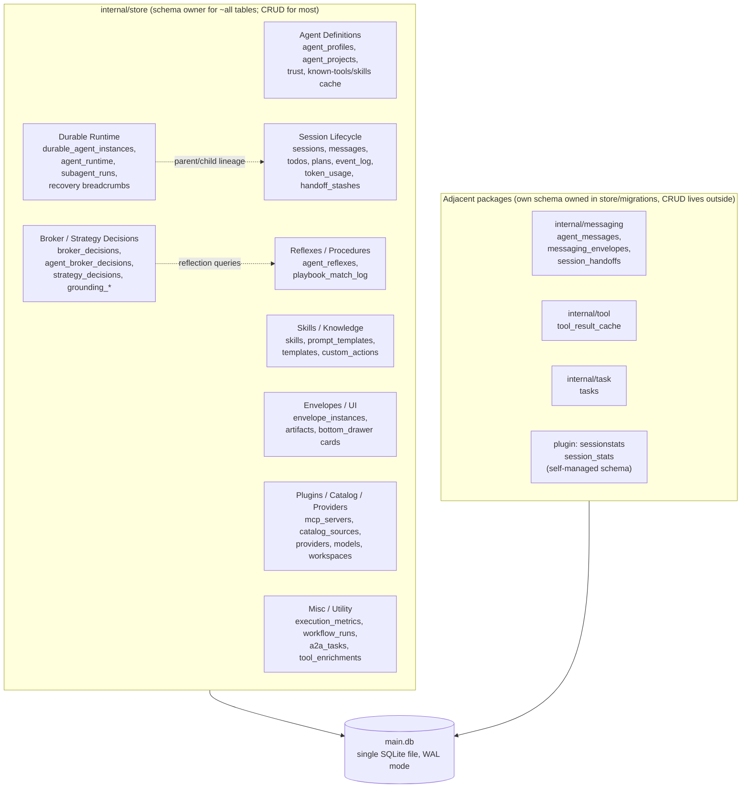

# 10 — Storage Layer

## 1. Purpose

Nanite persists essentially all of its state — agent definitions, chat sessions and messages, durable-agent runtime state, tool/broker decisions, inter-agent messages, envelopes, skills, plugin catalogs, usage metrics — in a single SQLite database file, opened once at process start and shared for the life of the daemon. The connection is opened via `sqlitekit.OpenSingle` (`internal/store/store.go`) as a **single-connection pool** with DSN-level pragmas applied on every connection modernc opens: WAL journal mode, `foreign_keys`, a 5-second `busy_timeout`, `synchronous(NORMAL)`, `temp_store(memory)`, a 30 GB `mmap_size`, a 64 MiB `journal_size_limit`, and `_txlock=immediate`. There is no separate read replica, no connection pool in the usual sense, and no external database server — SQLite-on-disk, accessed in-process, is the entire persistence layer.

The on-disk location is resolved through `internal/config/layout.go` via `go-apppaths`, in XDG mode: the main DB lives at `~/.local/share/nanite/workspaces/default/main.db`, with sibling XDG paths for plugin-data, plugin-cache, and state (coordination/worktrees). The literal path segment `workspaces/default/` is a **filesystem-level** partitioning point — `go-apppaths` supports resolving a different workspace name via a `NANITE_WORKSPACE` env var (each workspace would get its own directory and thus its own independent `main.db`), but only `default` is materialized in the observed installation. This is a single-tenant-per-workspace-directory model: one SQLite file per workspace, selected by environment/config at process start, not a runtime-switchable multi-tenancy scheme. Confusingly, the schema *also* defines an application-level `workspaces` table (1 row: `default`/"Default workspace") and a `projects` table nested under it — this is a **separate**, thinner concept: an in-app grouping construct for organizing sessions in the UI (sidebar grouping), unrelated to the filesystem-level workspace-as-separate-database-file mechanism. Both are named "workspace" and both default to a single row/directory named `default`, which is a likely source of confusion but not (as observed) a functional collision.

A second, independently-resolved SQLite database exists alongside this one: the embedded Tesseract memory store (`ResolveTesseractLayout` in the same file), at `~/.local/share/tesseract/workspaces/default/main.db` — a different application (`tesseract`, not `nanite`) sharing the same go-apppaths XDG convention and the same "workspaces/default" path shape, but a fully separate file and schema. This subsystem's scope is the `nanite` app database only.

## 2. Migration mechanism

There is **no `schema_migrations` ledger table**. Every one of the 93 embedded `.sql` files in `internal/store/migrations/` (numbered `001_schema.sql` through `093_playbook_match_log_raw_sent_text.sql`, embedded via `//go:embed migrations/*.sql`) re-executes, in full, on **every process boot** (`Store.migrate()` in `internal/store/store.go`). Idempotency is achieved entirely by making each statement individually safe to re-run, via three mechanisms the runner recognizes and swallows as non-errors:

- `ALTER TABLE ADD COLUMN` failing with "duplicate column" → treated as already-applied.
- `DROP COLUMN` / `CREATE INDEX` failing with "no such column" → treated as already-applied (gated to DDL-only statements so a genuine DML typo in a `SELECT`/`UPDATE`/`INSERT`/`DELETE` still hard-fails).
- `ALTER TABLE ... RENAME TO` failing with "no such table" (source already renamed) or "already another table" (destination exists) → treated as already-applied.

Because SQLite cannot `ALTER` a `CHECK` constraint in place, several migrations need to **widen an enum** on an existing table (e.g. adding a new valid `status` value) and do so via a **rename → recreate → copy** pattern: rename the live table to `<name>_legacy_<migration#>`, `CREATE TABLE IF NOT EXISTS` the new (wider) definition under the original name, `INSERT OR IGNORE ... SELECT ...` the old rows across, and leave the `_legacy_*` table in place (never dropped) so the next boot's re-run of the same statements finds the rename already done and no-ops via the swallowed-error paths above. This pattern appears at least three times: `018`/`089` (`agent_messages` → `agent_messages_legacy_089`), `043` (`todos` → `todos_legacy_d1`), and `019`/`065`/`067` (`subagent_runs`, three separate migrations each widening the same `status` CHECK over time).

**Concrete failure mode (commit `e2273f8`, 2026-08-17):** the `subagent_runs` case above crash-looped the live production daemon (250 restart attempts). Migrations `019`, `065`, and `067` each independently rebuild `subagent_runs` from scratch, but each rebuild statement is baked from *that migration's own, historical* column/CHECK definition — `019`'s `CHECK` predates the `'stalled'`/`'over_budget'` status values `065` added later. Once a real row was ever written with one of those newer statuses (here: a subagent run the reaper marked `'stalled'` after 30 minutes of inactivity), the *next* boot's re-run of `019` tried to copy that row into a table rebuilt with `019`'s original 7-value `CHECK` and failed outright — a hard migration error, before `065`/`067` ever got the chance to re-widen the constraint back. Independent of the crash, the same pattern was also silently **dropping and resetting to defaults** every column a later migration (`067`, `092`) had added — `provider`, `retry_count`, `max_retries`, `on_fail`, `attempts_json`, `last_activity_at` — on every single restart, since `019`'s rebuild statement has no idea those columns exist.

The fix added a `-- migrate:skip-if-column-exists <table> <column>` directive, checked via `PRAGMA table_info` before a migration's statements run at all: once `subagent_runs` already has the column introduced by the *last* migration in the rebuild chain (proof the table has already moved past what an earlier rebuild would otherwise undo), that earlier migration's rebuild is skipped entirely rather than executed and having its damage silently swallowed. This directive was applied to `019`/`065`/`067` only — the same structural pattern in `043`/`089` (and any future CHECK-widening migration) does not currently carry the same guard, so the general failure mode (an early rebuild in a chain clobbering later columns/constraints on every boot, and hard-failing if live data has already moved past what it recreates) remains a property of the "rename+recreate+copy, no ledger" migration mechanism itself, not something fixed once for all instances of the pattern.

## 3. Functional map

`internal/store/` contains 128 `.go` files: 64 implementation files and 64 matching `_test.go` files (one-to-one for nearly every implementation file, plus several `migration_NNN_*_test.go` files that test individual migrations directly). The live database has 79 real tables (plus SQLite's own `sqlite_sequence` bookkeeping table) across those files' `CREATE TABLE` statements in `migrations/`.

**Not everything that persists into `main.db` is CRUD'd from `internal/store`.** A handful of functional areas define their table's schema in `internal/store/migrations/` (schema is centralized) but implement all reads/writes in a sibling package that holds the shared `*sql.DB` or `*store.Store` handle directly:

- `internal/messaging/` (`sqlite.go`, `handoff.go`, `gomsg/sqlstore.go`) owns `agent_messages`, `messaging_envelopes`, `agent_mailbox_view`, `session_handoffs`.
- `internal/tool/cache.go` owns `tool_result_cache` (the Phase 3 S4a tool-result cache/pointer system).
- `internal/task/snapshot.go` owns `tasks` (subagent task-tree snapshots).
- `internal/plugin/builtin/sessionstats/` owns `session_stats` — and notably calls its **own** `InitSchema` (`CREATE TABLE IF NOT EXISTS ...`) at plugin init time rather than shipping a numbered file under `internal/store/migrations/`; this table's schema is not part of the central migration set at all.

### Agent Definitions
*(sibling doc: agent-definitions coverage in this audit, not yet present in this directory at time of writing)*

- `agents.go` → `agent_profiles` (the central agent-definition CRUD; also joins across nearly every agent-related child table to assemble a full "agent object" for listing/loading)
- `agent_projects.go` → `agent_projects` — links `agent_profiles` ↔ `projects`
- `agents_hash.go` → no table; `ComputeAgentHash` computes the content-hash stored in `agent_profiles.agent_hash`
- `trust.go` → `agent_profiles`, `workspace_role_trust` — role trust-tier resolution
- `agent_procedures.go` → `agent_procedures` — per-agent named procedure/playbook text blocks
- `agent_known_skills.go`, `agent_known_tools.go`, `agent_known_tools_reaper.go` → `agent_known_skills`, `agent_known_tools` — per-agent visibility cache of which skills/tools an agent currently knows about, plus a reaper that prunes stale entries
- `agent_state_store.go` → no table directly; documented as "the indirection seam over the five per-agent durable state tables introduced by migration 065" (sharded per-agent state across `agent_cycles`/`agent_log`/`agent_known_tools`/`agent_known_skills`/`agent_procedures`), explicitly designed so a future per-agent-file backend could swap in behind the same interface
- `catalog.go` → `catalog_sources` — registered plugin/agent catalog source URLs (could also be read as Plugins/Catalog; grouped here because agent profiles are the primary catalog consumer)

### Durable Runtime
*(sibling doc: `09-durable-agents-runtime.md`)*

- `durable_agents.go` → `durable_agent_instances`, `durable_agent_instance_sessions`, `durable_agent_events`, `agent_runtime`
- `agent_runtime.go` → `agent_runtime`, `agent_runtime_checkpoints`
- `agent_cycles.go` → `agent_cycles` — per-agent wake/tick cycle bookkeeping
- `agent_log.go` → `agent_log` — per-agent durable log
- `agent_boot_plans.go` → `agent_boot_plans` — precompiled boot-prompt plans
- `agent_knowledge_seed.go` → `agent_knowledge_seed` — seed knowledge injected at agent creation
- `agent_schedules.go` → `agent_schedules` — cron-like wake schedules for durable agents
- `recovery.go` → `nanite_recovery_breadcrumbs`, `agent_runtime` — crash-recovery bookkeeping
- `session_halt.go` → `sessions`, `execution_metrics`, `messages`, `token_usage` — the halt/kill-switch path
- `subagent_runs.go` → `subagent_runs` — sync/async/api/interactive subagent dispatch and lifecycle (the table at the center of the `e2273f8` crash-loop)
- `a2a_tasks.go` → `a2a_tasks`, `a2a_push_deliveries` — Agent2Agent protocol task tracking
- `sessions.go` also contributes here: its session-listing queries use a `WITH RECURSIVE` CTE (`latest_subagent_edges` / `subagent_lineage`) joining `sessions` and `subagent_runs` to reconstruct parent/child subagent trees — these two names are query-scoped CTE aliases, not tables.

### Reflexes / Procedures
*(sibling doc: reflexes coverage in this audit, not yet present in this directory at time of writing)*

- `agent_reflexes.go` → `agent_reflexes`, `pending_reflexes` — predicate/event/interval-triggered reflex rules and their pending-fire queue
- `reflex_log.go` → `playbook_match_log` — audit trail of reflex/playbook pattern matches
- Consumer outside `internal/store`: `internal/agent/reflexes/` (`state.go`, `types.go`) reads recent session/agent signals through `store.Store` to evaluate reflex predicates — this is a consumer of the store's public methods, not a second independent SQL path.

### Broker / Decisions
*(sibling doc: broker/strategy decisions coverage in this audit, not yet present in this directory at time of writing)*

- `broker.go` → `broker_decisions` — tool-broker layer-selection log (which tool-discovery layer was reached, what got selected, per session/turn)
- `broker_decisions.go` → `agent_broker_decisions` — a **separately named, separately owned** table from the one above, despite the near-identical file/table names (see Open Questions)
- `strategy_log.go` → `strategy_decisions` — the approach/strategy chosen per turn (`direct_chain` etc.), with links to reflex matches and playbook hits
- `grounding_log.go` → `grounding_consultations`, `grounding_outcomes` — grounding-check consultation/outcome log

### Messaging (inter-agent)
*(sibling doc: inter-agent messaging coverage in this audit, not yet present in this directory at time of writing — schema lives in `internal/store/migrations`, CRUD lives in `internal/messaging`)*

- `internal/messaging/sqlite.go` → `agent_messages` (renamed from the legacy `a2a_messages` name by migration `018`; deliberately not named `messages` to avoid colliding with the session-chat `messages` table)
- `internal/messaging/gomsg/sqlstore.go`, `envelope_bridge.go` → `messaging_envelopes`, `agent_mailbox_view` — a newer URN-addressed envelope messaging layer (`gomsg`) alongside the older `agent_messages` shape
- `internal/messaging/handoff.go` → `session_handoffs` — agent-to-agent session handoff requests/approvals
- `internal/store/session_overrides.go` → `session_agent_overrides` — the one messaging-adjacent table still owned directly by `internal/store`

### Session Lifecycle
*(sibling doc: session lifecycle coverage in this audit, not yet present in this directory at time of writing)*

- `sessions.go` → `sessions`, `session_agents` — core session CRUD, agent-assignment-per-session, and the recursive lineage queries noted above
- `session_objects.go` → `session_objects`
- `modes.go` → `modes`, `agent_mode_assignments` — chat "mode" (persona/behavior profile) definitions and assignment
- `pinned_content.go` → `pinned_content`, plus reads `sessions`
- `reminders.go` → `reminders`, plus reads `sessions`
- `bookmarks.go` → `bookmarks`
- `bottom_drawer_cards.go` → `bottom_drawer_pinned_cards`
- `todos.go` → `todos`, plus the renamed-away `todos_legacy_d1` (see Open Questions)
- `plans.go` → `plans`
- `handoff_stashes.go` → `handoff_stashes` — stashed context for in-progress handoffs
- `documents.go` → `documents`, plus reads `sessions`
- `compaction_events.go` → `compaction_events` — context-compaction event log
- `usage.go` → `usage` queries against `token_usage`
- `events.go` → `event_log` — the general-purpose event/audit log (largest table by row count observed)
- `internal/plugin/builtin/sessionstats/` → `session_stats` (self-managed schema, see above)
- `internal/task/snapshot.go` → `tasks` — subagent task-tree snapshots, outside `internal/store`

### Skills / Knowledge
*(sibling doc: skills/knowledge coverage in this audit, not yet present in this directory at time of writing)*

- `skills.go` → `skills`, `agent_skills`
- `skill_mode_filter.go` → no table; pure two-pass filter logic (mode binding + mode tool-override allow/deny) over in-memory skill lists
- `skills_source.go` → no table; source-classification constants (`internal`/`user`/`plugin`) used by the FE dev-mode editor
- `prompt_templates.go` → `prompt_templates`, `agent_prompt_templates`
- `templates.go` → `templates`
- `custom_actions.go` → `custom_actions`
- `trigger_rules.go` → `trigger_rules`

### Envelopes / UI
*(sibling doc: envelopes coverage in this audit, not yet present in this directory at time of writing)*

- `envelope_instances.go` → `envelope_instances` — persisted envelope cards (structured UI cards) and their response state
- `artifacts.go` → `artifacts`

### Plugins / Catalog / Providers
*(no dedicated sibling doc identified; closest existing coverage is `16-plugin-system.md` and `07-tool-calling-mcp.md`)*

- `mcp_servers.go` → `mcp_servers` — registered MCP server connections, trust tier, env allowlist
- `catalog.go` → `catalog_sources` (cross-listed under Agent Definitions above)
- `providers.go` → `providers`, `models` — LLM provider/model registry
- `defaults.go` → no table directly; `ResolveProviderAndModel`/`DefaultModelForProvider` walk `user_settings` → `providers.default_model` → compile-time fallback
- `plugin_settings.go` → `plugin_settings`
- `user_settings.go` → `user_settings`
- `workspaces.go` → `workspaces`, `projects`
- `seed.go` → first-run seeding across `catalog_sources`, `models`, `providers`, `user_settings`, `workspaces`

### Misc / Utility
*(no dedicated sibling doc identified)*

- `execution_metrics.go` → `execution_metrics`
- `workflow_runs.go` → `workflow_run_steps`, `workflow_runs`; the `workflows` table itself (defined in the schema) has no `internal/store/*.go` or wider-codebase file that reads or writes it (see Open Questions)
- `tool_enrichments.go` → `tool_enrichments` — cached hint metadata per tool name
- `internal/tool/cache.go` → `tool_result_cache`, outside `internal/store` (the Phase 3 S4a tool-result cache/pointer system referenced in this repo's `CLAUDE.md`)
- `mode_auto_switch.go`, `mode_tool_overrides.go` → no tables; pure resolver logic for mode auto-switch precedence and mode tool-override specs

## 4. Scale/activity signal

Row counts observed against the live `main.db` (37.9 MB file + an 11.2 MB WAL file not yet checkpointed, i.e. active write traffic at the time of this audit):

**Heavily active (100s–1,000s of rows) — clearly load-bearing:**

| Table | Rows | Category |
|---|---:|---|
| `event_log` | 3,833 | Session Lifecycle |
| `tool_result_cache` | 1,117 | Misc (tool cache) |
| `messages` | 1,103 | Session Lifecycle |
| `broker_decisions` | 1,004 | Broker/Decisions |
| `execution_metrics` | 995 | Misc |
| `skills` | 821 | Skills/Knowledge |
| `token_usage` | 422 | Session Lifecycle |
| `strategy_decisions` | 410 | Broker/Decisions |
| `session_agents` | 344 | Session Lifecycle |
| `sessions` | 343 | Session Lifecycle |
| `agent_known_tools` | 321 | Agent Definitions |
| `agent_broker_decisions` | 314 | Broker/Decisions |
| `subagent_runs` | 174 | Durable Runtime |

**Lightly active (tens of rows) — in use, low volume:**
`durable_agent_events` (122), `playbook_match_log` (114), `nanite_recovery_breadcrumbs` (61), `agent_procedures` (41), `todos` (42), `todos_legacy_d1` (26, legacy), `handoff_stashes` (26), `plans` (28), `agent_profiles` (28), `envelope_instances` (22), `durable_agent_instances` (18), `durable_agent_instance_sessions` (17), `providers` (16), `agent_known_skills` (13), `agent_messages` (13), `agent_messages_legacy_089` (7, legacy), `prompt_templates` (11), `artifacts` (8), `modes` (7), `sqlite_sequence` (6), `models` (34), `agent_reflexes` (14).

**Zero rows at time of audit (27 of 79 real tables — over a third of the schema):**
`a2a_push_deliveries`, `a2a_tasks`, `agent_boot_plans`, `agent_cycles`, `agent_knowledge_seed`, `agent_log`, `agent_mailbox_view`, `agent_mode_assignments`, `agent_projects`, `agent_runtime_checkpoints`, `agent_skills`, `compaction_events`, `custom_actions`, `documents`, `grounding_consultations`, `grounding_outcomes`, `messaging_envelopes`, `pending_reflexes`, `plugin_settings`, `projects`, `session_agent_overrides`, `session_handoffs`, `session_objects`, `session_stats`, `tool_enrichments`, `trigger_rules`, `workflows`.

This zero-row set spans every functional category — it is not concentrated in one area. Some are plausibly legitimate "feature exists, not yet exercised in this particular installation's history" (e.g. `session_handoffs`, `compaction_events`, `documents`); others (`workflows` with zero referencing code found anywhere in the tree beyond its own migration; `agent_projects` and `projects`, whose parent `workspaces` row count is 1) look more like schema that shipped ahead of, or instead of, feature usage. This is stated as an observation of what the data shows, not a judgment of which case applies to which table.

## 5. Cross-references

| Functional category | This doc's section | Sibling doc |
|---|---|---|
| Agent Definitions | §3 | Not yet present in this directory at time of writing |
| Durable Runtime | §3 | `09-durable-agents-runtime.md` |
| Reflexes / Procedures | §3 | Not yet present in this directory at time of writing |
| Broker / Strategy Decisions | §3 | Not yet present in this directory at time of writing |
| Inter-agent Messaging | §3 | Not yet present in this directory at time of writing |
| Session Lifecycle | §3 | Not yet present in this directory at time of writing |
| Skills / Knowledge | §3 | Not yet present in this directory at time of writing |
| Envelopes / UI | §3 | Not yet present in this directory at time of writing |
| Plugins / Catalog / Providers | §3 | Related: `16-plugin-system.md`, `07-tool-calling-mcp.md` |
| Boot process (reads `agent_profiles`, boot plans) | — | `02-boot-process.md` |
| Launch paths (reads/writes `sessions`, `subagent_runs`, durable tables) | — | `03-launch-paths.md` |
| Context Broker / Slot System (reads `broker_decisions`, `strategy_decisions`, `skills`) | — | `05-context-broker-slot-system.md` |
| Provider/LLM round-trip (reads `providers`, `models`, writes `token_usage`) | — | `06-provider-llm-roundtrip.md` |

As of this writing, only `02-boot-process.md`, `03-launch-paths.md`, `05-context-broker-slot-system.md`, `06-provider-llm-roundtrip.md`, `07-tool-calling-mcp.md`, `09-durable-agents-runtime.md`, and `16-plugin-system.md` exist in `docs/system-audit/2026-08-17/code-architecture/`. The categories marked "not yet present" above are called out explicitly in this audit's task scope as separate documents (agent definitions, durable agents, reflexes, broker/strategy decisions, inter-agent messaging, session lifecycle, skills/knowledge, envelopes) but had not landed in this directory at the time this document was written; this table should be revisited once they do.

## 6. Open questions

These are observations about the storage layer's shape, stated without a proposed resolution.

- **`broker_decisions` vs `agent_broker_decisions`.** Two tables with near-identical names, owned by two near-identically-named files (`broker.go` and `broker_decisions.go`), both logging tool/broker-related decisions (1,004 and 314 rows respectively — both clearly active). Whether these represent two genuinely distinct concerns that happen to be named confusingly close, or one superseding the other, is not evident from the schema alone.
- **`agent_messages` vs `agent_messages_legacy_089`, `todos` vs `todos_legacy_d1`.** Both pairs are artifacts of the rename-recreate-copy CHECK-widening migration pattern (§2). The `_legacy_*` tables are never dropped by any migration observed and still hold rows (7 and 26 respectively) — live remnants of a schema state the running table has moved past, kept around indefinitely as a side effect of how the idempotent-rerun mechanism works, not as a deliberate archival decision.
- **The rename-recreate-copy pattern is applied unevenly.** The `migrate:skip-if-column-exists` guard that fixed the `e2273f8` crash-loop was applied only to the three `subagent_runs` migrations (`019`/`065`/`067`) involved in that incident. The structurally identical pattern in `043` (`todos`) and `089` (`agent_messages`) does not carry the same guard, so the same class of failure (an early migration in a chain re-clobbering columns a later migration added, and potentially hard-failing against live data that has moved past the early migration's own CHECK) is a property of any table that has been through this pattern more than once, not something resolved once for the mechanism as a whole.
- **Schema management has two independent paths.** Every table observed except one is defined by a numbered file under `internal/store/migrations/`, applied by the shared `Store.migrate()` runner at boot. `session_stats` is the one exception: its owning package (`internal/plugin/builtin/sessionstats`) calls its own `CREATE TABLE IF NOT EXISTS` at plugin-init time, entirely outside the migration set. It is empty (0 rows) at the time of this audit.
- **CRUD ownership is split from schema ownership for at least four tables/groups.** `agent_messages`/`messaging_envelopes`/`agent_mailbox_view`/`session_handoffs` (owned by `internal/messaging`), `tool_result_cache` (owned by `internal/tool`), and `tasks` (owned by `internal/task`) all have their `CREATE TABLE` in `internal/store/migrations/` but their reads/writes entirely outside `internal/store`. `internal/store` is the schema's single source of truth but not, as its file count might suggest, the storage layer's single implementation surface.
- **Two overlapping "workspace" concepts share the word and the default value.** The filesystem-level XDG workspace (`~/.local/share/nanite/workspaces/<name>/main.db`, `NANITE_WORKSPACE`-selectable, currently only `default` exists) and the in-app `workspaces` table (a UI-grouping construct, currently 1 row, also named `default`) are unrelated mechanisms that happen to share a name and a default value.
- **`workflows` has a schema, an FK from `sessions.workspace_id`-style pattern (`workspace_id REFERENCES workspaces(id)`), zero rows, and no code path in the repository (outside the migration itself) that reads or writes it** — `workflow_runs`/`workflow_run_steps` (which do have minimal code and 1/2 rows respectively) look like the table actually used by whatever workflow-execution feature exists, leaving `workflows` itself unclear as either a planned-but-unbuilt definition layer or a superseded design.
- **Roughly a third of the schema's tables (27 of 79) hold zero rows** at the time of this audit, spread across every functional category rather than concentrated in one (§4). Some plausibly reflect features simply not yet exercised in this installation's history (e.g. `session_handoffs`); the schema alone does not distinguish those from tables that shipped ahead of, or in place of, an actually-wired feature.
