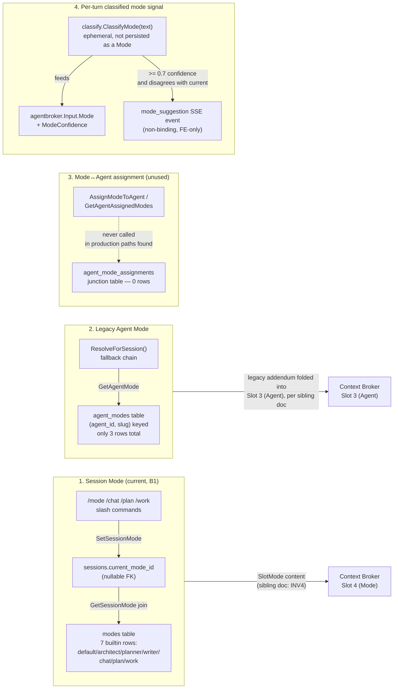

# Broker & Strategy Decisions

> System audit — code architecture. Describes the subsystem that makes
> meta-decisions about agent behavior (which agent handles a turn, what
> execution approach and turn budget it gets, which tools/skills are
> exposed) as it exists in the codebase today. Not a review; no
> recommendations.

## 1. Purpose

This subsystem makes the "how should this turn be handled" decisions that
sit upstream of and around the LLM's own tool-use loop. Concretely, three
independently-evolved decision layers run on (nearly) every chat turn:

- **The agent broker** (`agentkit/broker`, wired as `agent_broker_decisions`)
  decides, once per turn, *which agent profile* should own the turn — the
  chat agent handles it directly, or it gets dispatched to a `worker` /
  `planner` / reflex-named subagent slug. It runs immediately before the
  tool-use loop starts.
- **The strategy planner** (`internal/strategy`, wired as
  `strategy_decisions`) decides, once per turn, the turn's *execution
  approach* (`direct_chain` vs `subagent_delegation`) and its *turn budget*
  (`MaxTurns`) — the ceiling on how many loop iterations the chat agent gets
  before the loop forcibly stops. It runs immediately after the agent
  broker, in the same per-turn sequence.
- **The tool broker** (`go-toolbroker`, wired as `broker_decisions`) decides,
  potentially multiple times *within* a single turn, *which tools* are
  exposed to the LLM as it progressively discovers/requests more via
  `request_tools`. This is an older, narrower mechanism (tool selection, not
  agent/approach selection) that happens to share the word "broker" and
  briefly appears here because the task's DB grounding sample asked for it
  — its full behavior is documented in the tool-calling/MCP sibling doc.

All three are deterministic, rule-based, synchronous, and cheap — none of
them call an LLM. All three write an append-only telemetry row per decision
to SQLite (never gating the turn on write success). A fourth, related
concept — **modes** — is a persistent per-session/per-agent behavioral
label (`chat`/`plan`/`work`/custom) that these deciders *read as a signal*
but do not themselves own; mode assignment is covered in §5.

## 2. Key entry points/files

- `internal/service/chat_broker_dispatch.go` — `attemptBrokerDispatch`: the upstream agent-broker call site; builds `agentbroker.Input`, calls `s.agentBroker.Decide()`, persists `agent_broker_decisions`, emits the `agent_broker_decision` SSE event, and on a dispatch decision synthesizes a `task_execute` call.
- `github.com/hollis-labs/agentkit/broker` (external module, `agentkit@v0.3.0`) — `broker.go` (`Input`/`Decision`/`Broker` interface, `ModeBroker`), `deterministic.go` (`DeterministicBroker` — the actual priority-ordered rule set, see §4).
- `internal/service/chat_strategy.go` — `planStrategyForTurn`, `applyStrategyToLimits`, `reviewExhaustedBudget` (defined but not called in production — see §9), `strategyClarifyingQuestion`.
- `internal/strategy/plan.go` — `PlanStrategy`: the rule-based turn-budget/approach planner.
- `internal/strategy/review.go` — `ReviewMidExecution`, `ClarifyingQuestion`: the budget-exhaustion review step (tested, not wired — §9).
- `internal/strategy/types.go` — `Strategy`, `PlanInput`, `Approach`, `ReviewDecision`, the hardcoded budget constants (`BudgetTrivial`/`BudgetMedium`/`BudgetLarge`).
- `internal/promptrouter/catalog.go` — `BuiltinReflexes()`: the hand-authored phrase→agent-profile reflex catalog both the agent broker and the strategy planner consult.
- `internal/promptrouter/matcher.go` — `Match`/`MatchAll`: substring phrase matcher over the reflex catalog.
- `internal/classify/mode.go` — `ClassifyMode`: the deterministic per-turn "chat/plan/work" mode classifier that feeds `agentbroker.Input.Mode`.
- `internal/classify/scope.go` — `ScopeTier`/`ExecutionPattern` — the M1 intent-classification primitive both the broker and strategy planner read (populated upstream by `classifyAndAttach`, not detailed here).
- `internal/grounding/` (`types.go`, `recall.go`, `outcome.go`) — the E2 memory-grounding recall step some strategy/dispatch paths consult; gated off by default (see §9).
- `internal/store/broker_decisions.go` — `AgentBrokerDecision` struct + `InsertAgentBrokerDecision`/`ListRecentAgentBrokerDecisions` (the `agent_broker_decisions` table).
- `internal/store/broker.go` — `BrokerDecision` struct + `LogBrokerDecisionEx`/`ListBrokerDecisions` (the *tool* broker's `broker_decisions` table).
- `internal/store/strategy_log.go` — `LogStrategyDecision`/`ListStrategyDecisions` (the `strategy_decisions` table).
- `internal/store/reflex_log.go` — `LogReflexMatch`/`ListReflexMatchLog` (the `playbook_match_log` table — logs reflex catalog matches, see §9 naming note).
- `internal/store/modes.go` — `Mode`, `AgentModeAssignment`, `BuiltinModes`, `SetSessionMode`/`GetSessionMode`/`ClearSessionMode`, `AssignModeToAgent`/`GetAgentAssignedModes`.
- `internal/chat/commands_mode.go` — `/mode`, `/chat`, `/plan`, `/work` slash commands that flip `sessions.current_mode_id`.
- `internal/service/agent.go` — `ResolveForSession`/`resolveForSession`: resolves the legacy per-agent `AgentMode` (distinct from session `Mode` — see §5).
- `internal/service/chat_generate.go` — the per-turn call site ordering (`classifyAndAttach` → `attemptBrokerDispatch` → `attemptRouteDispatch` → `planStrategyForTurn` → tool-use loop) and the `mode_suggestion` SSE emission.
- `internal/mcp/self_tools_dispatch.go` — `callExecuteTask`: the downstream "inner" reflex+grounding enrichment layer that runs when a dispatch call is actually made (distinct from the upstream broker *decision* — see the load-bearing boundary comment in `chat_broker_dispatch.go`).
- `internal/toolclient/broker.go`, `internal/toolclient/ranking.go` — the tool broker's selection/ranking logic (`go-toolbroker/broker.LocalBroker`).
- `ui/src/components/plugins/debug/BrokerDecisionsPanel.tsx` / `BrokerDecisionsWidget.tsx` — the one FE debug surface, and it reads the *tool* broker's `broker_decisions`, not `agent_broker_decisions` or `strategy_decisions` (see §9).

## 3. Flow

### 3.1 Per-turn sequence

Every call to `generateResponse` (the chat turn entry point) runs the same
fixed sequence before the LLM tool-use loop begins. This is not three
independent subsystems each finding their own moment to run — they are
explicitly ordered, one seam after another, in `chat_generate.go`:

```mermaid
flowchart TD
    A["User turn arrives\ngenerateResponse()"] --> B["classifyAndAttach()\nM1: ScopeTier + ExecutionPattern\n(loopState.Classification)"]
    B --> C["attemptBrokerDispatch()\nAGENT BROKER"]
    C --> C1["buildBrokerInput():\nUserText, Mode (ClassifyMode),\nScopeTier/Pattern (from B),\nReflexMatchID/Slug/Confidence\n(promptrouter.Match, builtin reflexes)"]
    C1 --> C2["agentBroker.Decide(input)\nDeterministicBroker — 6 fixed rules, see 4"]
    C2 --> C3["INSERT agent_broker_decisions\n+ event_log row\n+ SSE agent_broker_decision"]
    C3 --> C4{"Decision.AgentProfile\n== \"\" (chat)?"}
    C4 -->|yes| C5["No dispatch.\nChat-direct loop still runs next."]
    C4 -->|no: worker/planner/reflex slug| C6["Synthesize task_execute call\n(runs the DOWNSTREAM reflex/grounding\nenrichment in mcp.callExecuteTask)\n→ plugin_envelope SSE event\n(NOT a short-circuit — chat loop\nstill runs afterward)"]
    C5 --> D
    C6 --> D["attemptRouteDispatch()\n(B2 classifier-route seam — informative,\nnot detailed in this doc)"]
    D --> E["planStrategyForTurn()\nSTRATEGY PLANNER"]
    E --> E1["promptrouter.Match() again\n(same builtin reflex catalog)"]
    E1 --> E2["PlanStrategy(): 3 ordered rules\n(reflex-background / grounding-prior-success /\nintent-tier) → Approach + MaxTurns"]
    E2 --> E3["INSERT strategy_decisions"]
    E3 --> F["applyStrategyToLimits()\nls.limits.maxTurns = Strategy.MaxTurns"]
    F --> G["Tool-use loop runs\n(up to MaxTurns iterations)"]
    G --> H["Per request_tools call inside the loop:\nTOOL BROKER (go-toolbroker)\nranks/filters exposed tools\n→ INSERT broker_decisions\n(layer_reached: request_tools/broker/augmented)"]
    G --> I["Loop ends: end_turn or MaxTurns reached"]
```

Two things this diagram makes explicit:

- **The agent broker's decision is informative, not prohibitive.** Even when
  it decides `worker`/`planner` and successfully dispatches, the chat-direct
  LLM loop *still runs afterward* — the code comment in
  `chat_broker_dispatch.go` calls this "informative not prohibitive,"
  mirroring the same stance documented for the B2 classifier-route seam. The
  dispatched subagent's envelope is pushed onto the stream as a *side
  channel*; it does not replace the chat agent's own turn.
- **Both the agent broker and the strategy planner independently run the
  same reflex-catalog match** (`promptrouter.Match` over
  `promptrouter.BuiltinReflexes()`) on the same user text. They are two
  separate consultations of the same catalog, at two different call sites,
  producing two separate log rows — not one shared reflex-match result
  reused by both layers.

### 3.2 What the outputs change

- **Agent broker output** (`Decision.AgentProfile`) — when non-empty, causes
  a synthesized `task_execute` call and a `plugin_envelope` SSE event
  alongside the normal chat response. It does not change which prompt slots
  ship or which tools are offered to the *chat* agent's own loop.
  `mcp.callExecuteTask` (the actual dispatch executor for that synthesized
  call) is where the *downstream* reflex/grounding enrichment happens for
  whatever subagent gets spun up.
- **Strategy planner output** (`Strategy.MaxTurns`) — directly overwrites
  `ls.limits.maxTurns`, the loop's hard iteration ceiling for this turn.
  This is the one strategy output actually consumed by the live loop.
  `Strategy.Approach` is recorded but the v1 loop does not branch on it —
  per `internal/strategy/types.go`'s package doc: "the LLM still decides"
  whether to call `task_execute`; the strategy layer only *logs* the
  recommendation.
- **Tool broker output** — changes which tool definitions are actually sent
  to the LLM this iteration (full definition / partial / pointer-hydrated),
  progressively as `request_tools` calls happen. This is the mechanism the
  sibling tool-calling/MCP doc covers in depth.
- **None of the three** touch which context-broker *slots* ship or their
  content directly — that's the sibling context-broker/slot-system doc's
  domain (see §5 for the one place these systems *do* intersect: the Mode
  slot).

## 4. Concrete decision anatomy

### 4.1 `agent_broker_decisions` — the agent broker's per-turn row

Real row (`id=311`, from the live DB):

```
session_id      = 93af1250-ca9a-48b9-8381-a55d4436a2d4
turn_id         = 1
user_input_hash = d1c43a931ef0cf6f3384c4aeca52240ecb285b2a36895d10391cf49cff7d9470
mode_signal     = chat
scope_tier      = small
reflex_id       = (empty)
decision        = (empty)
reason          = default-chat-handle
confidence      = 0.0
created_at      = 2026-08-17 21:15:47
```

Field-by-field: `user_input_hash` is `sha256(UserText)` — the raw text is
never persisted, only a fingerprint for correlating repeat inputs.
`mode_signal` and `scope_tier` are the classifier projections fed in as
`Input.Mode`/`Input.ScopeTier` (see §3.1's `buildBrokerInput`); `reflex_id`
is populated only when `promptrouter.Match` fired. `decision` is
`Decision.AgentProfile` — empty string means "chat handles it," a non-empty
value is a dispatch slug (`worker`, `planner`, or a reflex-specific
profile). `reason` is a fixed label from the rule that fired (see the exact
rule set below); `confidence` is that rule's confidence value, not a
learned/calibrated score.

Aggregate over the live 314 rows:

| decision | count |
|---|---|
| *(empty = chat-direct)* | 173 |
| `planner` | 57 |
| `worker` | 49 |
| `reviewer` | 34 |
| `researcher` | 1 |

| reason | count |
|---|---|
| `default-chat-handle` | 173 |
| `tier=open,pattern=subagent` | 43 |
| `reflex:worker-execute` | 39 |
| `reflex:reviewer-mention` | 34 |
| `reflex:planner-mention` | 6 |
| `reflex:planner-large-task` | 6 |
| `action-verb-work` | 6 |
| `mode=work` | 4 |
| `mode=plan,tier=open` | 2 |
| `reflex:researcher-mention` | 1 |

This is the exact rule set (`github.com/hollis-labs/agentkit@v0.3.0/broker/deterministic.go`,
`DeterministicBroker.Decide`, first-match-wins, priority order as written):

1. `ReflexMatchID != "" && ReflexAgentSlug != ""` → that slug. `Confidence = ReflexConfidence`. `reason = "reflex:<id>"`.
2. `Mode == "work" && ModeConfidence >= 0.85` → `worker`. `reason = "mode=work"`.
3. `Mode == "work" && ModeConfidence >= 0.7` → `worker`. `reason = "action-verb-work"`.
4. `Mode == "plan" && ModeConfidence >= 0.85 && ScopeTier == "open"` → `planner`. `reason = "mode=plan,tier=open"`.
5. `ScopeTier == "open" && ExecutionPattern == "subagent"` → `planner` (mode-independent). `reason = "tier=open,pattern=subagent"`, fixed `Confidence = 0.75`.
6. Default → chat-direct. `reason = "default-chat-handle"`, `Confidence = 0`.

`0.85` and `0.7` are literally `ModeConfidenceHigh`/`ModeConfidenceLow`
constants in the broker package, and those in turn line up exactly with
`internal/classify/mode.go`'s own hardcoded confidence values (`1.0` for
slash prefix, `0.85` for an imperative phrase, `0.7` for a first-token
action verb) — the two hardcoded threshold sets were written to match each
other, but nothing enforces they stay in sync if either changes
independently.

### 4.2 `strategy_decisions` — the strategy planner's per-turn row

Real row (`id=410`):

```
session_id                  = 069545a3-0bcf-49a2-9ee8-8d289e22a7a0
turn_id                     = fea75ccf-31ca-4c1c-bfe9-eb0dba48f0a7
approach                    = direct_chain
rationale                   = "intent: small → direct_chain"
max_turns                   = 20
escalation_budget           = 0
reflex_match_id             = (null)
playbook_hit                = (null)
grounding_consultation_ids  = null
created_at                  = 2026-08-17T22:30:05Z
```

`approach` is one of `direct_chain` / `subagent_delegation` (v1 never emits
`ask_to_clarify` or `already_answered_from_cache` — those enum values exist
only for the review step and a deferred v2 heuristic, respectively).
`rationale` is a free-text string built by concatenating which rule fired;
across the 410 live rows every distinct rationale follows the pattern
`"intent: <tier> → <approach>[; reflex match <id> (advisory)][; user
prefers terse replies]"`. `escalation_budget` is always `0` in this
dataset — the field exists for a v2 budget-extension path that is never
populated. `playbook_hit` is always `NULL` — the field is reserved for "when
E1 evolves into a full playbook runtime," which per the package doc has not
happened. `grounding_consultation_ids` is `NULL`/`"[]"` for every sampled
row, consistent with grounding being disabled (§9).

Aggregate over the live 410 rows:

| approach | count |
|---|---|
| `direct_chain` | 298 |
| `subagent_delegation` | 112 |

| max_turns | count |
|---|---|
| 20 | 155 |
| 10 | 143 |
| 40 | 112 |

The planner's actual rule order (`internal/strategy/plan.go`,
`PlanStrategy`):

1. Reflex match with background dispatch (`DispatchVia == "executeBackground"` or `HintPattern == PatternBackground`) → `subagent_delegation`, `MaxTurns=40` (`BudgetLarge`).
2. Grounding surfaced a `PriorSuccessApproach` → adopt that approach, budget from `budgetForApproach`. (Never observed in this dataset — grounding is disabled.)
3. Fall through to the M1 intent tier: `trivial→direct_chain/10`, `small|medium→direct_chain/20`, `large|open→subagent_delegation/40`.
4. Default (`TierInvalid`): `direct_chain/20`.

Every sampled rationale in the live data matches rule 3 or 4 — rules 1 and
2 never fired in this dataset (no `background-long-task` reflex hit landed
here, and grounding is off). When a reflex *does* match under rule 3, the
rationale records it explicitly as `"(advisory)"` — the reflex is logged
alongside the decision but the intent-tier rule, not the reflex, chose the
approach. This is a materially different weighting of the same reflex
catalog than the agent broker applies: the agent broker's rule 1 treats a
reflex-agent-slug match as the single highest-priority, decision-overriding
signal; the strategy planner treats the very same match as commentary
appended to an intent-tier-driven decision.

### 4.3 `broker_decisions` — the tool broker's per-call row (for contrast)

Real row pair from one `request_tools`-adjacent turn (`id=1003`/`1004`,
same session, same timestamp — two layers of the same decision):

```
id=1003  intent="fragments engine routed"  layer_reached=augmented
         selected_tools=[13 tool names incl. message_send, loom_page_search, ...]
         signals={"final":5,"top":[{"name":"list_entity_fragments","score":2,"sk":0,"mem":0,"kw":2}, ...]}
         outcome=selected

id=1004  intent="fragments engine routed"  layer_reached=broker
         selected_tools=[same 13 tool names]
         signals=""   outcome=selected
```

`intent` here is a short free-text label (not the M1 `ScopeTier`), `signals`
is a JSON scoring trace (keyword/skill/memory sub-scores per candidate
tool, `"final"` = 5 candidates scored) only populated at the `augmented`
layer. `layer_reached` values seen in this call site's code
(`internal/service/tool.go`): `request_tools`, `broker`, `augmented`.
Aggregate `outcome` over the live 1004 rows: `selected` 977, `loaded` 21,
`empty` 4, `halted` 1, `reflected` 1 — this is the tool-selection layer's
own state machine (progressive discovery / reflection-on-cap), distinct
from and unrelated to the agent-profile / approach decisions above. Full
behavior lives in the tool-calling/MCP sibling doc; it is included here
only because it shares the word "broker" and a decision-log shape.

## 5. Modes

"Mode" names **three separate, independently-persisted mechanisms** in
this codebase, plus one ephemeral per-turn signal that is *not* itself a
persisted mode but feeds into the agent broker's rules above. They are not
layers of one system — they are distinct tables with distinct write paths
that happen to share vocabulary (`chat`/`plan`/`work`).



1. **Session Mode** (`modes` + `sessions.current_mode_id`, added under
   CW-20260428-0009/0010) is the current, actively-used path: a session
   points at one row in the shared `modes` table (7 built-ins:
   `default`, `architect`, `planner`, `writer`, `chat`, `plan`, `work`,
   each just a `prompt_addendum` string plus unused-in-practice
   `tool_overrides`/`settings` JSON blobs — all `"{}"` for every built-in).
   The `/mode`, `/chat`, `/plan`, `/work` slash commands are the only
   production write path (`SetSessionMode`). In the live data, only **6 of
   343 sessions** (~1.7%) have a non-null `current_mode_id` — the large
   majority of sessions never explicitly set a mode and run on whatever the
   fallback resolves to.
2. **Legacy Agent Mode** (`agent_modes` table, keyed by `(agent_id, slug)`,
   no foreign key to `agent_profiles` because "agents may be file-based")
   is resolved by `AgentService.ResolveForSession` as part of the
   agent-resolution fallback chain and passed into `assembleTurnContext` as
   the `mode *store.AgentMode` parameter — separately from the Session Mode
   pointer above. The live table has exactly **3 rows total**, one of which
   (`blt-planner-001-default`) has a `prompt_addendum` that literally reads
   `"Planner mode stub. Full behavior defined in Phase 6."` and another
   (`blt-hint-selector-001-default`) has an **empty** `prompt_addendum`.
3. **Mode↔Agent assignment** (`agent_mode_assignments` junction table +
   `AssignModeToAgent`/`GetAgentAssignedModes`/`UnassignModeFromAgent`
   store methods) links the shared `modes` catalog (mechanism 1) to
   specific agents. The table has **0 rows** in the live database. No call
   site under `internal/service` or `internal/api` invoking
   `AssignModeToAgent` in a way that would populate it was found during
   this audit; the store methods exist and are presumably reachable from
   an agent-admin API surface, but nothing in the current data shows them
   ever having been used.
4. **The per-turn classified mode signal** (`classify.ClassifyMode`) is not
   a persisted Mode at all — it is a fresh, stateless classification of the
   *current message text* into `chat`/`plan`/`work` with a confidence score,
   recomputed on every turn. It is the one "mode" concept that is actually
   load-bearing for a real decision: it is what `agentbroker.Input.Mode`/
   `ModeConfidence` are built from (§4.1 rules 2–4). Separately, when its
   confidence is ≥ 0.7 *and* it disagrees with the session's resolved
   current mode, `chat_generate.go` emits a non-binding `mode_suggestion`
   SSE event — this is purely informational (a suggestion chip), not a
   state change; nothing auto-applies it.

**Relationship to the context broker's "mode-aware content swap" invariant
(INV4, sibling doc):** INV4 is about mechanism 1 only — it guarantees that
once `sessions.current_mode_id` changes, `SlotMode`'s *content* (the
`prompt_addendum`) changes on the very next dispatch while its *position*
in the assembled prompt stays fixed. This document's job stops at "where do
modes come from and how do they get assigned" (the four mechanisms above);
how the resolved Mode's `prompt_addendum` actually gets rendered into
`SlotMode` (and how the legacy `AgentMode` gets folded into `SlotAgent`
instead) is the sibling doc's territory.

## 6. Data model touched

| Table | Rows (live) | Written by | Shape |
|---|---|---|---|
| `agent_broker_decisions` | 314 | `attemptBrokerDispatch` → `InsertAgentBrokerDecision` | One row per turn: session/turn IDs, `user_input_hash`, `mode_signal`, `scope_tier`, `reflex_id`, `decision`, `reason`, `confidence`. Append-only telemetry; no update/delete helpers exist. |
| `broker_decisions` | 1004 | `internal/service/tool.go` → `LogBrokerDecisionEx` | One or more rows per turn (per progressive-discovery layer): `intent`, `layer_reached` (`request_tools`/`broker`/`augmented`), `selected_tools` (JSON array), `signals` (JSON scoring trace), `outcome`, plus Phase-5 reflection counters (`consecutive_empty`, `total_calls`, `loaded_count`, `reflection_query`). This is the *tool* broker's table, unrelated in content to `agent_broker_decisions` despite the similar name. |
| `strategy_decisions` | 410 | `planStrategyForTurn` → `LogStrategyDecision` | One row per turn: `approach`, free-text `rationale`, `max_turns`, `escalation_budget` (always 0 observed), `reflex_match_id`, `playbook_hit` (always null observed), `grounding_consultation_ids` (JSON array, always empty/null observed). |
| `modes` | 7 | `SeedBuiltinModes` at boot (`INSERT OR IGNORE`) | The shared, agent-agnostic mode catalog: `slug`, `name`, `prompt_addendum`, `tool_overrides`/`settings` (JSON, unused — always `"{}"`), `is_builtin`. |
| `agent_modes` | 3 | Presumably an agent-admin path (not exercised by this audit's call-site search); no production call site inserting new rows was found | Legacy per-agent mode table: `(agent_id, slug)` unique, own `prompt_addendum`/`tool_overrides`/`settings`. No FK to `agent_profiles`. |
| `agent_mode_assignments` | 0 | `AssignModeToAgent` (exists, unreached in this audit) | Many-to-many junction: `(agent_id, mode_id)` linking `modes` to agents. Empty in the live DB. |
| `playbook_match_log` | 114 | `promptrouter` dispatch path → `LogReflexMatch` | One row per reflex-catalog match (not per turn — only rows where `promptrouter.Match` actually fired): `reflex_id`, `priority`, `source` (always `"reflex"` in this data), `hint_tier`, `hint_pattern`, `profile_slug`, `mode` (the reflex's `SideEffects.ModeSignal`), plus optional raw/rewritten-input pair when a pre-dispatch rewrite occurred. Despite the table name, nothing here is a "playbook" — see §9. |
| `grounding_consultations` | 0 | `LogConsultations` (exists, gated off — see §9) | Would hold one row per memory hit per turn (`memory_key`, `namespace`, `summary`, `similarity`, `consumed`). |
| `grounding_outcomes` | 0 | `RecordOutcome` (exists, gated off — see §9) | Would hold the heuristic accept/refine classification of the user's follow-up turn, referencing a `grounding_consultations` row. |

## 7. Configuration & manual-setup points

This is where the machinery's steering surface is entirely code-authored,
not learned, not tuned by feedback loops, and not exposed as runtime
configuration in most cases:

- **The agent broker's entire rule set is a fixed Go priority list** (6
  rules, `deterministic.go`) with two hardcoded confidence thresholds
  (`0.85`, `0.7`) and one hardcoded fixed-confidence rule (`0.75` for
  tier=open×pattern=subagent). There is no config file, database row, or
  admin surface that changes these rules or thresholds — changing broker
  behavior means editing and redeploying the `agentkit` module.
- **The strategy planner's turn budgets are three hardcoded integers**
  (`BudgetTrivial=10`, `BudgetMedium=20`, `BudgetLarge=40` in
  `internal/strategy/types.go`), explicitly called out in the package doc as
  "the numbers locked in the strawman MVP — they are tunable in v2 once we
  have a clear corpus of telemetry." No such tuning mechanism exists yet.
- **The reflex catalog (`promptrouter.BuiltinReflexes()`) is 8 hand-authored
  entries**, each a hardcoded list of English phrase substrings (e.g.
  `worker-execute` triggers on the literal strings `"build"`, `"implement"`,
  `"fix"`, `"refactor"`, `"write the code"`, `"add the feature"`, `"make
  it"`, `"run the migration"`). Two of the eight (`documentor-mention`,
  `strategist-mention`) resolve to an agent `Profile` that is explicitly
  left empty in code, with a comment noting no matching agent profile
  exists yet — those reflexes match text but silently fall back to the
  default `worker` role rather than a documentor/strategist agent. A
  `LoadUserReflexes` mechanism exists (`internal/promptrouter/loader.go`,
  not detailed above) so operators can add workspace-local reflex overrides
  from `~/.nanite/reflexes/`, but the shipped catalog itself is entirely
  fixed phrase lists.
- **`classify.ClassifyMode`'s mode vocabulary is closed and phrase-based**:
  a fixed list of imperative-plan phrases, imperative-work phrases, and a
  fixed map of "action verbs" (`implement`, `fix`, `refactor`, `build`,
  `ship`, `deploy`, `merge`, `commit`, `push`, `rebase`, `revert`, `test`,
  `add`, `remove`, `delete`, `create`, `update`, `rename`). The package doc
  explicitly states an LLM-judge tiebreak for ambiguous input "MUST NOT be
  added here without an ADR" — the deterministic-only constraint is a
  stated architectural decision, not an oversight.
- **Grounding (`internal/grounding`) is fully implemented — recall,
  consultation logging, outcome classification, prior-success signal
  plumbing into the strategy planner — but is gated off by default** via
  the `NANITE_GROUNDING_ENABLED` environment variable (no settings-flag
  equivalent has been wired yet, per the code comment: "the long-term home;
  for v1 the env var is the toggle"). The live database's 0 rows in both
  `grounding_consultations` and `grounding_outcomes` are consistent with
  this flag being unset in this deployment — every code path that would
  populate those tables checks `IsGroundingEnabled()` first and short-
  circuits to an empty/no-op result otherwise. Because grounding is off,
  the strategy planner's rule 2 (adopt a prior-success approach from
  grounding) has never fired in the observed data, and `PrefersTerse`
  detection never runs.
- **The budget-exhaustion review step (`ReviewMidExecution`,
  `ClarifyingQuestion`) is fully implemented and unit-tested but has no
  production call site.** `reviewExhaustedBudget` (the service-layer
  wrapper) and `strategyClarifyingQuestion` are referenced only from
  `internal/service/chat_strategy_test.go`; no call was found anywhere in
  `chat_generate.go`'s actual loop body. The turn budget itself (`MaxTurns`)
  *is* applied to the live loop via `applyStrategyToLimits`, but the
  differential behavior the review step defines — ask a clarifying
  question when the budget is exhausted and no tool result was
  load-bearing, versus wrap with partial data when one was — is not
  invoked; whatever the loop's pre-existing default at-budget behavior is
  applies uniformly.
- **The one FE debug surface for this whole subsystem
  (`BrokerDecisionsPanel.tsx`) reads the tool broker's `broker_decisions`
  table only**, via `api.getBrokerDecisions(sessionId)`. Its layer-label
  map (`LAYER_LABELS`: `explicit`/`rule`/`classifier`) does not match the
  `layer_reached` string values actually written by
  `internal/service/tool.go` (`request_tools`/`broker`/`augmented`) — the
  panel's numeric-string keys (`'1'`/`'2'`/`'3'`) suggest an earlier schema
  version. The agent broker's `agent_broker_decisions` and the strategy
  planner's `strategy_decisions` — despite each having its own SSE event
  (`agent_broker_decision`) or event_log entry — have no dedicated FE
  panel; both the agent-broker SSE payload code comments and the ticket
  history explicitly call the FE inspector card "out of scope" /
  "intentionally a follow-up."

## 8. Cross-references

- **`05-context-broker-slot-system.md`** — owns how a resolved Mode's
  `prompt_addendum` is rendered into `SlotMode` (position 4) and how the
  legacy `AgentMode` addendum folds into `SlotAgent` (position 3); this doc
  only covers where modes come from and how they get assigned.
- **`07-tool-calling-mcp.md`** — owns the tool broker's full progressive-
  discovery/reflection state machine (`broker_decisions`, `layer_reached`,
  `outcome` values); §4.3 and §6 here only sample it for contrast with the
  agent-broker/strategy tables.
- **chat-engine-orchestration** (expected sibling, not yet read for this
  doc) — likely owns the fuller picture of `classifyAndAttach`'s M1
  classification and the tool-use loop mechanics that `Strategy.MaxTurns`
  bounds.
- **reflexes-internal-tooling** (expected sibling) — likely the home for
  `internal/agent/reflexes` (the FU-30 predicate/event/interval steering
  engine — `drift_detector_echo`, `runaway_superlative_detector`, etc.),
  which is an entirely different system from `internal/promptrouter`'s
  phrase-match reflex catalog despite the shared "reflex" name; the two
  were explicitly renamed apart (`promptrouter` was previously
  `internal/reflex`) to reduce this confusion, per the package doc comment
  in `internal/promptrouter/catalog.go`.
- **durable-agents-runtime** (`09-durable-agents-runtime.md`) — the
  `internal/agent/reflexes` predicate engine referenced above is described
  there as evaluating session-state signals (token usage, tool calls) and
  staging actions like `inject_reminder`/`halt_session` — worth checking
  for overlap with this doc's strategy/mode machinery.

## 9. Open questions

- **"Broker" names four unrelated subsystems.** Per the doc comment in
  `internal/skillbroker/broker.go` itself: "the Skill Broker is the fourth
  member of the broker quartet (Context, Tool, Skill, Agent)." Add the
  strategy planner (which is not called a "broker" in code but performs the
  same class of per-turn rule-based decision) and there are effectively
  five independently-evolved rule-based deciders sharing overlapping
  vocabulary (`Decide`, `Decision`, `Reason`, `Confidence` appear in more
  than one of them) but different modules, different tables, and — per the
  migration comments — different tables specifically *because* an earlier
  naming collision occurred (`agent_broker_decisions` exists because
  `broker_decisions` was already taken by the tool broker).
- **`playbook_match_log` logs reflex matches, not playbooks.** No code
  artifact called a "playbook" currently executes; `internal/strategy`'s
  `PlaybookHit` field is permanently empty and its doc comment says a
  "full playbook runtime (CW-20260419-0027)... is not yet implemented."
  The table predates that field and is named for a runtime that appears to
  still be conceptual.
- **`grounding_consultations`/`grounding_outcomes` are fully wired but at 0
  rows** — consistent with the `NANITE_GROUNDING_ENABLED` env var being
  unset in this deployment, per the code's explicit default-off design
  intent for v1/UAT. Whether it is unset by oversight or by current
  operating choice was not determined from the code alone.
- **The budget-exhaustion review step (`ReviewMidExecution`) is tested but
  not called from any production path** (§7) — `MaxTurns` is applied, but
  the ask-to-clarify-vs-wrap-with-partial-data branch it defines never
  executes.
- **`agent_mode_assignments` (the `modes`↔agent junction table) has 0 live
  rows** and no production call site inserting into it was located during
  this audit — it is unclear whether it is reachable from an
  as-yet-unaudited admin API path or is currently dead.
- **`agent_modes` (the legacy per-agent mode table) has only 3 rows, one
  of which is a literal stub** (`"Planner mode stub. Full behavior defined
  in Phase 6."`) and one of which has an empty `prompt_addendum` — whether
  "Phase 6" landed elsewhere or this stub is still load-bearing for the
  `blt-planner-001` agent was not determined.
- **The agent broker and strategy planner weight the same reflex signal
  differently** (§4.2): a reflex-agent-slug match is the agent broker's
  single highest-priority, overriding rule, but the same match is recorded
  as merely "(advisory)" commentary in the strategy planner whenever an
  intent-tier rule already decided the approach. Both consult the identical
  `BuiltinReflexes()` catalog independently, at two separate call sites, on
  the same turn.
- **The FE's only broker debug panel reads the older/narrower tool broker**
  (`broker_decisions`), whose UI layer-label keys (`explicit`/`rule`/
  `classifier`) do not match the `layer_reached` values the backend
  actually writes (`request_tools`/`broker`/`augmented`) — the panel and
  the table appear to have drifted from a shared earlier schema.
- **`documentor-mention` and `strategist-mention` reflexes match on live
  phrase lists but resolve to no dedicated agent profile** (empty
  `Resolution.Profile`, falling back to `worker`) — the reflex catalog
  entries exist and log matches (`playbook_match_log` shows 24
  `documentor-mention` hits) even though the agent they're meant to name
  was never built.
