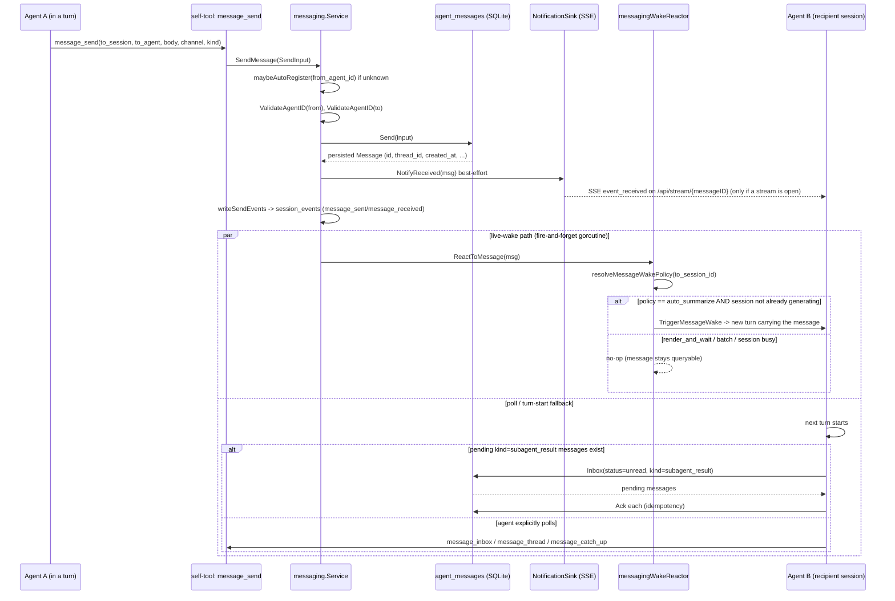
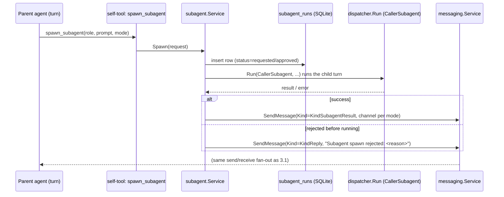
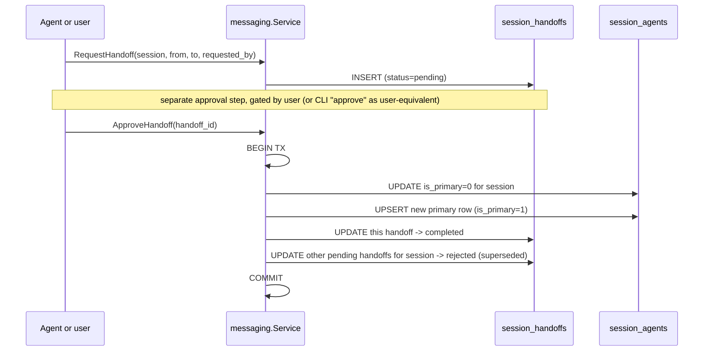
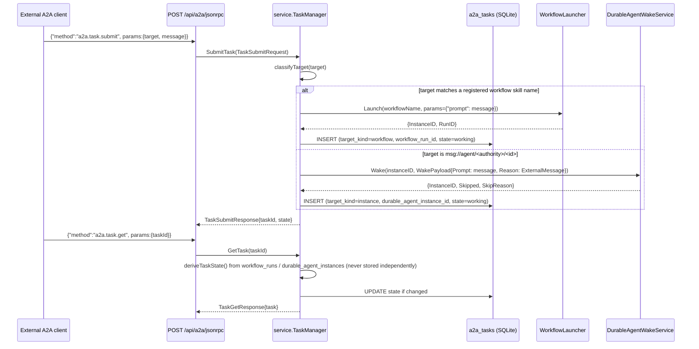

# Inter-agent messaging

## 1. Purpose

Nanite implements inter-agent communication three separate times, at three different levels of live wiring. All three are present in the codebase today:

- **`internal/messaging`** (table `agent_messages`, plus `session_handoffs` for primary-agent handoff and `internal/subagent` for spawn/reply) — a tuple-addressed `(session_id, agent_id) → (session_id, agent_id)` message primitive. This is the system with real traffic: agents send chat replies, subagent completions, and status notifications to each other and to the human user through it, over MCP self-tools, HTTP, and CLI. Originally called "A2A," renamed to "messaging" in a rebuild (Phase 3 S7) that is unrelated to the second system below despite the name collision.
- **`internal/a2a`** + `internal/service/a2a_task_manager.go` + `POST /api/a2a/jsonrpc` — an implementation of the external **A2A ("Agent-to-Agent") protocol v1.0** (a Linux Foundation spec at a2a-protocol.org), exposing Nanite as a Task-submission target for outside callers. It is explicitly documented as "a protocol adapter, not a new execution substrate": every submitted Task is routed to one of Nanite's two existing execution paths (a workflow run, or waking an existing durable-agent instance) rather than running its own logic. Fully wired at process boot and reachable over HTTP; has never actually been invoked in the sampled live database (zero task rows).
- **`internal/messaging/gomsg`** (table `messaging_envelopes`) — a second Store implementation that conforms to the portfolio-shared `github.com/hollis-labs/go-messaging` contract (typed URN addresses, a closed `Kind` enum, federation-ready), positioned as the long-term target for Nanite to interoperate with other apps in the portfolio. Fully built and contract-tested but never constructed anywhere the live server actually boots.

A fourth table the live database exposes, `agent_mailbox_view`, turned out on inspection to be **unrelated to any of the above** — see §9.

## 2. Key entry points/files

- `internal/messaging/interface.go` — `Store` interface (Send/Get/Inbox/Thread/Recent/Ack/Resolve/UnreadCount), the Nexus-shaped persistence contract.
- `internal/messaging/service.go` — `Service`: auth checks, auto-register-on-first-send, pubsub fan-out, SSE notification hook, live-wake hook, session-event logging.
- `internal/messaging/sqlite.go` — the only production `Store` implementation, backed by `agent_messages`.
- `internal/messaging/handoff.go` — `RequestHandoff` / `ApproveHandoff` / `RejectHandoff`, crossing into `session_handoffs` + `session_agents` via a direct `*sql.DB` transaction.
- `internal/subagent/service.go` — inline subagent spawn (`Spawn`/`Approve`/`Reject`/completion), posts its reply via `messaging.Service.SendMessage`.
- `internal/service/messaging_reactor.go` — `messagingWakeReactor.ReactToMessage`: on eligible sends, resolves a per-session/per-agent wake policy and optionally triggers a live turn on the recipient instead of leaving delivery to a poll.
- `internal/service/chat_subagent_inbox.go` — turn-start fallback: injects pending `kind=subagent_result` messages into the recipient's context and Acks them.
- `internal/service/chat.go:952` — `TriggerMessageWake`, the live-wake entry point the reactor calls.
- `internal/mcp/self_tools.go` (~L558-670) — registers the MCP self-tools: `message_send`, `message_inbox`, `message_thread`, `message_ack`, `message_resolve`, `message_catch_up`, `handoff_request`, `handoff_approve`, `handoff_reject` (docs refer to these with a `nanite_` prefix; the registration in this file uses the bare names).
- `internal/api/messages.go` — HTTP handlers for `/api/messaging/*` and `/api/handoffs/*`, plus `handleStream` (the `message_received` SSE consumer).
- `internal/a2a/types.go` — A2A v1.0 wire types (`Task`, `TaskState`, `AgentCard`, JSON-RPC request/response shapes). Zero-import-discipline package, designed for possible future extraction.
- `internal/service/a2a_task_manager.go` — `TaskManager.SubmitTask`/`GetTask`/`ProvideTaskInput`: classifies a Task's target as a workflow skill name or a `msg://agent/<authority>/<id>` instance URN and routes accordingly; derives `TaskState` from `workflow_runs`/`durable_agent_instances` on every read rather than storing it independently.
- `internal/service/a2a_agent_card.go` — `AgentCardGenerator`, serves `/.well-known/agent-card.json`.
- `internal/service/a2a_push_notifier.go` — `A2APushNotifier.EnqueueDelivery` / `ProcessPendingDeliveries` for A2A Task state-change push notifications.
- `internal/api/a2a.go`, `internal/api/a2a_jsonrpc.go` — HTTP surface: `GET /.well-known/agent-card.json`, `POST /api/a2a/jsonrpc` (methods `a2a.task.submit`, `a2a.task.get`, `a2a.task.cancel` (unimplemented), `a2a.task.provideInput`).
- `internal/store/a2a_tasks.go` — CRUD for `a2a_tasks` / `a2a_push_deliveries`.
- `cmd/nanite/main.go` (~L519-536) — constructs `AgentCardGenerator` and `TaskManager` unconditionally at boot and wires them into the container.
- `internal/messaging/gomsg/` — `sqlstore.go` (Store backed by `messaging_envelopes`), `address.go` (tuple ⇄ URN mapping), `federation.go` (authority-routing `Router` decorator), `kind.go` (Kind enum mapping).
- `internal/messaging/envelope_bridge.go` — `ToEnvelope`/`FromEnvelope`, a lossless translator between a legacy `Message` and a go-messaging `Envelope`.
- `internal/agent/reflexes/state.go` — `mailUnreadCount`, a live read consumer of `agent_messages` (unread count feeds reflex-trigger state).
- `internal/store/migrations/018_rename_a2a_messages.sql`, `088_a2a_tasks.sql`, `089_agent_messages_subagent_result_kind.sql`, `064_messaging_envelopes.sql`, `076_agent_mailbox_view.sql` — schema history for the tables in §5.
- `docs/messaging.md`, `docs/messaging-upgrade-path.md`, `docs/messaging-federation.md`, `docs/architecture/a2a-protocol-design.md`, `internal/service/A2A_TASK_MANAGER_README.md` — the project's own reference docs for these subsystems.

## 3. Flow

### 3.1 `agent_messages` send/receive (the live path)

An agent (running inside a chat turn) calls the `message_send` self-tool. The service layer validates both address ends, persists the row, and fans it out three ways: a best-effort SSE push, an optional live "wake" of the recipient session, and a durable row the recipient can poll. If no live wake fires, the message still becomes visible to the recipient either via an explicit `message_inbox` poll, or automatically injected at the start of the recipient's next turn when its `kind` is `subagent_result`.

Three independent delivery paths exist for the same row: (1) SSE push to an already-open stream — a UI hint, not a guarantee, since it only fires if a generation stream happens to be open on the recipient session; (2) the live-wake reactor, which can spin up a brand-new turn on the recipient session outright; (3) durable storage + poll/turn-start injection, which is the only path guaranteed to eventually surface a message regardless of the other two. `session_events` also gets a row on every send/ack/resolve for replay and context-broker consumption.

### 3.2 Subagent spawn and reply

A primary agent spawning a subagent is itself a form of inter-agent handoff of work, and its completion path re-uses the `agent_messages` primitive to report back.

Reply channel depends on spawn mode: `sync` replies land on `chat` (caller is blocked waiting), `async` replies land on `inbox` (caller polls later), `api` replies land on `chat` without blocking the caller. `Kind=KindSubagentResult` is deliberately excluded from the generic `messagingWakeReactor` live-wake path (§3.1) — subagent completions already have their own dedicated wake mechanism (`subagent.CompletionReactor`, invoked directly by `internal/subagent/service.go`) plus the turn-start injection in §3.1, so routing both would double-trigger the parent's turn.

### 3.3 Primary-agent handoff

Handoff is not exposed as an MCP tool for direct agent-to-agent negotiation beyond `handoff_request`/`handoff_approve`/`handoff_reject` — approval is treated as a user-gated action (CLI `approve` counts as user approval).

### 3.4 A2A protocol Task submission (external-facing, wired but unexercised)

`AgentCardGenerator` and `TaskManager` are constructed unconditionally in `cmd/nanite/main.go` at every boot (not feature-flagged), and the HTTP routes are registered unconditionally in `internal/api/api.go`. The endpoint handlers call `a.Services.TaskManager.SubmitTask(...)` directly with no nil-guard (unlike `handleAgentCard`, which does check `cardGen == nil` and returns 503). Nothing in the sampled database shows this path has ever been exercised (`a2a_tasks`: 0 rows).

`a2a.task.cancel` returns a hardcoded JSON-RPC error ("not yet implemented") rather than routing anywhere — it is not wired to any of the two execution substrates.

### 3.5 go-messaging (`gomsg`) conformance layer — built, not booted

`internal/messaging/gomsg.SQLStore` independently satisfies the same `messaging.Store` interface used in §3.1, backed by the separate `messaging_envelopes` table, with `envelope_bridge.go` able to losslessly translate between the two `Message`/`Envelope` shapes. `internal/messaging/gomsg/federation.go`'s `Router` can route by URN authority to a different backing `Store` for federated (cross-app) delivery. No sequence diagram is given here because there is no live call path: nothing outside `internal/messaging/gomsg`'s own test files constructs a `gomsg.SQLStore`, wires a `Router`, or calls `ToEnvelope`/`FromEnvelope` from application code. The messaging service actually running in the process is still the legacy `SQLiteStore` from §3.1.

## 4. Legacy vs current: `agent_messages` vs `agent_messages_legacy_089`

This is **not** a legacy-feature-vs-new-feature situation, and it is **not** an in-progress migration. It's a byproduct of one mechanical schema change.

- Migration `089_agent_messages_subagent_result_kind.sql` needed to widen the `kind` CHECK constraint on `agent_messages` to add the value `'subagent_result'` (previously: `request | reply | notification | handoff`). SQLite cannot `ALTER ... CHECK` in place, so the migration follows a rename-recreate-copy pattern also used elsewhere in this codebase: the existing table is renamed to `agent_messages_legacy_089`, a fresh `agent_messages` table is created with the widened CHECK, and every row is copied over with `INSERT OR IGNORE`.
- **Schema diff** confirmed via `.schema`: the legacy table's `kind` CHECK lacks `'subagent_result'`; it also lacks the `idx_agent_messages_kind_unread` index the current table has. Column set and all other constraints are otherwise identical.
- **Data**: at inspection time `agent_messages_legacy_089` has 7 rows and `agent_messages` has 13. The first 7 rows in the current table are byte-identical to the legacy table's 7 rows (same ids, timestamps, bodies) — they're the copied-forward set. The 6 rows added since all postdate the migration and several use `kind='subagent_result'`, a value the legacy schema's CHECK constraint would reject outright — direct evidence the widened constraint is what unblocked them.
- **Is the legacy table read anywhere?** No. `grep -rn "agent_messages_legacy_089" --include="*.go"` across `internal/` returns zero matches. It exists purely as the rename-artifact left by the migration's own idempotency design (the migration comment explains it is intentionally *not* dropped, so a re-run of the same migration on a later boot finds it and safely no-ops via the rename-swallow + `INSERT OR IGNORE` pattern, since there is no `schema_migrations` ledger and every migration file re-executes on every boot).
- **Verdict**: completed, one-way, single-table schema widening. The "legacy" name refers to the pre-widened schema shape, not to a deprecated feature or a parallel system still being written to.

## 5. Data model touched

| Table | Rows (sampled) | Role |
|---|---|---|
| `agent_messages` | 13 | Current message store. Addressed by `(from_session_id, from_agent_id) → (to_session_id, to_agent_id)`. `thread_id`/`reply_to` group a conversation. `type` is a legacy classification (`message`/`help_request`/`directive`/`status_update`/`handoff`); `channel` (`chat`/`inbox`/`alert`) is the transport-policy bucket; `kind` (`request`/`reply`/`notification`/`handoff`/`subagent_result`) is the wire-type axis used for filtering (e.g. the turn-start injection query). `status` tracks `unread → read/acknowledged → resolved`. `payload_json` carries structured envelope data. |
| `agent_messages_legacy_089` | 7 | Pre-migration-089 shape of the same table, retained as a migration-rename artifact (see §4). Same columns minus the `subagent_result` kind value and the `idx_agent_messages_kind_unread` index. Not read by any Go code. |
| `a2a_tasks` | 0 | A2A protocol Task bookkeeping. `target_kind` (`workflow`\|`instance`) + `target_ref` record what a Task points at; `durable_agent_instance_id`/`workflow_run_id` are FK pointers to the real execution record (never duplicated state); `state` is a cache "refreshed on read," constrained to the A2A v1.0 spec's `TaskState` vocabulary (`submitted`, `working`, `input-required`, `completed`, `failed`, `canceled`, `rejected`, `auth-required`); `push_notification_config` is a JSON-encoded callback URL/token for state-change pushes. |
| `a2a_push_deliveries` | 0 | Retry bookkeeping for A2A Task push notifications: `task_id` FK, `target_state` (which transition triggered this), `attempt_count`/`last_error`/`next_retry` for backoff. |
| `messaging_envelopes` | 0 | Backing store for the go-messaging-conformant `gomsg.SQLStore` (§3.5). URN-addressed (`from_urn`/`to_urn`) rather than tuple-addressed; `kind` uses the closed go-messaging enum (`request`/`response`/`notice`/`status_update`/`handoff`/`escalation` — a different, non-overlapping vocabulary from `agent_messages.kind`); `delivered_at`/`consumed_at` model per-recipient lifecycle; `canceled` excludes a row from Inbox/Subscribe. |
| `agent_mailbox_view` | 0 | **Not part of this subsystem** — see §9. A `(message_id, agent_urn)`-keyed per-tick dedup table for a boot-time mail digest sourced from an external mux/tether mailbox, per its migration comment. No relationship to `agent_messages`. |
| `session_handoffs` | 0 | Handoff audit trail: `from_agent_id` (nullable, for claiming an orphaned session), `to_agent_id`, `requested_by` (`departing`\|`incoming`\|`user`), `status` (`pending`\|`approved`\|`rejected`\|`completed`), `approved_by_user` flag. |
| `session_agents` | 344 | Session-to-agent binding, `(session_id, agent_id)` PK, `is_primary` is the authoritative primary-agent flag flipped atomically by `ApproveHandoff`. Heavily used generally (not exclusively a messaging-subsystem table — every session-agent binding lives here), which is why its row count is high while `session_handoffs` is zero: bindings get created by normal session/agent assignment, not only by handoff. |

## 6. Activity vs dormancy

**Active, real usage:**
- `agent_messages` — 13 rows spanning April through August 2026, multiple distinct senders (`fragments-engine`, `researcher`, `file-backend`, `blt-worker-001`, durable-agent UUIDs), multiple kinds including the newer `subagent_result`. Write call sites: `messaging.Service.SendMessage` (self-tool `message_send`, HTTP `POST /api/messaging/send`, subagent completion/rejection posts). Read call sites: `message_inbox`/`message_thread`/`message_catch_up` self-tools, `internal/service/chat_subagent_inbox.go`'s turn-start injection, `internal/agent/reflexes/state.go`'s `mailUnreadCount` (feeds reflex-trigger state).
- The live-wake reactor (`messagingWakeReactor`) and the SSE `message_received` push are both wired to fire on every send.
- `session_agents` — 344 rows, actively written by ordinary session/agent binding as well as by handoff approval.

**Built and wired, but never exercised (0 rows):**
- `session_handoffs` — the full handoff feature (CLI `nanite message handoff *`, HTTP `/api/handoffs/*`, MCP `handoff_request`/`handoff_approve`/`handoff_reject`, the atomic `ApproveHandoff` transaction) is present and reachable end-to-end, but no handoff has ever been recorded in the sampled database.
- `a2a_tasks` / `a2a_push_deliveries` — `TaskManager` and `AgentCardGenerator` are constructed unconditionally at every boot and the HTTP routes (`/.well-known/agent-card.json`, `/api/a2a/jsonrpc`) are always registered, so the surface is live, not feature-flagged off. Zero rows means no external caller has ever submitted a Task. Within this path, push-notification draining is even less finished: `TaskManager` calls `A2APushNotifier.EnqueueDelivery` on every task-state transition, but `A2APushNotifier.ProcessPendingDeliveries` — the method that would drain `a2a_push_deliveries` — has no caller anywhere in the codebase outside its own tests. Its doc comment says "called by the background worker ticker," but no such ticker exists in this repo.

**Built, contract-tested, but not constructed anywhere the process boots:**
- `messaging_envelopes` / `internal/messaging/gomsg` — `SQLStore`, `Router`, `AgentAddress`, and the `ToEnvelope`/`FromEnvelope` bridge all exist and pass a shared contract test suite (`messagingtest.RunContract`), but grepping `cmd/` and `internal/` for any non-test construction of `gomsg.SQLStore` or call of `ToEnvelope`/`FromEnvelope` from application code returns nothing. The live messaging service is still exclusively the legacy `SQLiteStore`.

**Unrelated to this subsystem, dormant, and referencing a missing file:**
- `agent_mailbox_view` — zero Go call sites at all (not even in `internal/messaging/gomsg`). Its migration comment (`076_agent_mailbox_view.sql`) attributes it to `internal/composer/source_mail.go`, a file that does not exist anywhere in the current repository tree.

## 7. Configuration & manual-setup points

- **Addressing has no discovery service.** A sender must already know the exact `(session_id, agent_id)` tuple (or `"user"` for the human sentinel) to reach a recipient — there is no directory lookup baked into the messaging tools themselves beyond what an agent's own context provides. Unknown `from_agent_id`s auto-register on first send (kind `external` or `cli`), but the *recipient* side is validated against existing agents and fails closed if unknown.
- **`"user"` is a hardcoded reserved sentinel** — cannot be used as a real agent slug or ID; enforced in `ValidateAgentID`.
- **Channel is unenforced convention**, not code — `chat`/`inbox`/`alert` is a CHECK-constraint-bounded set, but which channel to use for a given message is left to the caller's judgment per the documented policy table; nothing in the service layer routes differently by channel except through the CHECK constraint.
- **Message-wake policy is a manual per-deployment/per-agent/per-session knob.** Resolution order: `sessions.metadata["message_wake_policy"]` (session-level override) → `agent_profiles.constraints` JSON `MessageWakePolicy` (agent-profile default) → hardcoded global default `auto_summarize`. Misspelled/unrecognized values are logged and ignored rather than applied. Subagent completions default to the opposite policy (`render_and_wait`) for reasons documented inline (a subagent completion has a guaranteed fallback delivery path via the turn-start injection; a generic message does not).
- **A2A Task routing requires exact identifiers.** `TaskManager.classifyTarget` only recognizes two shapes: an exact registered workflow-skill name, or a well-formed `msg://agent/<authority>/<id>` URN for an *existing* durable-agent instance. There is no fuzzy matching; the caller must already have the identifier (discoverable via the Agent Card's `skills[]` list at `/.well-known/agent-card.json`, but instance IDs specifically are not enumerated there).
- **Handoff `requested_by` is a hardcoded three-value enum** (`departing`\|`incoming`\|`user`) validated in `RequestHandoff`; no extensibility point observed.
- **Federation (gomsg `Router`) requires explicit peer registration** — a standalone install registers no foreign authorities and behaves as a bare local store; nothing in this codebase currently registers any peer, consistent with §6's finding that the layer isn't constructed at all yet.

## 8. Cross-references

- **`09-durable-agents-runtime.md`** — the A2A Task instance-routing path (§3.4) targets `durable_agent_instances` directly via `DurableAgentWakeService.Wake`; the same wake primitive subagent completions and workflow steps use.
- **Session lifecycle / recovery** (sibling doc, not yet present in this directory as of writing) — `session_agents.is_primary` and `session_handoffs` govern which agent owns a session's turns; relevant to how a session recovers or reassigns its primary agent after a crash or explicit handoff.
- **Chat engine orchestration** (sibling doc, not yet present in this directory as of writing) — the live-wake reactor's `TriggerMessageWake` (`internal/service/chat.go:952`) and the turn-start subagent-result injection (`internal/service/chat_subagent_inbox.go`) both hook directly into the chat-turn assembly path (`chat_generate.go` / slot assembly) described there; `dispatcher.Run`'s `CallerSubagent` caller-type is how a spawned subagent's turn actually executes.

## 9. Open questions

- Why three non-interoperating-in-practice messaging substrates (`agent_messages`, the A2A Task protocol, and the go-messaging `gomsg` layer) all exist in the same codebase, and what would decide which one a future caller should target, is not stated anywhere in code. `docs/messaging-upgrade-path.md` frames the go-messaging model as "the long-term target" and `docs/architecture/a2a-protocol-design.md` frames A2A as "a protocol adapter, not a new execution substrate" over the *other two* execution substrates (workflows, durable agents) — but neither doc explains how A2A Tasks and `agent_messages` sends relate to each other operationally, if at all.
- `docs/messaging-federation.md` states "Status: implemented" for the `gomsg` conformance layer. Runtime wiring shows no construction of `gomsg.SQLStore` anywhere outside its own package's tests. Whether "implemented" means "library-complete, integration deliberately deferred" or reflects documentation drift isn't determinable from the code.
- `A2APushNotifier.ProcessPendingDeliveries`'s doc comment says it is "called by the background worker ticker," but no ticker, cron, or scheduler calling it exists anywhere in the repository. Whether that worker was planned and never landed, or removed after landing, isn't stated.
- `agent_mailbox_view`'s migration comment attributes its use to `internal/composer/source_mail.go`, which does not exist in the current tree, and no other Go code references the table at all. Whether this represents removed functionality or a feature that was scaffolded (migration + doc comment) but never implemented isn't determinable from the repository alone.
- `session_handoffs` has zero rows despite a complete, atomic, transactionally-correct implementation reachable via CLI, HTTP, and MCP. Whether primary-agent handoff simply hasn't come up yet in this workspace's history, or whether some other undocumented mechanism performs the equivalent of a handoff in practice, is not evident from the code.
- The MCP tool names registered in `internal/mcp/self_tools.go` (`message_send`, `handoff_request`, etc.) are bare, while both `docs/nanite-messaging.md` and `docs/messaging.md` refer to the same tools with a `nanite_` prefix (`nanite_message_send`, `nanite_handoff_request`). Where or whether that prefix is applied before an LLM sees the tool name was not traced as part of this audit.
- `a2a.task.cancel` is wired at the transport layer (JSON-RPC method routing exists) but always returns "not yet implemented" — there's no `TaskManager.CancelTask` at all, so a Task, once submitted, has no cancellation path regardless of transport.
