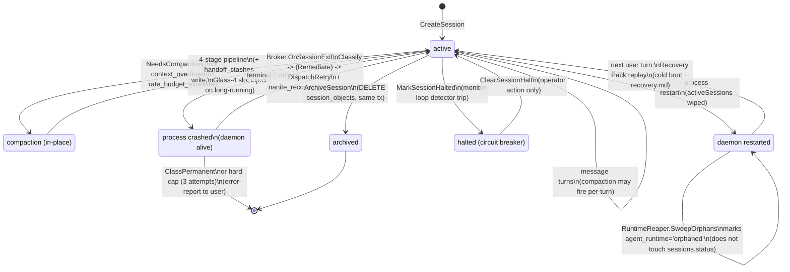

# Session Lifecycle & Recovery

> **Correction (2026-08-17, post-review):** "CLI" below describes the CLI-wrapped subprocess path loosely. No real pseudo-terminal is allocated in production — see `06-provider-llm-roundtrip.md`'s correction note for the full detail. This doesn't change any finding in this document — the Recovery Broker's HTTP-provider gap (§4.2) and the general session-recovery mechanics are unaffected — it only corrects what "the CLI path" actually is under the hood.

## 1. Purpose

A `sessions` row is born the instant a chat is opened (`CreateSession`, status `active`) and, in this workspace's data, ends the same way every time: `ArchiveSession` flips `status` to `archived` (259 of 343 rows) and evicts any `session_objects` rows scoped to it, inside one transaction. Between birth and archive, a session accumulates messages, moves through zero or more compaction passes (the conversation slot outgrows its token budget, gets summarized/deduped/stripped down), and may have its underlying agent *process* die and come back multiple times without the session row itself ever changing status. "Session" and "the OS process currently running that session's agent" are two different lifetimes tracked in two different tables (`sessions` vs `agent_runtime`), and the gap between them is where all of the interesting recovery machinery lives.

Nanite layers **four independent recovery mechanisms** on top of that gap, each answering a different question about what went wrong:
1. **Recovery Broker** (`internal/runtime/agent/recovery`) — in-process, same-daemon-lifetime: a booted agent process exits with an error while the daemon is still running; the broker classifies the failure and may dispatch a replacement process automatically.
2. **Orphan/Runtime Reaper** (`internal/runtime/agent/orphan_sweep.go`) — sweeps `agent_runtime` rows for PIDs that are actually dead (most commonly *en masse* right after a daemon restart, since every `activeSessions` entry from the prior process is gone).
3. **Recovery Pack** (`internal/service/recovery_pack.go`) — when a CLI session cold-boots after the daemon restarted, replays up to 20 trailing messages inline so the freshly spawned agent process doesn't answer the next user turn blind.
4. **Interrupted-turn detection** (`internal/api/sessions.go:detectInterruptedTurn`) — a cheap heuristic surfaced on `GET /api/sessions/{id}`: last message is from `user`, session is `active`, and no live stream exists → tell the frontend `"reason": "service_restart"`.

Separately, **compaction** (`internal/context/compaction.go`) is Nanite's analogue of Claude Code's own context-compaction: when the conversation slot exceeds its token budget (or a provider rejects a request as too large / rate-limited), an escalating four-stage pipeline shrinks it, optionally snapshotting a **handoff stash** first so continuity state survives the rewrite. There is no fixed guarantee that a crashed session resumes with full history — the guarantees are all *best-effort*: a bounded recovery pack, a bounded handoff-stash payload, a `recovery_breadcrumbs` postmortem trail, and (per the live data) at least one code path that is fully wired end-to-end but never actually fires in production.

## 2. Key entry points/files

- `internal/store/sessions.go` — `Session` struct + CRUD (`CreateSession`, `GetSession`, `ArchiveSession`, `ForkSession`, `UpdateSessionCompaction`); the `sessions` table is the root of the whole subsystem.
- `internal/store/session_halt.go` — `HaltStatus`/`MarkSessionHalted`/`ClearSessionHalt`: a monitor-loop circuit breaker independent of `sessions.status`.
- `internal/store/recovery.go` — `RecoveryBreadcrumb` struct + `WriteRecoveryBreadcrumb`/`ListRecoveryBreadcrumbsForSession` (backs `nanite_recovery_breadcrumbs`).
- `internal/store/handoff_stashes.go` — `HandoffStash` CRUD (backs `handoff_stashes`).
- `internal/store/compaction_events.go` — `CompactionEvent` CRUD (backs `compaction_events`); fully implemented, never called in production (§6).
- `internal/store/session_objects.go` — ephemeral per-session payload store, evicted atomically on archive.
- `internal/context/compaction.go` — `CompactionPipeline`: the four-stage compaction escalation (`drop_enrichment` → `dedupe_tool_results` → `summarize_oldest` → `strip_tool_blocks`).
- `internal/context/window.go` — `ContextWindow.NeedsCompaction()` (the budget-exceeded gate) and `Assemble()`.
- `internal/context/handoff.go`, `internal/context/handoff_stash.go` — two distinct payload schemas: `HandoffPayload` (Glass-4, self-authored by the agent) and `HandoffStashPayload` (legacy P7, deterministic scratchpad snapshot).
- `internal/service/handoff_glass4.go`, `internal/service/handoff_glass4_fallback.go` — `WriteGlass4Handoff`/`ReadLatestGlass4Handoff`/`InjectGlass4HandoffSlot`; gated by `sessions.intent == "long-running"`.
- `internal/service/chat_generate.go:2325` (`recoverFromContextOverflow`) and `:2605` (`enforceBudgetOrCompact`) — the two production call sites that construct `*ctxpkg.CompactionPipeline{}`.
- `internal/runtime/agent/recovery/{types,broker,orchestration,classifier,remediator,envelope}.go` — the Recovery Broker: `Classify` → `Remediate` → `DispatchRetry` → breadcrumb.
- `internal/service/chat_boot_drive.go:395` (`observeSessionForRecovery`) — the Wait-observer goroutine that routes a terminal process exit into `deps.Recovery.OnSessionExit`.
- `internal/service/recovery_pack.go` — `shouldRecoverColdBoot`/`shouldBuildRecoveryPack`/`buildRecoveryPack` (cold-boot context replay after a daemon restart).
- `internal/runtime/agent/orphan_sweep.go` — `RuntimeReaper`/`SweepOrphans` (dead-PID reconciliation for `agent_runtime`).
- `internal/subagent/reaper.go` — the separate 30-second-cadence reaper that flips `subagent_runs` to `stalled` after 30 minutes of inactivity (the row involved in the e2273f8 incident, §4).
- `internal/api/sessions.go` — `detectInterruptedTurn`, `handleRecoverSession` (`POST /api/sessions/{id}/recover`), `handleRebootSessionAgent` (`POST /api/sessions/{id}/reboot`), `handleCompactSession` (`POST /api/sessions/{id}/compact`, manual force-compact).
- `internal/store/migrations/{005_a2a_session_scoping,024_handoff_stashes,028_compaction_events,030_compaction_disclosure_prompts,054_recovery_breadcrumbs,071_session_halt}.sql` — schema history for this subsystem.

## 3. Flow

### 3.1 Birth → active

`CreateSession` assigns a UUID + the next sequential short code (`c<N>`), sets `status='active'`, and writes empty `metadata`/`tags`. From here the session is "just a row" until a turn runs — `internal/09-durable-agents-runtime.md` describes the several ways a turn gets triggered (human message, durable-agent wake, subagent spawn). Every message insert (`CreateMessage`) bumps `message_count` and `last_activity` on the session row in the same transaction.

### 3.2 Two lifetimes, one session

The chat-session row (`sessions`) and the OS-process-level runtime row (`agent_runtime`, documented in the durable-agents-runtime doc) are separate. A session can survive many process deaths/relaunches without its own `status` ever changing — `GetSession`/`ListSessions` surface the *current* process state as a derived `runtime_state` field by joining the most recent `agent_runtime` row for that `parent_session_id`, but that's a read-side convenience, not a stored session status. This split is exactly why recovery is a multi-mechanism subsystem rather than a single state machine: "session ended" and "process crashed" are different events that both routes to the *same* session row.

### 3.3 Compaction trigger

Compaction is driven purely by token budget, not by turn count or wall-clock time. `ContextWindow.NeedsCompaction()` returns true when the conversation slot's estimated token count exceeds `ConversationBudget()` (total budget = 80% of the provider's context window — `BudgetFraction = 0.80`, `internal/context/window.go:10`). Three call sites fire the pipeline:
- **Pre-loop gate** (`enforceBudgetOrCompact`) — runs before a turn starts if the assembled window is already over budget.
- **Context-overflow recovery** (`recoverFromContextOverflow`, trigger `context_overflow`) — the provider itself rejected the request as too large; runs `pipeline.Run()`, which re-checks `NeedsCompaction()` and can no-op if the overflow was actually caused by something else.
- **Rate-budget recovery** (same function, trigger `rate_budget_exceeded`) — a per-minute token-rate ceiling (30–40K, independent of the 200K model context window) was exceeded; this uses `pipeline.RunForce()`, bypassing the `NeedsCompaction()` gate entirely, because a request can trivially fit in the context window while still blowing the rate budget (a real UAT bug once made this path a no-op — see the CW-20260418-0099 comment at `chat_generate.go:2306`).

The pipeline always runs its four stages in a fixed escalating order, stopping early once the budget is satisfied (for the gated `Run()` path only): drop Context-slot enrichment → dedupe identical tool_call/tool_result pairs (via sha256 of the paired result content) → summarize the oldest span into one message (skipped below `SummarizeMinTokens = 200` tokens as a negative-savings guard, and skipped entirely if a Glass-4 `SlotHandoff` is already populated) → strip tool blocks from non-tool-use spans.

### 3.4 Handoff stash (pre-compaction continuity snapshot)

Immediately before any summarization stage runs, if a `StashWriter` is wired, the pipeline writes a `handoff_stashes` row keyed by a fresh UUID. There are two payload schemas sharing the one table, gated by `sessions.intent`:
- **Legacy P7** (`HandoffStashPayload`) — a deterministic snapshot of `decisions_locked`/`open_questions`/`active_file_refs`/`active_ticket_ids`/`should_reread`, pulled straight from the in-memory scratchpad. Used for sessions that are *not* classified `long-running`.
- **Glass-4** (`HandoffPayload`) — a *self-authored* handoff the agent writes proactively via a self-tool (`session_intent`, up to 3 `recent_decisions`, up to 5 `active_pointers`, a required `next_step_anchor`), capped at ~1500 tokens total and validated field-by-field before write. Used only when `sessions.intent == "long-running"` (`IsLongRunning`). When compaction fires on a long-running session and no proactive Glass-4 write exists yet, `ensureGlass4HandoffPreCompact` writes a fallback one just before the stages run.

After compaction, `InjectGlass4HandoffSlot` reads the *latest* stash row back and populates `SlotHandoff` with `AutoInject=true` (the LLM cannot strip it) — but only for long-running sessions. Non-long-running sessions' P7 stashes are write-only from the chat loop's perspective; nothing reads them back into context automatically (see §6).

### 3.5 Process crash while the daemon is alive → Recovery Broker

`observeSessionForRecovery` is a goroutine spawned per booted session that blocks on `sess.Wait(ctx)`. Three outcomes:
- **Clean exit** — nothing to recover; session state is deleted from in-memory maps.
- **Intentional reboot** (`RebootSessionAgent` armed a flag before calling `Stop`) — treated as deliberate even if it surfaces as an `ExitError`; the broker's per-session classifier state is cleared and the *next user turn* cold-boots fresh via `driveBootSession`. No broker involvement.
- **Genuine terminal `*agentsessions.ExitError`** — routed to `Broker.OnSessionExit(sessionID, exit, meta)`.

Inside the broker: a per-session attempt counter increments (hard cap `MaxBrokerRetries = 3`, `types.go:333` — the 4th observed terminal exit for the same session always escalates to permanent regardless of classification). `Classify(ev)` inspects, in order: the lib-supervisor's structured `Cause` (`idle_timeout`→transient, `watchdog_kill`→config/regenerate-CLAUDE.md, `oom_kill`→transient, `restart_exhausted`→permanent, `resource_limit`→permanent), then exit code 127 (binary not on PATH → permanent), then sandbox/MCP state (missing sandbox dir or down MCP transport → config-fix remediation), then stderr substring matches for 401/403/unauthorized (→ refresh-credentials remediation), falling through to an "unclassified" default (first occurrence → single transient retry; repeat → escalate).

Depending on class:
- `ClassTransient` → emit an info-card, dispatch a replacement session immediately (no remediation step).
- `ClassConfigPermissions` → emit an info-card, run the bounded remediation (10s default timeout, `WithRemediationTimeout`) — repopulate sandbox / restart MCP transport / refresh credentials / regenerate CLAUDE.md — then dispatch the replacement.
- `ClassPermanent` → emit an error-report envelope, no retry; per-session classifier state is cleared.

`DispatchRetry` always calls the *same* `agent.Boot(ctx, agent.Options{...})` path used for a fresh CLI boot, preserving `SessionID`, `AgentProfile`, `ParentSessionID` (lineage), `Workdir`, `Mode`, and `Provider`. Every path records a `nanite_recovery_breadcrumbs` row (`recordOutcome`/`escalatePermanent`) regardless of outcome — this is the one recovery mechanism with a durable, queryable postmortem trail.

### 3.6 Daemon restart → Orphan Sweep + Recovery Pack

A full daemon restart empties every in-memory map (`activeSessions`, the broker's per-session state, the live-session registry). Two separate mechanisms reconcile this, on two separate tables:
- **`RuntimeReaper.SweepOrphans`** (30s cadence, also run once synchronously at startup) walks `agent_runtime` rows in `running`/`launching` state and reconciles each against a signal-0 PID probe (PID>0) or, for PID-less adapters (codex-style), an in-memory live-session check plus a 5-minute staleness grace (`DefaultRuntimeReaperPidZeroGrace`). Rows that fail reconciliation flip to `state='orphaned'` with a `failure_reason` (`dead_pid` / `pid_zero_stale` / `no_live_session`). This does **not** touch `sessions.status` — it only marks the runtime row.
- **Recovery Pack** (`recovery_pack.go`) fires on the *next user turn* for a CLI session that cold-boots (no live runtime) but has prior persisted messages. It replays up to `recoveryHistoryMessages = 20` trailing messages (each capped at `recoveryMessageMaxChars = 1500` chars, current in-flight turn excluded) inline ahead of the user's new message, and also writes the full pack to a `recovery.md` file inside the session's boot dir as an on-disk pointer the agent can re-read. `shouldRecoverColdBoot` suppresses this exactly once when an intentional reboot armed a "fresh boot" flag — otherwise every cold boot with prior history auto-recovers.

Independently, `GET /api/sessions/{id}` runs `detectInterruptedTurn`: if the session is `active`, its last persisted message is from `user`, and no live SSE stream exists for it, the response includes `{"interrupted": true, "reason": "service_restart", "last_message_id", "last_activity_at"}` so the frontend can show an affordance — this is purely informational and writes nothing.

### 3.7 Manual recovery / halt

- `POST /api/sessions/{id}/recover` (`handleRecoverSession`) — user-triggered: evicts the session's live runtime (without a fresh-boot flag) so the *next* turn goes through the same cold-boot recovery-pack + provider-resume path §3.6 describes, distinct from a full `reboot`.
- `POST /api/sessions/{id}/reboot` (`handleRebootSessionAgent`) — arms the intentional-reboot flag, stops the runtime, and the next turn cold-boots with **no** recovery pack (`freshBootSessions` — a genuinely fresh start).
- `session_halt.go`'s `MarkSessionHalted`/`ClearSessionHalt` — a **monitor-loop circuit breaker** (separate concept from crash recovery): `halted_at`/`halted_reason` columns on `sessions` gate whether the driver even ticks a session at all. `ClearSessionHalt`'s own doc comment states the only resume path is operator action (manual SQL `UPDATE` or the resume endpoint) — there is no automatic un-halt.
- `POST /api/sessions/{id}/compact` (`handleCompactSession`) — manual force-compaction via `pipeline.RunForce()`, independent of any crash/error trigger.

### 3.8 End → archive

`ArchiveSession` is the only path that changes `sessions.status` away from `active`/`paused` in code that actually runs (see §6 for the unused `sleeping`/`halted`/`terminated` enum values). It runs `UPDATE sessions SET status='archived'` and `DELETE FROM session_objects WHERE session_id=?` inside one transaction — session_objects (ephemeral per-session card/tool-result payloads) are hard-evicted on archive, not soft-deleted. `handleDeleteSession` (`DELETE /api/sessions/{id}`, despite the HTTP verb) calls `ArchiveSession`, kills any orphaned CLI process for the session, and broadcasts an archived-presence event — sessions are never hard-deleted from the row-store.

### 3.9 State diagram



## 4. Concrete recovery example

### 4.1 e2273f8 — migration crash-loop (DB-level, not session-level, but the sharpest real incident on record)

On 2026-08-17, `nanite-api-service` crash-looped ~250 times on `constraint failed: CHECK constraint failed: status IN ('requested','approved','running','completed','failed','cancelled','rejected')`. Root cause: Nanite has no `schema_migrations` table — **every migration file re-runs on every boot by design**. Migrations 019/065/067 each `CREATE TABLE`-rebuild `subagent_runs` from scratch (SQLite can't `ALTER` a `CHECK` constraint), but each rebuild only knows its *own* historical column/CHECK set. Migration 019's `CHECK` predates the `'stalled'`/`'over_budget'` statuses added by migration 065. The live `subagent_runs` table did contain a `'stalled'` row — the exact one visible in this workspace's data (`SELECT status, count(*) FROM subagent_runs` → 1 row `stalled`, written by `internal/subagent/reaper.go`'s 30-minute inactivity sweep, `ReasonInactivityReaper`). On the next restart, migration 019 re-ran, tried to copy that `stalled` row into a freshly rebuilt table still constrained to 019's original 7-value CHECK, and failed outright — *before* 065/067 ever got a chance to re-widen it. Independent of the crash itself, the same rebuild-from-scratch pattern was silently dropping/resetting columns added by later migrations (`provider`, `retry_count`, `max_retries`, `on_fail`, `attempts_json`, `last_activity_at`) back to defaults on *every* restart.

Fix: a `migrate:skip-if-column-exists <table> <column>` directive on migrations 019/065/067 — once `subagent_runs` already has migration 092's `last_activity_at` column (proof the table has already moved past what these three would otherwise redo), they skip their rebuild entirely. Verified against a copy of the crashed production DB: all 174 `subagent_runs` rows (matching this workspace's live count) survived intact, including the stalled one, stable across repeated re-migrations. This is the sharpest illustration in this codebase's history of the "everything re-runs every boot" migration model interacting badly with a status taxonomy that grew over time.

### 4.2 A live, ongoing session-recovery failure mode visible in `nanite_recovery_breadcrumbs`

The 61 breadcrumb rows in this workspace (spanning 41 distinct sessions) split as:

| class | outcome | count |
|---|---|---|
| permanent | permanent | 50 |
| transient | transient_retry_succeeded | 7 |
| transient | unknown (lib-level `OnRestart` only observed, no terminal exit yet) | 4 |

The 7 successful transient retries are unremarkable — single-retry recoveries from `http_stream` or `idle_timeout` causes. The 50 permanent rows are dominated by one repeating reason string:

```
retry dispatch failed: agent.Boot: bootdir setup: agent: bootdir for provider "anthropic" is not yet implemented
  (awaiting go-providers BootDirSpec coverage)
```

(21 rows with provider `"anthropic"`, 25 more with provider `""`.) Tracing this: `Broker.DispatchRetry` always calls `agent.Boot()` — the CLI bootdir-setup path shared with `internal/09-durable-agents-runtime.md`'s "one-shot CLI/API launches" — passing `ev.Provider` straight through as `agent.Options.Provider`. `bootdirLayoutFor` only recognizes a small set of bare CLI adapter names (`claude`, `codex`, `opencode`, …); anything else falls to `unsupportedLayout{}`, whose `Setup()` unconditionally returns the "not yet implemented" error. In this workspace, `sessions.provider = 'anthropic'` on 197 of 343 sessions (the HTTP-streaming Anthropic API provider, not a CLI adapter name) — and the failing breadcrumbs' `cause` column is `http_stream`, confirming these were HTTP-streamed sessions, not CLI-booted ones. So for the majority-shape session in this workspace, a genuine transient failure (`http_stream`, first occurrence) gets correctly classified `ClassTransient` and attempts `DispatchRetry` — which then unconditionally fails at the bootdir-setup step because the CLI-adapter boot path was never meant to be the recovery mechanism for an HTTP-streamed session in the first place. The failed dispatch itself is caught and escalated to `ClassPermanent` (`escalatePermanent`, reason `"retry dispatch failed: ..."`), so the user sees a permanent error-report for what the classifier itself judged transient. This is stated purely as an observation of what the live breadcrumb data shows; §9 restates it as an open question.

### 4.3 Handoff stashes in practice

Of 26 `handoff_stashes` rows (9 distinct sessions), 25 are the legacy P7 schema and every single one has all five fields empty (`{"decisions_locked":[],"open_questions":[],"active_file_refs":[],"active_ticket_ids":[],"should_reread":[]}`) — the scratchpad snapshot passed in at compaction time is consistently empty in this workspace's traffic. Exactly one row is a Glass-4 self-authored handoff, with real content (`session_intent: "DAR (Durable Agent Runtime) architect session — produce the PRD/architecture/spec/plan doc package..."`, non-empty `recent_decisions`). That single row is the only handoff stash that will actually ever be read back into a session's `SlotHandoff` (`InjectGlass4HandoffSlot` only fires for `long-running`-classified sessions, and only Glass-4-schema rows parse successfully — `ReadLatestGlass4Handoff` treats a legacy P7 row as `ErrHandoffEnvelopeWrongSchema` and silently no-ops).

## 5. Data model touched

| table | live rows | role |
|---|---|---|
| `sessions` | 343 (259 archived / 84 active) | Root session record. `status` CHECK allows `active/paused/archived/sleeping/halted/terminated` but only `active`→`archived` is ever written by any code path found (§6). `halted_at`/`halted_reason` are a separate pair of columns (not a status value) driving the monitor-loop circuit breaker. `compaction_summary`/`compacted_at` exist but are unused in live data (0 non-null rows) — `UpdateSessionCompaction` is defined but has no call site in current production code; the actual per-turn compaction result lives in the conversation slot content itself, not this column. `intent` (nullable, `long-running`/`per-turn`/`ephemeral`) gates the Glass-4 handoff path. |
| `session_events` | 288 | Generic session activity log (`event_type`, `channel`, `envelope_pointer_json`). Live distribution: `pty_turn_start` (113), `pty_turn_complete` (77), `pty_turn_failed` (31), `context_pre_compact`/`context_post_compact` (19/13 — the P8-part-C compaction telemetry, wired through `events.WithSessionWriter`), `message_received`/`message_sent`/`message_acked` (13/13/6 — A2A messaging), `harness_triggered_turn` (3). |
| `session_handoffs` | 0 | **Not** the compaction-continuity concept — this is a separate, never-implemented in-chat multi-agent handoff *request/approval workflow* (`requested_by`, `status: pending/approved/rejected/completed`, `approved_by_user`) from migration 005's A2A session-scoping work. No `.go` file outside a single explanatory comment in `container.go` references this table; it has zero store methods. |
| `session_stats` | 0 | Per-session counters (`message_count`, `total_input_tokens`, `agent_switches`, `tool_calls`, ...). Fully implemented as a builtin plugin (`internal/plugin/builtin/sessionstats`) with `InitSchema`/Get/Update/Export HTTP handlers, registered at startup — but nothing in the chat/session lifecycle calls the update handler automatically; it is an opt-in surface nothing currently opts into. |
| `session_agents` | 344 | Session ↔ agent membership junction (`is_primary`, `mode`, `joined_at`). Roughly 1:1 with sessions (one primary agent per session in this workspace's data). |
| `session_agent_overrides` | 0 | Per-session override JSON blob keyed by `session_id`; full CRUD exists (`session_overrides.go`) but no session in this workspace has ever had an override written. |
| `session_objects` | 0 | Ephemeral per-session JSON payload store (1 MiB/object cap), atomically evicted on `ArchiveSession`. Zero live rows is explained either by no card-envelope-producing tool result having fired in this workspace's active sessions, or by every session that *did* write one having since been archived (which deletes the rows) — the schema and eviction logic are both exercised by tests; only the "still has live rows" state is unobserved here. |
| `handoff_stashes` | 26 (9 sessions) | Pre-compaction continuity snapshot. Two payload schemas share the table (legacy P7 deterministic scratchpad vs Glass-4 self-authored); see §4.3. |
| `nanite_recovery_breadcrumbs` | 61 (41 sessions) | Postmortem trail for the Recovery Broker only — `class`/`cause`/`remediation`/`action`/`outcome`/`attempt_count`/`duration_ms`/`reason`. Does not cover orphan-sweep reconciliations, recovery-pack replays, or manual `/recover`/`/reboot` calls — those write no equivalent audit row. |
| `compaction_events` | 0 | Structured post-compaction metadata (`coverage_window_start/end`, `evicted_cache_pointers`, `preserved_sources`, `summary_token_count`, `handoff_stash_id`, `stages_applied`). Store layer, context-package interfaces, and a read-side consumer (`renderCompactionDisclosure`) are all fully implemented and tested — the *writer* is simply never assigned at either of the two production `CompactionPipeline{}` construction sites (`chat_generate.go:2372`, `:2636`), so the table can never receive a row in this build. See §6. |

## 6. Activity vs dormancy

**Genuinely active:**
- `sessions`/`session_agents`/`session_events` — core lifecycle, high volume, exercised continuously.
- `nanite_recovery_breadcrumbs` — the Recovery Broker fires regularly (61 rows / 41 sessions) and its full classify→remediate→dispatch→record loop runs in production, including real transient-retry successes and real permanent escalations.
- `handoff_stashes` — the P7 write path fires on every compaction of a non-long-running session (25 rows), though every observed payload is empty (§4.3); the Glass-4 path has fired at least once with real content.

**Built but effectively unreachable in this build:**
- `compaction_events` — full read+write implementation, zero rows possible, because the writer is never wired at either production call site. This is not "feature not yet triggered" — it is architecturally impossible for a row to appear without a code change, because `ctxpkg.CompactionPipeline.CompactionEventWriter` is left as its zero value (`nil`) in both `recoverFromContextOverflow` and `enforceBudgetOrCompact`. Because of this, the entire downstream **CompactionContract disclosure** feature (`internal/chat/context.go:renderCompactionDisclosure` — meant to tell the model "you were just compacted, here's what was preserved" on the first turn after compaction) is also dead: `GetLatestCompactionEvent` always returns `(nil, nil)`, so the disclosure template never injects. Both the write side and the read side are fully coded, tested, and migrated (030_compaction_disclosure_prompts.sql seeds the disclosure prompt templates) — only the one-line wiring between them is missing.
- `session_stats` — plugin fully loaded and its schema initialized at startup, HTTP handlers registered, but nothing calls the update handler from the chat loop; it is dormant by omission rather than by design gap.
- `session_agent_overrides`, `session_objects` — schema + full CRUD exist and are exercised by tests; simply unused in this workspace's actual traffic window.
- `sessions.compaction_summary`/`compacted_at` columns and `UpdateSessionCompaction` — defined, but no production call site found; superseded in practice by `compaction_events`/`handoff_stashes` (which are themselves under-wired, see above) rather than this column.
- `sessions.status` values `sleeping`/`halted`/`terminated` — present in the `CHECK` constraint, never written by any session-lifecycle code found; they appear to be vocabulary carried over from (or shared with) the *durable-agent instance* status machine (`durable_agent_instances.status`, which genuinely uses `sleeping`/`paused`), not from anything that sets `sessions.status` itself. The word "halted" is separately load-bearing on `sessions` via the *distinct* `halted_at`/`halted_reason` column pair — so "halted" names two unrelated mechanisms in the same table.

**Never implemented beyond the schema:**
- `session_handoffs` — a complete table (multi-agent handoff request/approval workflow) with zero store methods anywhere in the codebase. The only reference is an explanatory code comment in `container.go` describing a future transaction that would span it. This is unrelated to the (actively used) `handoff_stashes`/Glass-4 concept despite the name collision.

## 7. Configuration & manual-setup points

- **Compaction budget** — `BudgetFraction = 0.80` of the provider's context window (`internal/context/window.go:10`), compile-time constant, not exposed as user/session config.
- **Negative-savings guard** — `SummarizeMinTokens = 200` (`compaction.go:212`): spans below this token count are never summarized, on the reasoning that the summarizer's own prompt+output overhead would cost more than the span saves.
- **Context-overflow recovery on/off** — gated by `UserSettings.ContextOverflowRecovery`; if false, `recoverFromContextOverflow` no-ops regardless of trigger.
- **Broker retry hard cap** — `MaxBrokerRetries = 3` (`types.go:333`), overridable via `recovery.WithMaxRetries`, but no config surface threads a non-default value into production wiring found in this pass.
- **Remediation timeout** — 10s default (`recovery.WithRemediationTimeout`), same story — compile-time default, no observed override wiring.
- **Runtime reaper cadence/grace** — `DefaultRuntimeReaperInterval = 30s`, `DefaultRuntimeReaperPidZeroGrace = 5min` (`orphan_sweep.go:22,32`).
- **Subagent inactivity stall threshold** — 30 minutes (`internal/subagent/service.go: DefaultTimeoutSeconds = 1800`), the exact threshold whose crossing produced the `stalled` row at the center of the e2273f8 incident.
- **Stale-resume fast-exit window** — `staleResumeFastExitWindow = 5s` (`chat_boot_drive.go:31`): a `--resume` boot that dies within 5s of starting is treated as a stale provider-side session id and cleared so the next turn cold-boots without `--resume`.
- **Recovery pack sizing** — `recoveryHistoryMessages = 20`, `recoveryMessageMaxChars = 1500` (`recovery_pack.go:27,32`) — compile-time constants, not per-session tunable.
- **Session halt is manual-only by design** — `ClearSessionHalt`'s own doc comment: "the only resume path is operator action (manual SQL `UPDATE` OR `POST /api/sessions/{id}/resume`)." There is no automatic timeout or health-check that un-halts a session.
- **Migration model is a manual-setup hazard by construction** — every migration file re-runs on every daemon boot (no `schema_migrations` ledger); a rebuild-style migration (`CREATE TABLE`-from-scratch, required whenever SQLite can't `ALTER` a `CHECK` constraint) must manually be taught a `migrate:skip-if-column-exists` guard whenever a *later* migration widens that same table's constraint, or the crash-loop class of e2273f8 recurs. This is an operational discipline the codebase now documents via the guard mechanism and a regression test (`internal/store/migration_skip_recreate_test.go`), but nothing prevents a future migration author from recreating a table without adding the guard.

## 8. Cross-references

- **Durable Agents Runtime** (`09-durable-agents-runtime.md`) — the `agent_runtime` table this doc's Recovery Broker and Orphan Sweep operate on is the same CLI boot-lifecycle table (`runtime_kind`: `streaming-stdio`/`subprocess`, not a real PTY) documented there; that doc also covers the `durable_agent_instances` status vocabulary (`sleeping`/`paused`/`active`) that appears to have leaked into the unused `sessions.status` CHECK values noted in §6.
- **Chat Engine Orchestration** (expected sibling doc, not yet present in this audit pass) — owns `chat_generate.go`'s turn loop that both compaction call sites live inside, and the `activeSessions`/`activeSessionSlots` in-memory maps this doc's crash/restart flows manipulate.
- **Context Broker / Slot System** (`05-context-broker-slot-system.md`) — owns `ContextWindow`/`Slot`/`SlotHandoff` mechanics that compaction and Glass-4 handoff injection both operate through.
- **Inter-agent Messaging** (expected sibling doc, not yet present) — owns the `session_handoffs`-adjacent A2A messaging tables (`a2a_messages`) and the `message_received`/`message_sent`/`message_acked` `session_events` rows.
- **Storage Layer** (expected sibling doc, not yet present) — owns the migration-replay-every-boot model this doc's §4.1/§7 describe as the structural cause of the e2273f8 crash-loop class.
- **Boot Process** (`02-boot-process.md`) / **Launch Paths** (`03-launch-paths.md`) — own the `agent.Boot()` bootdir-setup path that both a fresh session boot and every Recovery Broker `DispatchRetry` call converge on (relevant to §4.2's provider-name mismatch observation).

## 9. Open questions

- **Does the Recovery Broker's `DispatchRetry` path actually work for HTTP-streamed sessions?** §4.2's breadcrumb data shows 46 of 50 permanent-outcome rows failing at the `agent.Boot` bootdir-setup step for sessions whose `cause` is `http_stream` and whose provider is `anthropic`/`""` — i.e., sessions that were never CLI-booted in the first place. Whether `DispatchRetry` is intended to cover HTTP-streamed sessions at all, or whether this class of session is supposed to recover through some other path entirely, isn't evident from the code as read.
- **Is `compaction_events`/the CompactionContract disclosure feature abandoned or just mid-rollout?** Both sides are fully built, tested, and migrated; only the one-line writer assignment is missing at the two production call sites. No comment, TODO, or commit found in this pass explains whether this is a deliberate pause or an oversight.
- **What is `session_handoffs` for, going forward?** A complete schema with zero implementation and zero references outside one comment — unclear whether it's superseded by the (unrelated, despite the name) `handoff_stashes`/Glass-4 mechanism, by the A2A messaging tables, or is simply stale.
- **Why are P7 handoff-stash payloads consistently empty in live traffic (25/25 non-Glass-4 rows)?** The scratchpad snapshot mechanism that feeds `BuildPayloadFromScratchpad` appears to never have real `decisions_locked`/`open_questions`/etc. content by the time compaction fires in this workspace's actual sessions — whether that's because the scratchpad itself is rarely populated, or because compaction usually fires before the scratchpad accumulates anything, isn't determinable from this data alone.
- **Is there any postmortem trail for the other three recovery mechanisms?** Only the Recovery Broker writes to `nanite_recovery_breadcrumbs`. Orphan-sweep reconciliations, recovery-pack replays, and manual `/recover`/`/reboot` calls are all only visible in `slog` output (if the log is retained) — there's no queryable row for "this session's process was silently orphaned and reaped" the way there is for "this session's process crashed and the broker retried it."
- **`sessions.status` vs `halted_at`/`halted_reason`**: two mechanisms named "halted" coexist on the same table — a never-written CHECK enum value and an actively-used column pair. Whether the enum value was meant to be set in lockstep with the column pair (and the wiring was simply never finished) or is vestigial from a different design isn't clear from the code.
