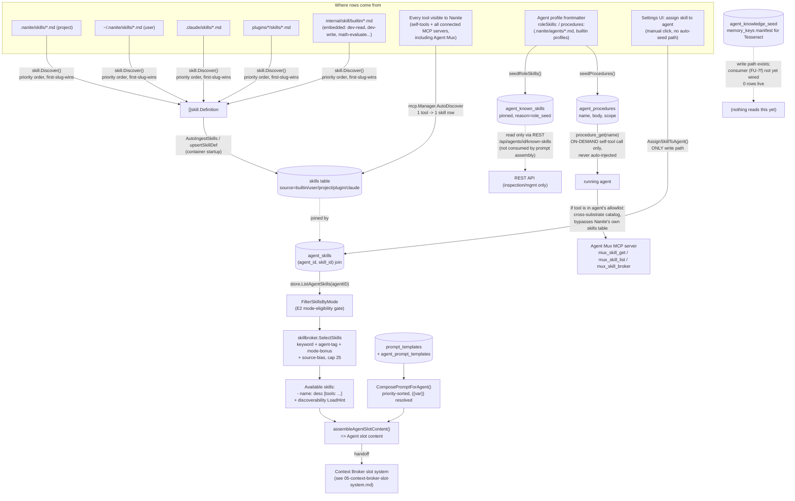

# Skills & Knowledge Attachment

## 1. Purpose

Nanite ships its own file-plus-database system for attaching reusable "skills"
(markdown instructions bound to tools), named "procedures" (long-form
per-agent playbooks fetched on demand), prompt templates (composable system
prompt fragments), and a knowledge-seed manifest (intended to plant memory
content on first agent activation) to an agent. Sources are ingested into
SQLite at container startup and, for the skill list specifically, re-ranked
per turn by a dedicated "Skill Broker" before being folded into the Agent
slot of the assembled system prompt. Two of the six tables this doc covers
(`agent_known_skills`, `agent_knowledge_seed`) are populated but are **not**
currently read by anything at runtime outside their own REST/CRUD surface —
this is stated as observation in §8, not a defect judgment.

## 2. Key entry points/files

- `internal/skill/discovery.go` — `Discover()`: scans 4 file locations (project `.nanite/skills/`, user `~/.nanite/skills/`, `.claude/skills/`, `plugins/*/skills/`) for skill `.md` files, first-slug-wins priority.
- `internal/skill/parser.go` — `Definition` struct + `ParseMDFile`: YAML-frontmatter-plus-markdown-body parser (name/slug/description/argument-hint/allowed-tools/model/effort/context/broker-hints/modes).
- `internal/skill/loader.go` — `EnsureHomeDirs`/`HomeSkillsDir`/`WriteUserSkillFile`: creates and writes to `~/.nanite/skills/`.
- `internal/skill/builtin/*.md` + `embed.go` — 8 binary-embedded builtin skills (`dev-read`, `dev-write`, `dev-grep`, `dev-bash`, `dev-glob`, `dev-edit`, `math-evaluate`, `encoding-convert`).
- `internal/service/container.go` (~L490-548) — startup wiring: `skill.EnsureHomeDirs` → `skill.Discover` → append builtins → `AutoIngestSkills` → `NewSkillService`.
- `internal/service/ingest.go` — `AutoIngestSkills`/`upsertSkillDef` (skill file → `skills` row), `seedProcedures`/`seedRoleSkills` (agent frontmatter `procedures:`/`roleSkills:` → `agent_procedures`/`agent_known_skills`).
- `internal/service/skill.go` — `SkillService`: merges file-based definitions (primary) with DB rows (fallback), file-based skills are read-only ("edit the .md file instead").
- `internal/mcp/manager.go` (~L931-1010) — `Manager.AutoDiscover`: creates one `skills` row per discovered MCP tool (`category="auto-discovered"`) — this is the dominant source of skill rows, not the file-based system.
- `internal/skillbroker/broker.go` — `SelectSkills`/`SelectSkillsScored`: pure-function per-turn ranker (keyword/query/agent-tag/mode-binding/source-bias) over an agent's already-assigned skill set; caps output at `MaxSelectedSkills` (25).
- `internal/chat/context.go` — `buildSkillListForSessionWithIntent`/`filterAgentSkillsByMode`/`skillCatalogLoadHint`: mode-filters, calls the Skill Broker, renders the "Available skills:" block plus a discoverability pointer for the rest of the catalog.
- `internal/chat/context_client.go` (~L592-644) — `assembleAgentSlotContent`: merges `ComposePromptForAgent` (prompt templates) + skill list + compaction disclosure into the Agent slot's content.
- `internal/store/skills.go`, `agent_known_skills.go`, `agent_procedures.go`, `agent_knowledge_seed.go`, `prompt_templates.go`, `templates.go` — table CRUD (see §5).
- `internal/store/prompt_templates.go` — `ComposePromptForAgent`: joins `prompt_templates` via `agent_prompt_templates`, sorts by priority, resolves `{{var}}` placeholders.
- `internal/store/skill_mode_filter.go` — `FilterSkillsByMode`: E2 two-pass mode-eligibility filter that runs upstream of the Skill Broker.
- `internal/mcp/self_tools.go` / `self_tools_transport.go` / `self_tools_procedure.go` — first-party self-tools: `skill_create`/`skill_list`/`skill_update`/`skill_delete` (local skill-registry CRUD) and `procedure_get` (on-demand fetch of one named procedure body for the calling agent).
- `internal/agent/parser.go` — agent `Definition.Procedures` (`ProcedureDefinition{Name, Body, BodyFile, Scope}`), `Definition.Skills`/`RoleSkills` — the frontmatter fields on an *agent* profile file that seed skills/procedures at ingest.
- `ui/src/components/settings/agents/AgentCapabilitiesPanel.tsx` — Settings UI: separate panels for assigned skills (`agent_skills`), known-skills, procedures, and knowledge-seeds per agent.
- `ui/src/components/settings/SkillsBrowser.tsx`, `SkillCreateWizard.tsx`, `SkillDetailView.tsx` — global skill catalog browser/editor.

## 3. Flow

There are, in practice, **three independent skill-related pipelines** feeding
Nanite's `skills` table, plus a fourth path that bypasses that table
entirely by calling out to an external service. They converge only at the
`skills` table schema; nothing downstream distinguishes "how a row got
there" except the `source`/`category`/`origin_system` columns.

**Pipeline 1 — file-based skill definitions (the "real" skill system).**
At container startup, `skill.Discover` scans, in priority order: project
`.nanite/skills/`, user `~/.nanite/skills/`, `.claude/skills/`, and
`plugins/*/skills/`, parsing every `*.md` file as YAML frontmatter + a
markdown body (the Prompt). `internal/skill/builtin`'s 8 embedded dev-tool
skills are appended as lowest priority. Every discovered `Definition` is
then upserted into the `skills` table by `AutoIngestSkills` (content-hash
based version bump on re-ingest). This is the pipeline that most closely
resembles "a real skill": a name, description, argument hint, optional tool
allowlist, model/effort override, and a markdown body that can be dynamically
templated with `` !`shell command` `` markers (`internal/skill/context.go`,
`ResolveDynamicContext`).

**Pipeline 2 — auto-discovered tool-wrapper skills.** `mcp.Manager.AutoDiscover`
walks every tool currently visible to Nanite (its own self-tools plus every
tool exposed by every connected MCP server) and, for any tool without a
matching skill slug already in the DB, mechanically creates a `skills` row:
`category="auto-discovered"`, `tool_bindings=["<tool-name>"]`, no `prompt`
body, `source="builtin"`. This is a 1-tool-to-1-skill wrapper, not a
curated instruction set — it exists so every tool is individually visible
through the skill catalog (`skill_list`) and assignable via the skills
admin UI. Live-DB inspection (§5) shows this pipeline accounts for the
overwhelming majority of rows.

**Pipeline 3 — agent-profile seeding (`roleSkills:`/`procedures:`
frontmatter).** An *agent* profile file (`.nanite/agents/*.md`,
`internal/agent/builtin/profiles/*.md`, etc. — see the sibling
agent-definition doc) can declare `roleSkills: [slug, ...]` and
`procedures: [{name, body|body_file, scope}]` in its own frontmatter.
`service/ingest.go`'s `upsertAgentDef` reads these at ingest time and
writes one `agent_known_skills` row per `roleSkills` entry (pinned=1,
reason="role_seed") and one `agent_procedures` row per `procedures` entry.
`ProcedureDefinition.BodyFile` paths resolve relative to the profile file's
own directory and are inlined into `Body` at parse time
(`internal/agent/parser.go`, `resolveProcedureBodyFiles`). Migration 075's
own comment states the seed is "best-effort enrichment, NOT a contract the
runtime enforces" — and indeed `agent_known_skills` is read only by its own
REST endpoints (§5/§6), not by the prompt-assembly path.

**Pipeline 4 — external cross-substrate skill broker (bypasses the `skills`
table).** Some agent profiles (e.g. `system-architect`) list `mux_skill_get`
/ `mux_skill_list` directly in their `tools`/`roleTools` allowlist. These are
tools exposed by "Agent Mux" — a separate MCP server Nanite is itself
connected to (registered in the live `mcp_servers` table) that spans
Chrispian's whole multi-app substrate (Torque, Tesseract, Cerberus, Hadron,
etc.), not just this Nanite instance. When an agent has these tools in its
allowlist it can call out, mid-conversation, to a skill catalog that lives
entirely outside Nanite's own `skills` table. A code comment in
`system-architect.md` states this explicitly: those tools are "the actual
singular-fetch + browse pair for this profile's cross-substrate
skill-discovery use case... the local skill_create/list/update/delete tools
manage THIS Nanite instance's own skill definitions, a different concern."
(Ironically, `mux_ai_chat`, `torque_epic_delete`, and other Agent-Mux-exposed
tools *also* show up as Pipeline-2 auto-discovered rows in Nanite's own
`skills` table, because Nanite treats Agent Mux like any other connected MCP
server for tool discovery — the two pipelines aren't mutually exclusive.)

**Selection and injection, per turn.** Only the `agent_skills` join table
(assigned skill ↔ agent) feeds the prompt. `buildSkillListForSessionWithIntent`
loads an agent's assigned skills via `store.ListAgentSkills` (which joins
`skills` through `agent_skills`), passes them through `FilterSkillsByMode`
(mode-eligibility, upstream gate — mode-denied skills never reach the
broker), then through `skillbroker.SelectSkills` (per-turn intent keywords +
agent tags/slug + mode-binding bonus + source-bias tiebreak, capped at 25).
The rendered `- name: description [tools: ...]` lines, plus a
discoverability pointer counting the rest of the catalog
(`skillCatalogLoadHint`, pointing the agent at `skill_list`/`tool_list`),
become the `skill_list` template variable. `assembleAgentSlotContent` merges
that with `store.ComposePromptForAgent` (joins `prompt_templates` via
`agent_prompt_templates`, sorted by `priority`, `{{var}}`-interpolated) and a
compaction disclosure block, producing the full content of the **Agent slot**.
From there, injection into the assembled per-turn prompt (slot ordering,
caching, pointer/stash mechanics) is the Context Broker's job — see
`05-context-broker-slot-system.md`.

`agent_procedures` is **not** auto-injected anywhere. It is exposed to the
owning agent as an on-demand self-tool, `procedure_get(name)`, which the
agent must explicitly call — the pattern is "boot/instruction text tells you
to fetch a named procedure" rather than the procedure body always being
resident in context.

`agent_knowledge_seed` is a write-only manifest today: rows describe a
`memory_key`/`namespace`/`body` an agent "wants seeded into Tesseract on
first activation," with an `applied_at` column meant to be stamped by a
consumer. The store-layer comment states the consumer "wiring lands in
FU-7f" — not yet implemented as of this snapshot. This matches the live
data: 0 rows.

## 4. Explicit disambiguation

This doc covers **Nanite's own** skills/knowledge/procedures/templates
system: the `internal/skill` package, the `skills`/`agent_known_skills`/
`agent_procedures`/`agent_knowledge_seed`/`prompt_templates`/
`agent_prompt_templates`/`templates` tables in Nanite's SQLite store, the
Skill Broker (`internal/skillbroker`), and the first-party self-tools
(`skill_list`, `skill_create`, `procedure_get`, etc.) that read/write them.
This is application code that ships inside the Nanite binary and runs as
part of every chat session Nanite serves.

It is **not** the same thing as the Claude Code `/skills` mechanism used to
run this very audit. That is a feature of the Claude Code CLI/harness
itself — skills declared under `~/.claude/skills/` or a project's
`.claude/skills/` and invoked via the `Skill` tool — and has no code
presence in this repository at all; it is a capability of the tool doing
the auditing, not of the system being audited.

There is a **third, easy-to-confuse party**: this repo's own
`CLAUDE.md`/`.nanite/config.yaml` describe a "Boot `<agent>`" workflow —
"load each role file from `~/.nanite/roles/`... load the listed skills... "
— that is the operator's **personal meta-framework** for orchestrating
Claude Code CLI sessions across many unrelated projects (also confusingly
named "nanite"). Its skill files live at the exact same path
(`~/.nanite/skills/`) that Nanite's own `internal/skill.Discover` scans as
its user-tier source — the overlap is real, not coincidental, since Nanite's
`skill.Discover` was written to read that same directory. But the two
systems disagree on file format: the meta-framework's skill files (e.g.
`~/.nanite/skills/adr.md`, `sp-systematic-debugging.md`, `end-of-session.md`)
are plain markdown starting with an `#` heading, no YAML frontmatter, while
`skill.ParseMDFile` requires a file to *start* with a `---` frontmatter
delimiter or it is skipped with a `slog.Warn` and never becomes a Nanite
skill. Verified against the live directory: of 42 `.md` files in
`~/.nanite/skills/`, only one (`interview.md`) happens to carry valid
frontmatter and therefore successfully loads as a Nanite skill (`source=user`,
confirmed live in the `skills` table); the other 41 are silently skipped by
Nanite's parser even though they are exactly what the meta-framework's own
boot process expects to load. `internal/assets/framework/skills/*.md`
(binary-embedded) is a related-but-separate concern again: it is the
distributable copy of the *meta-framework's* content (roles, skills,
commands, docs — see `internal/assets/framework.go`, "bundles the Nanite
agent framework content... used by the install pipeline"), extracted to
disk on demand for scaffolding a fresh `~/.nanite/` tree; it is not read by
`skill.Discover` and does not participate in Pipeline 1 above.

## 5. Data model touched

| Table | Purpose | Populated by | Read by |
|---|---|---|---|
| `skills` | Catalog of skill rows: name/slug/description/category/tool_bindings/prompt/source/mode_ids | Pipeline 1 (`AutoIngestSkills`) + Pipeline 2 (`mcp.Manager.AutoDiscover`) + manual `skill_create` self-tool | `skill_list`, `SkillsBrowser` UI, `ListAgentSkills` (via `agent_skills` join) |
| `agent_skills` | Join table: which skills are assigned to which agent | **Manual only** — `AssignSkillToAgent`, called from exactly one place: the Settings UI's "assign skill" action via the REST API | `buildSkillListForSessionWithIntent` → feeds the Skill Broker → Agent slot |
| `agent_known_skills` | Per-agent "known skill" roster with pinned/activation_count/ttl/reason | Pipeline 3 (`seedRoleSkills`, `roleSkills:` frontmatter) or manual REST calls | Only its own REST endpoints (`/api/agents/{id}/known-skills`) and the Settings UI panel — **not** read by the prompt-assembly path |
| `agent_procedures` | Named procedure bodies (PK `agent_id, name`), scope `agent`/`shared` | Pipeline 3 (`seedProcedures`, `procedures:` frontmatter, inline `body` or `body_file`) or manual REST calls | `procedure_get` self-tool (on-demand, per calling agent) + REST endpoints |
| `agent_knowledge_seed` | Manifest of `(namespace, seed_key, body, tags)` an agent wants planted into Tesseract memory on first activation, with `applied_at` | Manual REST calls only (no ingest-time seeding path found) | Nothing yet — consumer wiring described as pending ("FU-7f") in the store-layer comment |
| `prompt_templates` | Composable system-prompt fragments: slug/scope(system,mode,skill,context)/template/variables/priority | `SeedBuiltinPromptTemplates` (5 hardcoded defaults) + migrations seeding more (11 live) | `ComposePromptForAgent`, `GetPromptTemplateBySlug` (compaction disclosures) |
| `agent_prompt_templates` | Join table: which templates are assigned to which agent, in priority order | Manual (`AssignPromptTemplateToAgent`) + migration seed for the canonical `file-default` agent | `ComposePromptForAgent` |
| `templates` | Separate, unrelated "output templates" (task-summary, code-review, standup — markdown formatting snippets for generated content) | `SeedBuiltinTemplates` | Not traced in this pass — appears to be a content-formatting feature distinct from agent-attachment; flagged in §8 |

**Live sample data** (`~/.local/share/nanite/workspaces/default/main.db`,
2026-08-17):

- **`skills` — 821 rows.** `source`: 820 `builtin`, 1 `user`. `is_builtin`
  flag is 0 for all 821 (the `is_builtin` column and the `source='builtin'`
  string are two different signals — see §8). `category`: 810
  `auto-discovered`, 6 `dev`, 2 `general`, 1 each of `research`,
  `interview`, `tool-discovery`. Sample auto-discovered rows: `torque_epic_delete`,
  `task_execute` ("Agent Mux-task-execute"), `nanite_plan_update`,
  `loom_bundle_put`, `mux_ai_chat` — one row per tool, `tool_bindings` a
  single-element JSON array, no `prompt` body. The 11 non-auto-discovered
  rows are the true file-based skills: 6 `dev-*` + `math-evaluate` +
  `encoding-convert` (the 8 embedded builtins, minus overlap) plus
  `interview-assistant` (builtin, category `research`), `interview` (the
  one live `source=user` row, from `~/.nanite/skills/interview.md`), and
  `tool-listing`.
- **`agent_known_skills` — 13 rows**, all `pinned=1, reason='role_seed'`,
  split across exactly 2 agents: `system-architect` (7 rows: `sp-writing-plans`,
  `sp-brainstorming`, `adr`, `capture-decision`, `capture-followup`,
  `surface-discovery`, `dispatching-parallel-agents`) and `torque-supervisor`
  (6 rows: `sp-systematic-debugging`, `sp-verification-before-completion`,
  `capture-investigation`, `escalate`, `surface-discovery`,
  `capture-to-vanta`). None of these 13 skill-name strings match any row in
  the 821-row `skills` table — they are slugs of files that exist only in
  the operator's personal `~/.nanite/skills/` meta-framework directory (§4),
  not skills Nanite itself has ingested. Since this table isn't read by the
  prompt-assembly path anyway, the mismatch has no runtime effect today.
- **`agent_procedures` — 41 rows** across roughly a dozen agent IDs.
  Common names: `boot`, `checklist` (present for most durable-agent
  profiles), plus role-specific ones (`build_agent`, `create_task`, `relay`,
  `curate_packet`, `write_or_supersede_knowledge`, `classify_and_compile_fragment`,
  `tick_base`, `run_contract`). Body sizes range from ~110 bytes to 12.5 KB
  (`agent-builder`'s `build_agent` procedure).
- **`prompt_templates` — 11 rows**, all `is_builtin=1`: `chat-role-harness`,
  `planner-role-harness` (priority 1, "system" scope — the two full
  role-identity templates), `base-identity` (priority 10), 4
  `compaction-disclosure-*` variants (priority 15, "mode" scope),
  `workspace-context`/`project-context` (priority 20/30, "context" scope),
  `mode-addendum` (priority 40), `tool-awareness` (priority 50, "skill"
  scope — the `{{skill_list}}` carrier).
- **`agent_prompt_templates` — 1 row**: `file-default` → `blt-chat-harness-001`
  (the canonical chat agent's identity template). No other agent in this
  workspace has an assigned prompt template row, meaning `ComposePromptForAgent`
  returns empty for every other agent and each falls back to
  `agent.SystemPrompt` plus mode addendum (the "legacy fallback" branch in
  `assembleAgentSlotContent`) — `warnUnassignedTemplateOnce` fires a one-shot
  log warning per such agent.
- **`agent_knowledge_seed` — 0 rows.** Consistent with the "consumer wiring
  not yet landed" comment in the store layer.

## 6. Configuration & manual-setup points

- **Assigning a skill so it actually renders in an agent's prompt is a
  manual, UI/API-only action.** There is no frontmatter field or ingest path
  that populates `agent_skills` (the join table the Skill Broker actually
  reads). `roleSkills:` frontmatter only seeds `agent_known_skills`, which
  is currently inert for prompt purposes. An operator wanting an agent to
  see a specific skill in its "Available skills:" block has to explicitly
  assign it through the Settings UI (`AgentCapabilitiesPanel.tsx` →
  `onAssignSkill` → `POST /api/agents/{id}/skills`).
- **Live-DB evidence that this manual step is largely unused**: `agent_skills`
  has 0 rows workspace-wide, so `buildSkillListForSessionWithIntent`
  currently renders an empty essentials list for every agent — only the
  discoverability `LoadHint` (pointing at `skill_list`/`tool_list`) appears.
- **Prompt-template assignment is likewise manual per agent** (`agent_prompt_templates`,
  1 row live). Only `file-default` has a template; every other agent's
  role-specific system-prompt content comes from the fallback path
  (`agent.SystemPrompt` markdown body baked into the profile file) rather
  than the templating layer.
- **Procedure bodies require both authoring and a naming convention the
  agent is expected to already know.** `procedures:` frontmatter (inline
  `body:` or `body_file:` relative to the profile file) is the only way to
  populate `agent_procedures`; there is no discovery — the agent's own
  system-prompt text has to separately instruct it to call
  `procedure_get(name="boot")` (or whatever name was chosen) for the tool
  call to find anything. A typo or unremembered name (`skill_get` referenced
  in old profile text before this tool existed — see the
  `agent-builder.md`/`system-architect.md` code comments) silently returns
  nothing more actionable than a "not found" tool-result string.
- **Knowledge seeds are configured but not consumed.** An operator (or an
  agent, via REST) can write `agent_knowledge_seed` rows today, but nothing
  in the current codebase applies them to Tesseract — the intended
  consumer/boot-hook ("FU-7f") had not landed as of this snapshot.
- **The auto-discovered skill catalog (810 of 821 rows) is not
  hand-curated** — it mechanically tracks whatever tools are currently
  reachable through connected MCP servers (including the external "Agent
  Mux" gateway), and is flagged (not deleted) with `"removed":true` in
  `settings` JSON when a tool disappears from discovery, rather than
  being pruned.
- **Cross-substrate skill access (`mux_skill_get`/`mux_skill_list`) is an
  explicit, hand-maintained tool-allowlist entry per agent profile** — an
  operator has to know to add these specific tool names to `tools:`/`roleTools:`
  for an agent to be able to reach the external Agent Mux skill catalog;
  nothing surfaces it by default.

## 7. Cross-references

- `05-context-broker-slot-system.md` — owns everything downstream of
  `assembleAgentSlotContent`'s output: how the Agent slot's rendered text is
  placed, cached, and reconciled against the other slots in the assembled
  prompt (this doc stops at "Agent slot content is produced").
- Agent-definition-and-config doc (sibling, not yet read in this pass by
  name but referenced throughout) — owns `.nanite/agents/*.md`,
  `internal/agent/builtin/profiles/*.md`, `agent.Discover`, and the
  `agent_profiles` table that `roleSkills:`/`procedures:`/`tools:`
  frontmatter live on; this doc only covers what those fields cause to be
  written into the skill/procedure/template tables.
- Chat-engine-orchestration doc (sibling) — likely owns the broader
  per-turn request path that calls `assembleAgentSlotContent` and the
  Context/Tool/Agent broker quartet this doc's Skill Broker is one member
  of.

## 8. Open questions

- **`skills.is_builtin` vs `skills.source='builtin'` appear to have drifted
  apart.** Live data shows `is_builtin=0` for all 821 rows even though 820
  have `source='builtin'`. `CreateSkill`/`SeedBuiltinSkills` both set
  `is_builtin` explicitly in some paths but `upsertSkillDef` (the ingest
  path) and `AutoDiscover` (the tool-wrapper path) never set it true. Given
  `DeleteSkill` is gated on `is_builtin = 0`, this means every row in the
  live catalog — including the ones sourced from embedded builtins — is
  technically deletable through the API, which may or may not be intended.
- **`agent_known_skills` and `agent_knowledge_seed` are populated tables
  with no runtime consumer** beyond their own REST CRUD surface. Whether
  this is "shipped ahead of the feature that reads it" (as the code
  comments for `agent_knowledge_seed` suggest — "FU-7f") or dead/superseded
  design is not determinable from the code alone.
- **Two different "template" concepts share the word "template" but do
  unrelated jobs**: `prompt_templates`/`agent_prompt_templates` compose
  system-prompt text; the separate `templates` table (`task-summary`,
  `code-review`, `standup`) is a content-formatting feature (Go
  `text/template`-shaped output snippets) not wired to agent attachment at
  all in anything traced during this pass. The names invite confusion.
- **The 41 `.nanite/skills/` files that fail Nanite's frontmatter parser
  are exactly the files the operator's own `CLAUDE.md` boot process expects
  to load as "skills."** It's unclear whether this is intentional
  separation (two systems that happen to share a directory name and
  nothing else) or an unintended casualty of Nanite's `skill.Discover`
  being pointed at the same path the meta-framework already owned. The one
  file that *does* parse (`interview.md`) appears to do so because it was
  deliberately dual-authored with frontmatter, not because the two systems
  were reconciled.
- **`agent_known_skills.skill_name` has no foreign key and no resolution
  step against the `skills` table** — the 13 live rows all reference slugs
  that don't exist as `skills` rows at all (they're meta-framework skill
  names). Since the table isn't read by prompt assembly, this is currently
  inert, but if a future consumer were wired up it would need to handle
  unresolvable names.
- **Pipeline 2 (auto-discovered) and Pipeline 4 (external Agent Mux broker)
  overlap without any visible reconciliation** — the same underlying tool
  (e.g. an Agent-Mux-exposed tool) can appear both as a mechanically
  generated Nanite `skills` row and be reachable via `mux_skill_get`/`mux_skill_list`
  as part of a completely separate, larger catalog. No code observed
  during this pass de-duplicates or cross-links the two.
