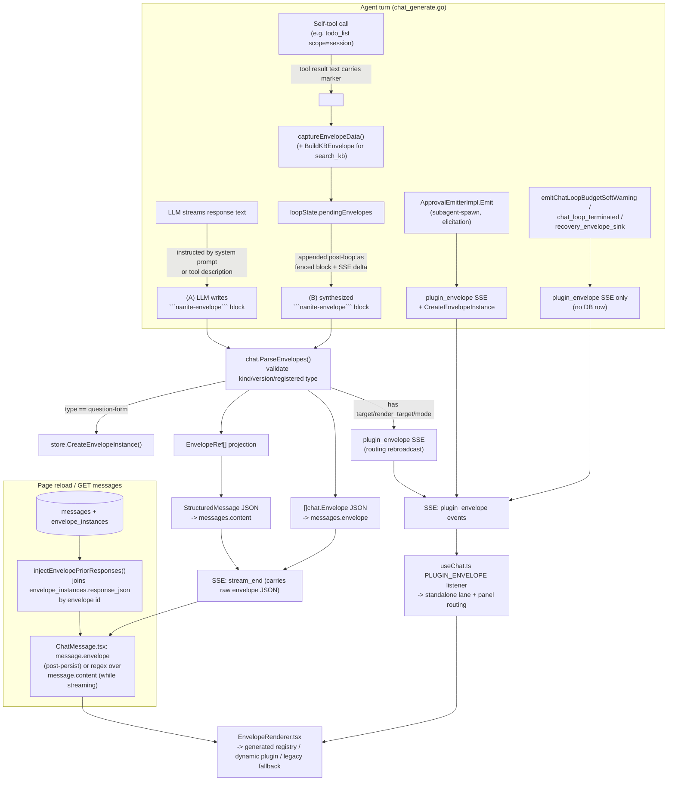

# 15 — Envelope System

## 1. Purpose

Envelopes are structured UI cards that ride inside chat messages alongside (or instead of) prose — question forms, approval prompts, KB search results, progress cards, todo lists, and similar. An envelope is a small JSON object (`kind`, `version`, `type`, `data`, plus optional interactive fields) that the frontend matches against a registry of React components and renders as a card instead of markdown text. The system exists to give agents a machine-checkable way to ask for structured input, propose actions, or display rich data, without inventing free-form UI conventions per feature.

## 2. Key entry points/files

**External — `github.com/hollis-labs/go-envelopes` module** (dev-time `replace` in `go.mod` points at the sibling checkout `../../libs/go-envelopes`; production build uses the tagged `v0.1.1`):
- `manifest/envelopes.yaml` — the canonical list of **26** core envelope types (type name + optional React component/export). Single source of truth consumed by both this Go module (`go:embed`) and the frontend codegen.
- `manifest/schemas/*.schema.json` — per-type JSON Schemas validating the `data` payload (19 files present; not every core type has one).
- `registry.go` / `types.go` — `LoadCore()`, `Registry`, `RegisterTypeFromManifest`.

**This repo (`nanite`):**
- `internal/chat/envelope.go` — `Envelope`/`Proposal`/`Question`/`Status` structs, `ParseEnvelopes()` (fenced-block extraction + validation), `ValidateEnvelope()`, `InitCoreTypes()`/`RegisterEnvelopeType()`/`SetEnvelopeRegistry()`, `BuildKBEnvelope()`.
- `internal/chat/structured.go` — `StructuredMessage` / `EnvelopeRef`, the persisted wire+DB shape for envelopes attached to a message.
- `internal/chat/envelope_handler.go` — `ResponseHandler` registry (per-type side-effect handlers for `POST /api/envelopes/:id/respond`).
- `internal/chat/errors.go`, `internal/chat/commands.go` — harness-authored envelope construction (error-report, command-result envelopes).
- `internal/service/chat_generate.go` — the main turn loop: envelope parsing, `EnvelopeInstance` creation, `EnvelopeRef` projection, SSE broadcast, structured-message assembly (lines ~1798‑1972 cover this end-to-end).
- `internal/service/envelope_emit.go` — `ApprovalEmitterImpl.Emit()`, the shared persist-and-stream helper used outside the main text-parsing path (approvals, elicitation, subagent-spawn).
- `internal/service/chat_loop_budget_soft_warning.go`, `internal/service/chat_loop_terminated.go`, `internal/service/recovery_envelope_sink.go`, `internal/api/tools_call.go` — additional harness-only envelope emitters (SSE-only, no DB row).
- `internal/store/envelope_instances.go` — `EnvelopeInstance` CRUD against the `envelope_instances` table.
- `internal/api/envelopes.go` — `POST /api/envelopes/:id/respond` and `injectEnvelopePriorResponses()` (reload-time hydration).
- `internal/envelope/legacy.go` — registers 5 "orphan" types (schemas that ship in `go-envelopes`'s `manifest/schemas/` but were never added to `manifest/envelopes.yaml`) under a synthetic `nanite-legacy` plugin id.
- `internal/mcp/self_tools.go` — self-tool descriptions that either instruct the LLM to hand-author an envelope block (`plan_create`) or state that the tool auto-emits one (`todo_list`).
- `internal/runtime/agent/sandbox_content_envelope.go`, `internal/runtime/agent/sandbox_content_claude.go` — the envelope-authoring instructions planted into CLI/boot-profile agents' boot directories (`.sandbox/envelope-schema.md`, `CLAUDE.md` addendum).
- `scripts/generate-plugin-imports.mjs` — codegen: reads the external manifest, applies `CORE_OVERRIDES`, writes the frontend registry file.
- `ui/src/generated/plugin-envelopes.ts` — generated frontend registry (`CORE_ENTRIES`, `getEnvelopeComponent()`).
- `ui/src/components/chat/envelopes/EnvelopeRenderer.tsx` — routes one envelope to its component / legacy fallback / unreachable placeholder.
- `ui/src/components/chat/ChatMessage.tsx` — per-message envelope extraction (`useMemo` at line 237) feeding `EnvelopeRenderer`.
- `ui/src/hooks/useChat.ts` — SSE `plugin_envelope` event listener (standalone/live envelope channel).
- `ui/src/lib/panel-signal.ts` — `applyEnvelopePanelEffects()`, routes `target`/`render_target`/`mode` to drawers.
- `ui/src/lib/plugin-loader.ts` — dynamic registration of runtime-plugin envelope components (giphy, oembed, support-ticket).

## 3. Flow

There are **three independent mechanisms** that produce an envelope, and the choice between them is made per-tool/per-feature in the Go source, not by a single unified policy:

- **(A) LLM-authored fenced block.** The model is instructed (via the CLI boot-dir `.sandbox/envelope-schema.md` / `CLAUDE.md` addendum, or via a specific tool's description, e.g. `plan_create`) to emit a ` ```nanite-envelope ` fenced JSON block directly in its response text. The harness never asks for this — it is entirely the model choosing to follow instructions it was given.
- **(B) Tool auto-emission via an in-band marker.** A self-tool (e.g. `todo_list` with `scope` set) computes an envelope server-side and smuggles it out through its own tool-result text using an `<!--ENVELOPE_DATA:...:ENVELOPE_DATA-->` marker. `captureEnvelopeData()` (`chat_generate.go:3147`) strips the marker out of the tool result before the LLM sees it, and stashes the payload in `loopState.pendingEnvelopes`. For `search_kb` results specifically, the raw payload is first transformed by `chat.BuildKBEnvelope()` into a `kb-result` envelope. After the tool-use loop ends, every pending envelope is appended to the final response text as a synthesized ` ```nanite-envelope ` block (`chat_generate.go:1798‑1804`) — from this point on it is indistinguishable from mechanism (A).
- **(C) Harness-only emission, no text/LLM involvement at all.** Several code paths build an envelope and broadcast it straight onto the SSE stream as a `plugin_envelope` event, bypassing `ParseEnvelopes` entirely: `ApprovalEmitterImpl.Emit` (subagent-spawn approval, elicitation prompts), `emitChatLoopBudgetSoftWarning` (dev-mode-only budget telemetry), `chat_loop_terminated.go`, `recovery_envelope_sink.go` (crash/recovery info-cards), and the CLI structured-input fallback in `tools_call.go`. These never enter the assistant's message content at all.

For (A) and (B), once the loop's final text is assembled, `chat.ParseEnvelopes()` extracts every fenced block, validates `kind`/`version`/registered `type`, and strips the JSON out of the displayed text. Only `question-form` envelopes get a `store.CreateEnvelopeInstance()` row written from this path (`chat_generate.go:1841‑1859`) — every other type parsed here is persisted solely as part of the message JSON, not as its own `envelope_instances` row. Envelopes carrying a routing hint (`target`/`render_target`/`mode`) are additionally re-broadcast as a `plugin_envelope` SSE event so the same wire format that mechanism (C) uses also drives drawer/panel routing for LLM-authored cards.

Two DB writes happen per assistant message: `messages.content` gets the `StructuredMessage` JSON (text + `EnvelopeRef[]`, the routing-safe projection used by the frontend's persisted-render path), and `messages.envelope` gets the raw `[]chat.Envelope` JSON (used later for `prior_response` hydration). `stream_end`'s SSE payload also carries this raw envelope JSON directly.

On the frontend, `ChatMessage.tsx` derives the envelope to render in two possible ways: **while streaming**, `message.envelope` is not set yet, so it independently re-parses fenced blocks straight out of the accumulating `message.content` text using its own regex (recognizing three historical fence tags: `nanite-envelope`, `volon-envelope`, and `fragments-envelope`) — the same detection logic as `ParseEnvelopes`, reimplemented in TypeScript. **After persistence/reload**, it instead parses `message.envelope`. If a message carries more than one envelope, the frontend merges them into a single card (`mergeEnvelopes`) — only one card renders per message; a later envelope's `data`/`type` only wins if the earlier one had none.

Separately, `plugin_envelope` SSE events (mechanism C, plus the routing re-broadcast from A/B) are handled by a second, independent listener in `useChat.ts` that feeds a standalone envelope lane (`addPluginEnvelope`) and drives `applyEnvelopePanelEffects` for drawer routing — this channel is live-only; a page reload does not replay it.



## 4. Audit result

CLAUDE.md's Envelope System section is **largely accurate on the mechanics** — manifest source of truth, `LoadCore`/`InitCoreTypes` wiring, generated frontend file, `CORE_OVERRIDES` — and all of it was independently verified against the running code:

- `envelopes.LoadCore()` → `chat.SetEnvelopeRegistry()` / `chat.InitCoreTypes(envReg.Names())` is exactly the sequence in `cmd/nanite/main.go:203‑218`.
- `scripts/generate-plugin-imports.mjs --check` currently **passes** (`CHECK PASSED: generated file is up to date`, 26 core types read from `libs/go-envelopes/manifest/envelopes.yaml`). Codegen and manifest are in sync today.
- `CORE_OVERRIDES` in the generator matches CLAUDE.md's description (host-side `props: "envelope"` overrides so cards can read `prior_response`, plus the `chat-loop-budget-soft-warning` and `question-form` components that have no `component:` entry in the shared manifest).

**Drift found:**

- **"Known envelope types" list in CLAUDE.md is stale.** It lists 8 core primitives + 8 Phase-7 primitives + 4 plugin types (20 total). The actual `go-envelopes` manifest now registers **26** core types — CLAUDE.md's list omits `todo-list`, `plan-review`, `artifact-mini`, `session-task`, `message-request`/`message-reply`/`message-notification`/`message-handoff`, `subagent-spawn-approval`, `chat-loop-terminated`, `chat-loop-budget-soft-warning`, and `elicitation-prompt` entirely.
- **The "Plugin types" registration mechanism CLAUDE.md describes doesn't match how 5 of the named plugin types are actually registered.** CLAUDE.md says plugin envelope types are "declared in `plugins/*/plugin.yaml` under `registers.envelopes`." In this checkout, `plugins/*/plugin.yaml` doesn't exist at all — plugins (`giphy`, `oembed`, `support-ticket`, etc.) are fetched from separate `hollis-labs/nanite-plugin-*` repos via `plugins/repos.yaml` + a catalog cache, not vendored locally. More importantly, `kb-result`, `giphy-modal`, `resolution-capture`, `ticket-form`, and `ticket-confirmation` — the exact types CLAUDE.md attributes to the giphy/support-ticket plugins — are not registered through any plugin manifest today. They're registered at startup via `internal/envelope/legacy.go`'s `RegisterOrphans()`, which pulls their JSON Schemas out of `go-envelopes`'s embedded `manifest/schemas/` directory (schemas that "were never carried into the YAML manifest because they predate the catalog tightening," per the code comment) under a synthetic `nanite-legacy` plugin id — independent of whether the actual giphy/support-ticket plugin repos are installed or loaded.
- **The CLI-agent system prompt (`.sandbox/envelope-schema.md`, planted by `internal/runtime/agent/sandbox_content_envelope.go`) is more stale than CLAUDE.md itself.** It tells CLI-launched agents "these are the only types the frontend can render" and lists just 7: `giphy-modal`, `document-viewer`, `report-card`, `kb-result`, `ticket-confirmation`, `ticket-form`, `resolution-capture` — a small subset of the 26+ actually registered. The companion `claudeMDBody` constant in `internal/runtime/agent/sandbox_content_claude.go` separately tells the agent to "consult `config/envelopes.yaml` and `internal/envelope/schemas/*.schema.json`" for the current type list — **neither path exists in this repo** (`config/envelopes.yaml` was removed when the manifest moved to `go-envelopes`, per CLAUDE.md's own note; `internal/envelope/schemas/` was never created — the real schemas live in the external module). This is a live, verifiable inconsistency: two different system-prompt fragments shipped to CLI agents point at two different, both-wrong sources of truth for "what envelope types exist."
- **The startup log/comment says `go-envelopes v0.1.0`; `go.mod` pins `v0.1.1`** with a local dev `replace` to `../../libs/go-envelopes` ("local dev against the go-envelopes schema addition... Remove once go-envelopes cuts a release that has the same change committed"). Minor, but the hardcoded version string in `cmd/nanite/main.go`'s log line is one release behind what's actually pinned.
- **Frontend re-implements backend fence-parsing.** `ChatMessage.tsx`'s live-streaming path independently regexes for ` ```nanite-envelope ` / ` ```volon-envelope ` / ` ```fragments-envelope ` fences rather than reusing a shared definition with `internal/chat/envelope.go`'s `envelopePattern` (which only matches `volon-envelope`/`nanite-envelope`, not `fragments-envelope`). Not a functional bug observed, but the three brand-generation fence tags (Fragments Engine → Volon → Nanite) are recognized inconsistently between backend and frontend today.

## 5. Data model touched

`envelope_instances` (SQLite, `internal/store/migrations/007_envelope_instances.sql`):

```sql
CREATE TABLE envelope_instances (
    id              TEXT PRIMARY KEY,
    session_id      TEXT NOT NULL REFERENCES sessions(id),
    envelope_type   TEXT NOT NULL,
    envelope_json   TEXT NOT NULL,
    emitted_at      TEXT NOT NULL,
    responded_at    TEXT,
    response_status TEXT,
    response_json   TEXT
);
CREATE INDEX idx_envelope_instances_session_time ON envelope_instances(session_id, emitted_at);
```

| Column | Meaning |
|---|---|
| `id` | UUIDv4, generated by `CreateEnvelopeInstance` if not supplied. Round-trips into the envelope's own `id` field so the FE can address it and `POST /api/envelopes/:id/respond` can resolve the row. |
| `session_id` | Owning chat session. |
| `envelope_type` | The envelope's `type` (e.g. `subagent-spawn-approval`), not the top-level `kind`. |
| `envelope_json` | The envelope's `data` payload only (not the full `{kind,version,type,...}` wrapper) — verified against live rows. |
| `emitted_at` | Set at insert. |
| `responded_at` | Set by `ClaimEnvelopeForResponse` at claim time (not at final-write time) — a NULL/non-NULL check doubles as both "someone is handling this" and "is this answered." |
| `response_status` | `"handling"` at claim, then overwritten with the terminal status by `UpdateEnvelopeResponse`. |
| `response_json` | The submitted `ResponseV1` payload; joined back into `messages.envelope` on reload via `injectEnvelopePriorResponses`. |

**Live sample** (`~/.local/share/nanite/workspaces/default/main.db`, 22 rows total): only **two** envelope types are actually persisted here — `chat-loop-budget-soft-warning` (17 rows) and `subagent-spawn-approval` (5 rows, 3 with `response_status = submitted`). No `question-form`, `approval-card`, `proposal-card`, or `elicitation-prompt` rows exist in this workspace's history, despite all of those having a `CreateEnvelopeInstance` call path in the code.

Example `subagent-spawn-approval` row's `envelope_json`:
```json
{"inputs_json":"{}","mode":"async","parent_agent_id":"assistant","prompt":"List the contents of /Users/chrispian/Projects-apps/nanite directory using ls command","risk_level":"medium","role":"file-backend","run_id":"bc6f6c31-526f-4414-bb91-801ef91c167d","timeout_seconds":300}
```

Example `chat-loop-budget-soft-warning` row's `envelope_json`:
```json
{"max_turns":20,"iteration":20,"reason":"iteration crossed soft max_turns budget; agent continuing","timestamp":"2026-05-20T00:56:41Z"}
```

## 6. Configuration & manual-setup points

CLAUDE.md's 5-step "adding a new core envelope type" process is real and was traced through the code as written:

1. **Add an entry to the external `go-envelopes` module's `manifest/envelopes.yaml`** (or a `CORE_OVERRIDES` entry in `scripts/generate-plugin-imports.mjs` for a host-only mapping) — a change in a *different repository* (`libs/go-envelopes`, tagged and versioned independently via `go.mod`), not this one, unless it's a host-only override.
2. **Create the React component** in `ui/src/components/chat/envelopes/` (or `primitives/` for Phase-7-style generic cards).
3. **Run `npm run generate:plugins`** — regenerates `ui/src/generated/plugin-envelopes.ts` from the manifest.
4. **Verify the `data` shape** the backend actually sends matches what the component destructures — there is no compile-time or schema-driven guarantee of this; it's manual verification. (A JSON Schema in `manifest/schemas/<type>.schema.json` can validate structurally, but only if one was authored — several core types, e.g. `todo-list`, `plan-review`, `artifact-mini`, ship without one.)
5. **Test both the SSE/streaming path and the persisted/reload path** — the two code paths on the frontend (`message.content` regex-parse vs. `message.envelope` JSON-parse, described in §3) are genuinely different code, so a component that renders correctly live can still break on reload and vice versa.

This is evidence of a multi-repo, multi-file, partially-generated-partially-manual coordination surface for every new core envelope type: one file in an external Go module, one JSON Schema (optional), one React component, one generated TypeScript file, plus two independent frontend render paths to manually verify. Adding a *harness-only* envelope (mechanism C — SSE-only, no manifest entry needed if reusing an existing type like `info-card`) is comparatively cheap, as demonstrated by `recovery_envelope_sink.go` and `cli_structured_input_fallback.go`, both of which reuse `info-card`/`error-report` rather than mint a new type.

## 7. Cross-references

- `04-chat-engine-orchestration.md` — the tool-use loop (`chat_generate.go`) that hosts mechanisms (A) and (B), `loopState.pendingEnvelopes`, and the SSE `StreamEvent` channel envelopes ride on.
- `16-plugin-system.md` — how `giphy`/`oembed`/`support-ticket` plugins are fetched (`plugins/repos.yaml`, catalog cache) and how runtime-registered plugin envelope components differ from the compiled-in core registry (`ui/src/lib/plugin-loader.ts`, `getDynamicEnvelope`).
- `07-tool-calling-mcp.md` (likely) — `internal/mcp/self_tools.go`'s per-tool decision to either auto-emit (mechanism B, `todo_list`) or instruct the LLM to author (mechanism A, `plan_create`) sits at the tool-definition boundary.
- `docs/panels/envelope-render-target.md` — the `RenderTarget`/`Target`/`Mode` routing contract referenced throughout `internal/chat/envelope.go` and `panel-signal.ts`.

## 8. Open questions

- **Unexplained `chat-loop-budget-soft-warning` persistence.** The live DB has 17 rows of this type in `envelope_instances`, with the most recent dated 2026-08-16 (one day before this audit). The only code path that constructs this envelope type (`emitChatLoopBudgetSoftWarning` in `chat_loop_budget_soft_warning.go`) sends it exclusively as an SSE `plugin_envelope` broadcast and has never, per `git log -S` across this file's entire history, called `CreateEnvelopeInstance`. No other call site in the repo (grepped exhaustively across `.go` files, including tests, seed scripts, and fixtures) writes this type to `envelope_instances` either. How these rows were persisted is unresolved from static inspection alone — it was not chased further (e.g. via binary diffing of previously-deployed artifacts or asking the operator) since that falls outside a static code audit.
- **`question-form` envelopes have a persistence path but zero rows.** `chat_generate.go` explicitly creates an `EnvelopeInstance` for every `question-form` envelope the LLM emits, yet none exist in this workspace's 22-row history. Whether this reflects "question-form is rarely/never actually emitted by agents in practice" or "this workspace's session history simply doesn't include one" wasn't distinguished.
- **Three fence-tag generations are all still live** (`nanite-envelope`, `volon-envelope` in the Go regex; those two plus `fragments-envelope` in the frontend regex) with no comment tying them to the brand history in `internal/brand/`. Observed as-is; not investigated further whether `fragments-envelope` is reachable from any current backend emission path or is purely a frontend-side relic for old persisted messages.
- **`EnvelopeRef`/message-level merge behavior with multiple envelopes per message** (`ChatMessage.tsx`'s `mergeEnvelopes`) collapses N envelopes into a single rendered card. Whether any current emission path (LLM or tool) actually produces more than one envelope in a single message in practice — and what a user would see if it did — wasn't traced end-to-end.
